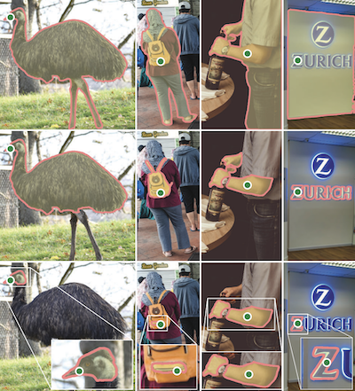

**Image segmentation** divides an image into distinct regions or segments, each representing a specific object or area within the image. This technique is commonly used in computer vision to identify, classify, and analyse different parts of an image, making it easier to understand the content and structure.

*Image is Fig 3 from [Segment Anything](../reference/papers/segment-anything.md) paper*

## Key Papers

* [U-Net: Convolutional Networks for Biomedical Image Segmentation](../reference/papers/u-net-convolutional-networks-for-biomedical-image-segmentation.md)
* [Segment Anything](../reference/papers/segment-anything.md)
