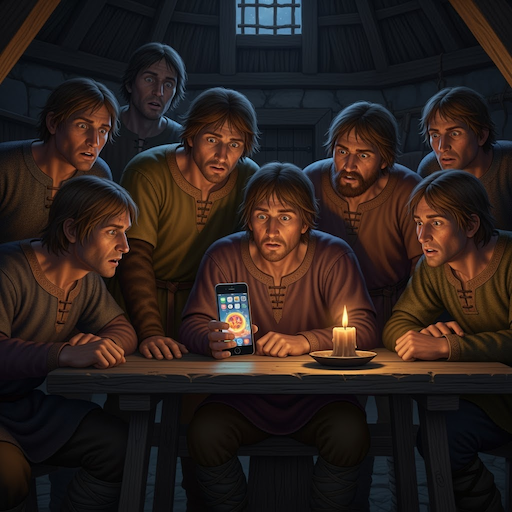
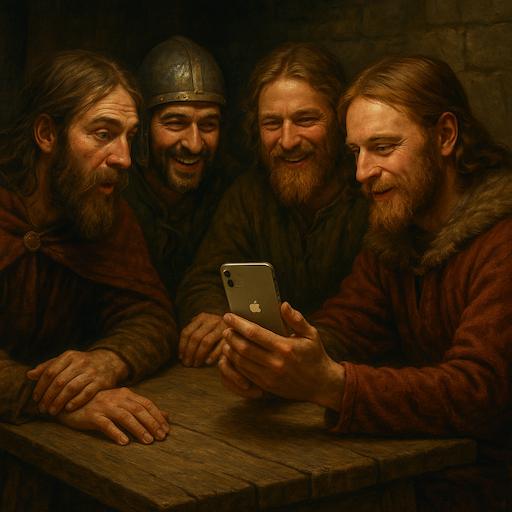
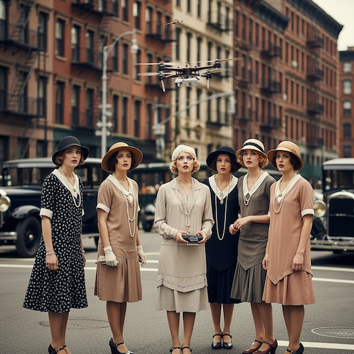
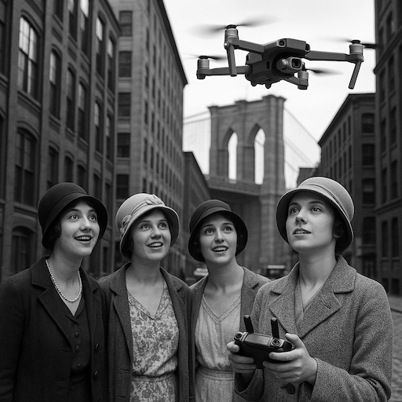
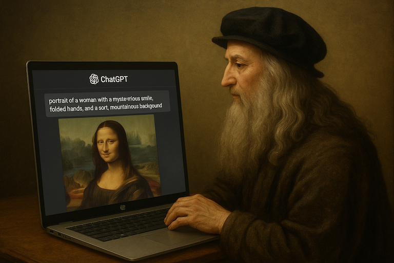
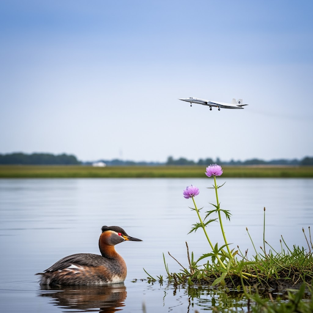
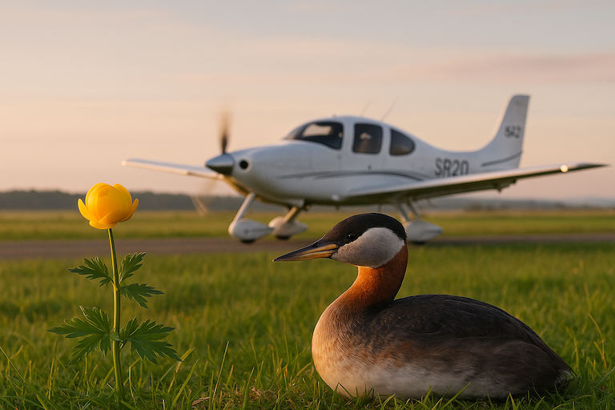
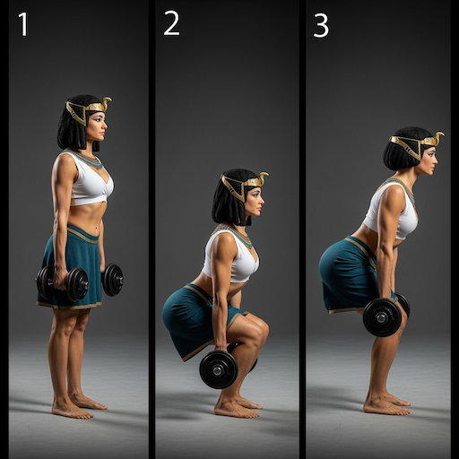
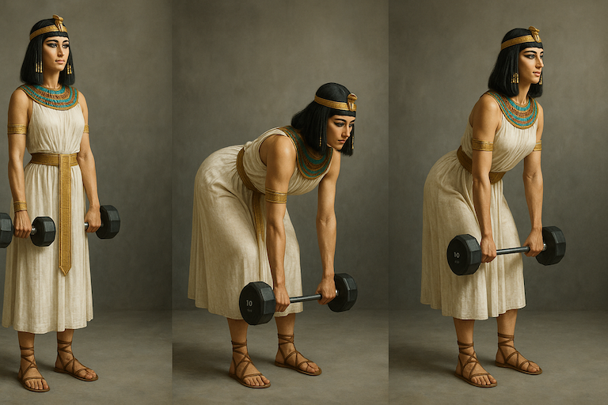

Yesterday, Google [announced](https://blog.google/technology/ai/generative-media-models-io-2025) a bunch of new generative tools at the ongoing Google I/O event. Although, at the time of writing, they're mostly unavailable outside of the USA:

* **Veo 3**: state-of-the-art video generation that can generate videos with audio. (can't access it)
* **Veo 2**: updated to include camera controls, outpainting, and adding and removing objects. (I can access Veo 2 via Gemini, but I'm not sure if these features are available)
* **Flow AI**: a filmmaking tool, which appears to be for creating videos with continuity between clips. (unavailable outside of the US)
* **SynthID Detector**: a tool for detecting the SynthID watermark that Google inject in all generated content.
* **Lyria 2**: an updated version of the music generation tool.
* **Imagen 4**: which promises a number of improvements on Imagen 3, including supporting up to 2k resolution and improved typography.

**Imagen 4** seems to be the only thing available to me right now, and only via the Gemini app. However, when generating images in Gemini, they don't mention the model name in the image outputs, I'm not sure if I'm testing Imagen 3 or 4. Also, in Google AI Studio, only **Imagen 3** is available. **Imagen 4** is available on [Fal.ai](https://fal.ai/models/fal-ai/imagen4/preview) - not sure I quite understand the logic behind that, but I do appreciate how complicated shipping products at Google's scale is.

I did a quick test of some prompts to compare **Imagen 4** to OpenAI's **gpt-image-1**, which is currently the SOTA for image gen.

TL;DR **gpt-image-1** is still the greatest for overall quality and prompt adherence, but **Imagen 4** is so absurdly fast.

---

> "A group of Mercians, from the Kingdom of Essex in the year 500, sit around a table showing each other a picture on an iPhone."

<table>
  <tr>
    <th>Imagen 4</th>
    <th>gpt-image-1</th>
  </tr>
  <tr>
    <td> Gen time: <strong>10.21s</strong></td>
    <td> Gen time: <strong>62.00s</strong></td>
  </tr>
</table>

In terms of aesthetic quality and prompt adherence, **gpt-image-1** is the clear winner. The phone is turned around the wrong way in the **Imagen 4** version, and it feels more AI-slop-esque. However, you can see that **Imagen 4** ran about 6x faster.

---

> "A group of young women, in the 1920s, watch as one of them flies a drone in the streets of Brooklyn, NYC."

<table>
  <tr>
    <th>Imagen 4</th>
    <th>gpt-image-1</th>
  </tr>
  <tr>
    <td> Gen time: <strong>9.6s</strong></td>
    <td> Gen time: <strong>47.25s</strong></td>
  </tr>
</table>

In this example, I would say this is one rare example of **Imagen 4** being better, although both are really good.

---

> "Leonardo da Vinci sits at a HP laptop, prompting ChatGPT with the text: 'portrait of a woman with a mysterious smile, folded hands, and a soft, mountainous background', the Mona Lisa is shown on screen."

<table>
  <tr>
    <th>Imagen 4</th>
    <th>gpt-image-1</th>
  </tr>
  <tr>
    <td> Gen time: <strong>8.00s</strong></td>
    <td> Gen time: <strong>58.70s</strong></td>
  </tr>
</table>

Again, while both are incredible, gpt-image-1 is nearly flawless. The text is a tiny bit off, but overall, it captured exactly the intention, and looks pretty amazing. Imagen 4 leans more towards the AI-slop aesthetic, reminiscent of earlier versions of DALL-E.

---

I read a nice paper last year did some investigation into the poor performance of rare "concepts" in AI image datasets ([No 'Zero-Shot' Without Exponential Data: Pretraining Concept Frequency Determines Multimodal Model Performance](../reference/papers/no-zero-shot-without-exponential-data-pretraining-concept-frequency-determines-multimodal-model-performance.md).

The thesis is that image classification and generation models perform much worse on rare concepts in the dataset. They created a dataset of rare concepts (at least rare in the LAION family of datasets) called [Let It Wag](let-it-wag.md). I made images with three rare concepts from the Let It Wag dataset: **red-necked grebe**, **Globeflower** and **SR-20**. Not sure how rare these are in OpenAI's or Google's dataset, but it gives some indication of how "rareness" affects the image outputs.

> "A Red-necked Grebe sits next to a Globeflower while an SR-20 aircraft prepares for take off in the distance."

<table>
  <tr>
    <th>Imagen 4</th>
    <th>gpt-image-1</th>
  </tr>
  <tr>
    <td> Gen time: <strong>8.57s</strong></td>
    <td> Gen time: <strong>57.13s</strong></td>
  </tr>
</table>

I'm no expert on Globe Flowers, Red-necked Grebes or SR-20s, but while **Imagen 4** does a really good job, it seems **gpt-image-1** is better. But only marginally. These are really impressive results. Both models can do well on even extremely rare concepts.

---

For the last test, I've tested a very specific prompt containing some complicated poses.

I enlisted GPT-4o's help to write this prompt:

> A three-frame sequence showing Egyptian queen Cleopatra performing a Romanian deadlift using dumbbells with perfect form: Frame 1 — standing tall at the top of the movement, dumbbells at her thighs; Frame 2 — at the bottom position with a flat back and slight knee bend, weights just below the knees; Frame 3 — halfway up on the return, hips driving forward, maintaining strong posture and control. Photo realistic.

<table>
  <tr>
    <th>Imagen 4</th>
    <th>gpt-image-1</th>
  </tr>
  <tr>
    <td> Image gen: <strong>5.60s</strong></td>
    <td> Image gen: <strong>71.47s</strong></td>
  </tr>
</table>

**gpt-image-1** got it usefully close. I'd say the form is nearly perfect, although Cleo goes from holding one and a half dumbbells to a barbell. I don't know what exercise **Imagen 4** is doing, but it ain't what I had in mind.

---

## Summary

I'd say **gpt-image-1** wins in 4/5 of the images, based on aesthetics and prompt adherence. However, **Imagen 4** was sometimes more than 10x faster than **gpt-image-1**. I could see **Imagen 4** being useful for rapid prototyping and exploration of ideas.
