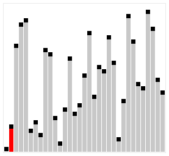

**Insertion Sort** is one of the most widely known sorting [Algorithm](algorithm.md). The algorithm iteratively compares each element with its left neighbours, shifting them one position to the right if they are greater. It has an average and worst-case run time of $O(n^2)$, so it is one of the slowest algorithms for large input sizes; however, if the list is mostly sorted, it can be one of the best-performing options.



*Image via [Wikimedia commons](https://commons.wikimedia.org/wiki/File:Sorting_insertion_sort_anim.gif).*

<iframe width="560" height="315" src="https://www.youtube.com/embed/Q1JdRUh1_98?si=7ZwTitcOrNLhU7wZ" title="YouTube video player" frameborder="0" allow="accelerometer; autoplay; clipboard-write; encrypted-media; gyroscope; picture-in-picture; web-share" referrerpolicy="strict-origin-when-cross-origin" allowfullscreen></iframe>
<br>

## Python code

```python
def insertion_sort(v):
    j = 1

    for i in range(j, len(v)):
        key = v[j]
        i = j - 1
        while i >= 0 and v[i] > key:
            v[i + 1] = v[i]
            i = i - 1
        v[i + 1] = key
        j = j + 1

    return v
```

## Time Complexity

* Worst case run-time: $O(n^2)$
* Avg run-time: $O(n^2)$
* Best case run-time: $O(n)$ (when the array is already sorted)

## Space Complexity

* $O(1)$ (in-place sorting algorithm)
