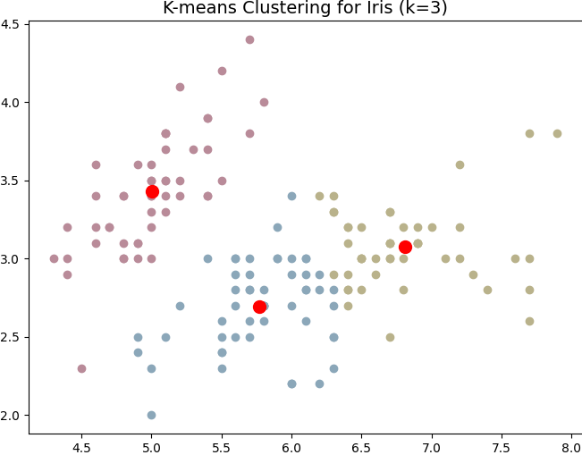

K-Means is an unsupervised [Clustering](clustering.md) algorithm and a method of [Vector Quantisation](vector-quantisation.md). The goal is to partition $n$ data points into $k$ clusters, where each data point belongs to the cluster with the closest centroid.

The algorithm works like this:

1. Standardise the data by centring at 0 to ensure all features are utilised equally for clustering.
2. Randomly create $k$ centroids—one for each cluster. Common methods include selecting $k$ random data points as centroids or randomly generating centroid coordinates.
3. Calculate the distance between each data point and the centroid. [Euclidean Distance](euclidean-distance.md) is commonly used: $\sqrt{\sum\limits_{i=0}^{n} (q_i - p_i)^2}$, where $q_i$ and $p_i$ refer to the $i_{th}$ feature of datapoint $q$ and centroid $p$, respectively. However, other distance functions may be more suitable.
4. Assign each datapoint to its closest centroid based on the calculated distances.
5. Update the position of the k centroids by taking the mean of all data points assigned to each cluster.
6. Repeat steps 4 and 5 until the centroids no longer change or a maximum number of iterations is reached.

The quality of the K-Means clustering is typically evaluated by calculating the average distance of all data points to their assigned centroids. However, K-Means does not guarantee convergence to the global minimum, and the final clustering may depend on the initial centroid positions.

