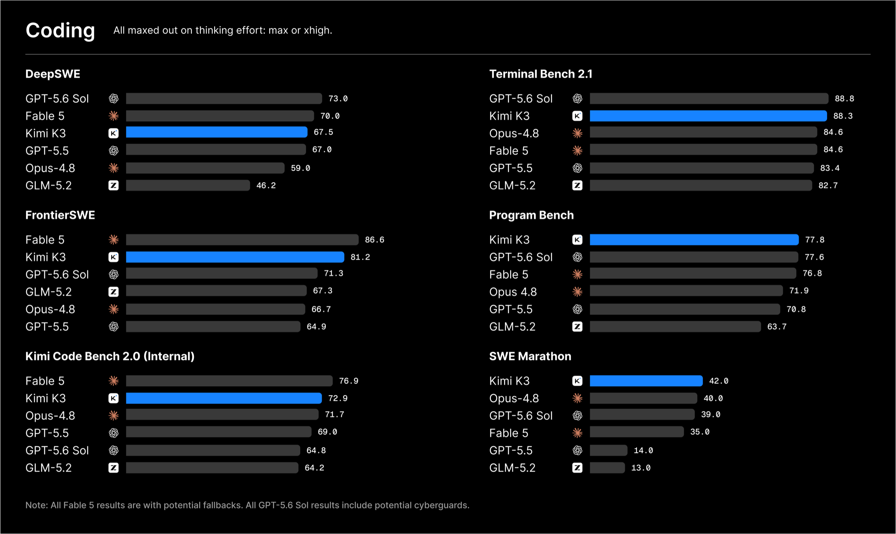
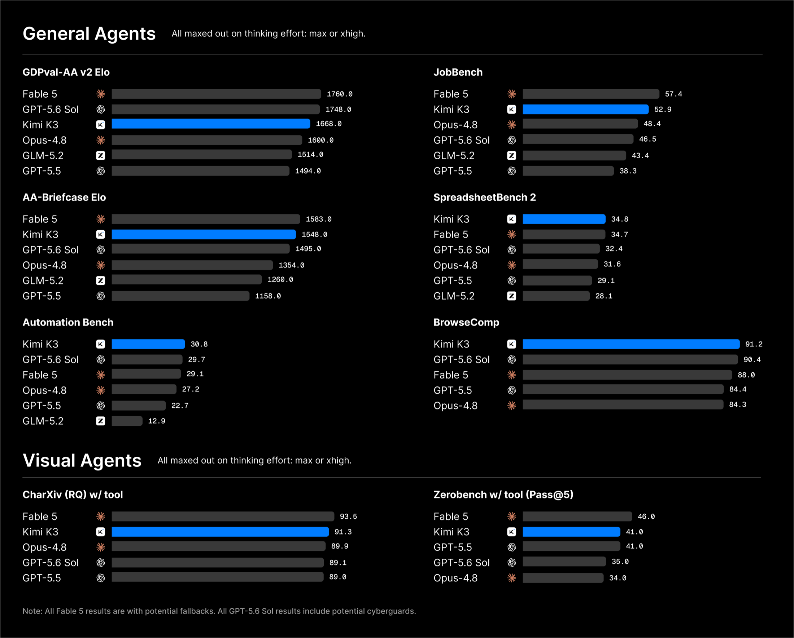

**Kimi K3** is a new 2.8-trillion-parameter native multimodal flagship [Mixture of Experts Model](mixture-of-experts-model.md) from Beijing-based Moonshot AI. It is by far the largest open-weight model released to date.

It has native vision capabilities and a 1M-token context window.

Kimi K3 is built on Kimi Delta Attention and Attention Residuals, which are intended to improve information flow across sequence length and model depth. Its Stable LatentMoE architecture activates 16 of 896 experts. Moonshot reports approximately 2.5x better overall scaling efficiency than Kimi K2.

The model launched through Kimi, Kimi Work, Kimi Code and the Kimi API. Moonshot said the full weights would be released by July 27, and they were subsequently published on [Hugging Face](https://huggingface.co/moonshotai/Kimi-K3).

## Benchmarks

Moonshot describes Kimi K3 as a frontier-level model, while acknowledging that its overall performance still trails Fable 5 and GPT 5.6 Sol.

Its published results are particularly competitive on coding and agentic tasks. Kimi K3 nearly matches GPT 5.6 Sol on Terminal-Bench 2.1, leads the listed models on Program Bench and SWE Marathon, and places second to Fable 5 on FrontierSWE.

On Moonshot's agent evaluations, Kimi K3 leads the listed models on Automation Bench, BrowseComp and SpreadsheetBench 2. Fable 5 remains ahead on GDPval-AA, AA-Briefcase and JobBench.

*Selected benchmark results published by Moonshot AI. The models sometimes use different agent harnesses, and Fable 5 results may include fallback behaviour.*

## Pricing and Cache Settings

The Kimi API lists the following prices per million tokens:

| Usage            |  Price |
| ---------------- | -----: |
| Cache-hit input  |  $0.30 |
| Input (uncached) |  $3.00 |
| Output           | $15.00 |

Definitely one of the more expensive open-weight models.

Moonshot says its official API achieves a cache-hit rate above 90% in coding workloads. This makes repeated long prompts relatively inexpensive, although output tokens are priced considerably higher than input.

At launch, Kimi K3 used max thinking effort by default. Low- and high-effort modes were planned for later updates.

## Sources

- [Kimi K3 announcement](https://www.kimi.com/blog/kimi-k3)
- [Kimi K3 model weights](https://huggingface.co/moonshotai/Kimi-K3)
- [Kimi API Platform](https://platform.kimi.ai/)
