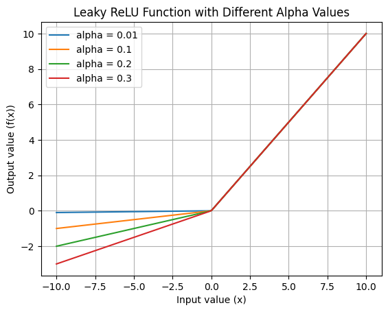

**Leaky ReLU** (Rectified Linear Unit) is a modification of the [ReLU](relu.md) activation function, which outputs a small value for negative numbers instead of 0.

The small value is generated by multiplying x with a hardcoded value like 0.1.

$$
\alpha = 0.1
$$

$$
f(x) = \begin{cases} 
    x & \text{if } x > 0 \\
    \alpha x & \text{if } x \leq 0 
\end{cases}
$$

In code:

```python
import numpy as np

def leaky_relu(x, alpha=0.1):
    return np.where(x > 0, x, alpha * x)
```

It's commonly used for training generative adversarial networks or any networks with sparse gradients. By introducing a non-zero gradient for negative values, Leaky ReLU allows the model to learn from data that standard ReLU might disregard, but at the cost of adding a hyperparameter. At $\alpha = 0$ Leaky ReLU is simply ReLU.


