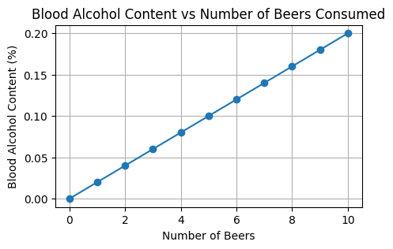

**A linear function** is represented by a straight line on a graph. It indicates a linear relationship between two variables: when one changes, the other changes constantly. For example:

- The count of floors vs number of windows on a high-rise building.
- The distance travelled vs time at a constant speed.
- The number of beers consumed vs blood alcohol content.

The general form of a linear function is: $f(x) = mx + b$ where $m$ is the *slope* of the line and $b$ is the *intercept*.

The slope, $m$, indicates how steep the line is and in which direction it points.

The point $b$ is the y-coordinate of the point where the line intercepts on the y-axis, which tells us the value of the function when $x$ is zero.