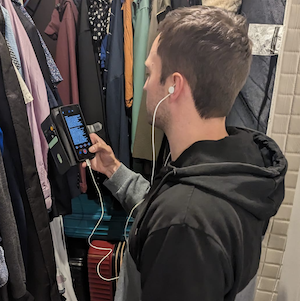
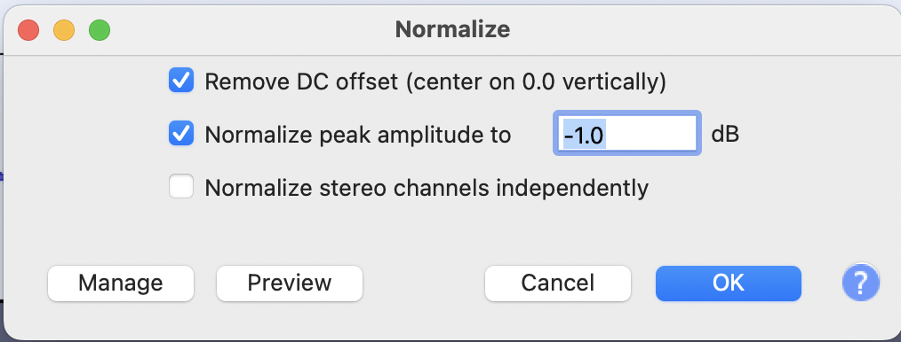
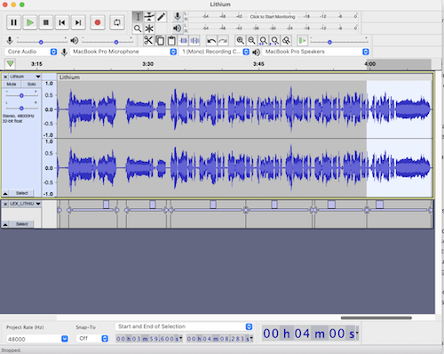
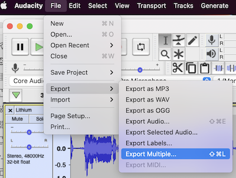

Recently, there has been a lot of talk about so-called [AI music](https://www.npr.org/2023/04/21/1171032649/ai-music-heart-on-my-sleeve-drake-the-weeknd), which in May 2023, likely refers to taking a song made by a person and applying a voice conversion model to the vocals to make it sound like Kanye, Drake, or any other artist singing the lyrics. Though if you're reading this in the future, AI music might be entirely different.

This weekend I wanted to play with this voice conversion technology to make AI covers of my own. But, instead of taking a song and making it sound like someone else was singing it, I want to do the inverse: take some tunes and have my voice cover them.

If you are eager to get straight to the point, [here is the finished product](https://www.youtube.com/watch?v=KES3UPP6pqg&list=PLYwKkLiwYbByrr1Mj4wpfMVrnTH9XeylO&index=1). Note that I have no natural singing talent, as you will see later in the article.

This article aims to give a high-level look at the technology that makes this possible and shows how I trained my voice model.

I want to share some thoughts about the implications for the music industry and society.

Let's start by looking at the ML learning system used for this.

## Singing Voice Conversion (SVC)

[Voice Conversion](https://paperswithcode.com/task/voice-conversion) is a technology that modifies the speech of a target speaker to sound like someone else. It has legitimate use cases in speech therapy, accessibility, entertainment and other fields. It has illegitimate use cases such as identity theft, fraud and starting world wars. I write a bit about the ethics of this technology later in the article.

As the name suggests, singing voice conversion or SVC is about taking source audio of a singing voice and making the voice sound like a different singer. It's just voice conversion + pitch.

The popularity of SVC has taken off in recent months, with Discord channels forming to allow people to share artist models and datasets, as well as tips for training models and inference. Social networks are full of sick AI covers, like [Biggie rapping the song N.Y. State of Mind](https://www.youtube.com/watch?v=IFb5DQHP05I) and [new bangers by Drake](https://www.youtube.com/watch?v=JSSSa62LZZY) that he had no involvement in (and are sure to be taken down).

The most widely used implementation of SVC is from a repository called [so-vits-svc](https://github.com/svc-develop-team/so-vits-svc), which is a portmanteau of the [SoftVC](https://github.com/bshall/soft-vc) encoder and [VITS](https://github.com/jaywalnut310/vits) Some alternative implements like [RVC](https://github.com/RVC-Project/Retrieval-based-Voice-Conversion-WebUI/blob/main/docs/README.en.md) exist, which improves training speed and requires less training data.

The core idea of the system at training time is to learn a representation of the speaker's voice, called an embedding, which captures the key details of the target's voice characteristics. Then at inference time, combine an embedding representation of the source speaker with the target embedding and decode it into a mel-spectrogram (a kind of image for sound) before vocoding into audio.

Though the original [so-vits-svc](https://github.com/svc-develop-team/so-vits-svc) project is now archived, many [forks](https://github.com/voicepaw/so-vits-svc-fork) have sprung up that add various functionality and simplify training and inference.

## Creating a dataset

Creating the dataset is the first step to training an SVC model on a new target voice.

You can train a new voice with around 100 clips of the target speaker's voice, each between 5-15 seconds (people commonly recommend making them ~10 seconds). You should trim excessive silence and ensure the vocals have minimal audio layers and processing.

I recorded myself singing six songs across different genres, including rap. I picked songs whose lyrics I know very well. In future, I would choose additional pieces that capture a range of timbres and pitches to improve the model. I used an app called [Voloco](https://resonantcavity.com/) record the vocals on my phone, which provides some tools for pitch correction and vocal cleaning. I recorded the songs in my closest facing towards my clothes to minimise unwanted noise (ChatGPT said it would help).



You can listen to the audio clips [here](https://soundcloud.com/5-footnothing/sets/lex-ai-training-set?si=1ff35fef8db747b4ac5c50113ecbfcb9), though a warning, I am a terrible singer with an annoying, nasally voice.

Next, I loaded each wav into Audacity and normalised them via the **Effects** menu > **Normalise**, as the recording was quiet.



Then, create and extract ~10-second clips around silence. You can highlight a region in Audacity and press Cmd + b (Ctrl + b on PC) to create a label. You don't need to add any text.



Then you can export each label as an audio clip via **File** > **Export** > **Export Multiple**.



I have a folder with about 113 clips and about 14 minutes of clean audio.

```
lex@lex-macbook-m1:~/datasets/lex> ls
LEX_ALLBLACK-01.wav		LEX_CHILDRENS_STORY-14.wav	LEX_LITHIUM-21.wav
LEX_ALLBLACK-02.wav		LEX_CHILDRENS_STORY-15.wav	LEX_LITHIUM-22.wav
# ...
lex@lex-macbook-m1:~/datasets/lex> ls -l | wc -l
113
```

Let's get to training.

## Training the model

The authors of the [so-vits-svc forks](https://github.com/voicepaw/so-vits-svc-fork) have simplified the training process. In [this Colab notebook](https://colab.research.google.com/github/34j/so-vits-svc-fork/blob/main/notebooks/so-vits-svc-fork-4.0.ipynb), you merely upload your dataset to your Google Drive and run all the cells and end up with a trained model.

Here's a breakdown of what's going on in the notebook.

1. Mount your Google Drive to access your training set.

```bash
from google.colab import drive
drive.mount('/content/drive')
```

2. Unzip the dataset to a folder called `dataset_raw`.

```bash
!mkdir -p "dataset_raw"
!unzip /content/drive/MyDrive/svc/LexDataset.zip -d dataset_raw/lex
```

3. Run the preprocessing scripts. These resample the audio to 44khz, normalise the audio and prepare the data for training.

```bash
svc pre-resample
svc pre-config
svc pre-hubert -fm dio
```

4. Train the model. You specify a path on Google Drive to dump the check points for easy resume ability.

```bash
svc train --model-path drive/MyDrive/svc/lex-20230506/logs/44k
```

I trained it for a few hours to about 2k epochs, then downloaded the weights to my local machine to perform inference.

## Transfer vocals to other songs

This idea of an AI cover is possible thanks to SVC, but also Facebook's magical source separator tool called [Demucs](https://github.com/facebookresearch/demucs). It separates songs into their stems: drums, bass, other instruments and vocals. It works unbelievably well.

In this inference example, I took a cover of Fleetwood Mac's Dreams from YouTube by a singer called [Lanie Gardney](https://www.youtube.com/watch?v=V1LhC1zGouc). The reason to use a cover version over the original is that the vocals have less layering and processing, but it still worked okay with the original song.

I split the stems using the `htdemucs_ft` model:

```bash
> demucs --device cpu --name htdemucs_ft songs/Dreams.wav
```

It is slow on a CPU but okay on a GPU. The `htdemucs` split stems about 4x faster than `htdemucs_ft`, so that's another option for a slight quality penalty.

And now I have a folder that contains the song stems:

```bash
> ls separated/htdemucs_ft/Dreams/
bass.wav	drums.wav	other.wav	vocals.wav
```

And can use the `svc infer` command to run inference using my voice model:

```bash
svc infer \
--model-path models/lex/G_2057.pth \
--config-path models/lex/config.json \
--transpose 0 \
--cluster-model-path "models/lex/means.pt" \
--cluster-infer-ratio 0.5 \
--wav_format wav \
separated/htdemucs_ft/Dreams/vocals.wav
```

The inference script takes in a few parameters that are worth paying attention to:

* `--model-path` - the path to the trained weights (a `G_*.pth` file).
* `--config-path`: the config used for training
* `--transpose` allows you to transpose the source voice before inference. Usually, you would transpose `-12` for female-to-male or `+12` for male-to-female. Although, it is incredible to hear my voice in the range of Stevie Nicks.
* `--auto-predict-f0` is an alternative to `--transpose, automatically adjusting the pitch to match the target speaker. It works amazingly for rap, but for singing, it can alter the pitch and make the vocals out of the key.
* `--cluster-model-path` and `--cluster-infer-ratio` can choose an optional clustering scheme to make the trained sound more like the target's timbre. But it makes the results less clear sounding. A fusion method can control the balance between timbre and clarity, allowing an appropriate trade-off point to be manually adjusted. 0.5 is a good starting point.

Now I have my converted vocals in the `results` folder.

Here's how they sound side-by-side against the source.

Original:

<audio controls>
  <source src="/_media/lanie-gardner-dreams-part.mp3" type="audio/mpeg">
</audio>

Transferred vocals with transpose 0 (singing in Larie's/Stevie's pitch):

<audio controls>
  <source src="/_media/lex-dreams-transpose0.mp3" type="audio/mpeg">
</audio>

Transferred vocals with transpose -12 (probably closer to my range, if I could sing):

<audio controls>
  <source src="/_media/lex-dreams-transpose-12.mp3" type="audio/mpeg">
</audio>

And just for good measure, here's me trying to sing it without any autotune (warning: it is bad. I swear I did my best here):

<audio controls>
  <source src="/_media/lex-singing-dreams-no-ai.mp3" type="audio/mpeg">
</audio>

Then I added the stems and my new vocals into a Logic Pro project and applied these effects:

* a noise gate to clean out some artefacts.
* eq to reduce some noisy parts and remove sub rumble.
* compressor to flatten the peaks
* reverb and delay, which masks imperfections.

And here's the [finished song on YouTube](https://www.youtube.com/watch?v=KES3UPP6pqg).

I also tried my voice on my wife's favourite Taiwanese band, Mayday, and [it worked well](https://www.youtube.com/watch?v=MrNbKMLbZ4E).

I tried transferring to rap, and it had mixed results. I thought [Regulate](https://www.youtube.com/watch?v=QBj_feKDG-0) worked pretty well.

In future, I'm planning to run some additional experiments:

* experiment with smaller/larger datasets.
* experiment with just speaking training data transferring to rap and singing.
* trying non-human voices. I'm keen to hear how my dog sounds singing the classics.

## The implications of this for the music industry

I want to finish the article by giving my two cents on the implications for the music industry, as an uninformed layperson.

Will this effectively destroy the music industry as we know it? Probably not.

Most uploaded AI covers are already tagged and monetised as per any streaming platform, so it's more streaming engagement for labels.

The songs made by unknown producers, using a famous person like Drake's vocal to get publicity, will likely get taken down for now as they a) violate the artist [right to publicity](https://www.tiktok.com/@lawyerdrummer/video/7223492225462783238) and b) trained on a corpus such that it violates [copyright law](https://edition.cnn.com/2023/04/18/tech/universal-music-group-artificial-intelligence/index.html). Eventually, I think social networks will automatically classify SVC vocals and offer to remove the offending material or compensate the label, and the labels will go back to the BAU monetisation system for working with streaming services.

Some artists are already starting to monetise their voice models. Grimes already set up [a tool](https://www.musicradar.com/news/grimes-ai-voice-model) to use her AI voice in exchange for a 50% proceeds split.

The reality is that people will likely get sick of the deep fake music, and I imagine the fad will die off and be mostly forgotten as we enter the next phase of AI music, whatever that is.

The next question is: if anyone can sing in perfect pitch, does that invalidate natural talent?

Again, probably not. There's more to music than the audio file; people want to connect to a person with a story. Human's will always have a role to play in music for other humans.

[Chess is more popular than ever](https://qz.com/work/1329974/jobs-and-ai-if-you-are-worried-about-human-obsolescence-consider-chess); even though AI mastered it in the 80s.

## The ethics of deep fakes

The true implication of this tech, and deep fakes in general, is that we can no longer trust voice (and video) recordings without sufficient verification of authenticity.

If you have a bank using voice recognition technology to authorise you, I recommend turning off this feature immediately or changing banks if you cannot.

Voice conversion isn't a technology of the future; it's a technology of the present. As you can see from the simplicity of training a model, this technology is available to everyone, regardless of technical capability.

Perhaps, we should be wary of how much of our audio we publicly release to the world?

Now that we know the potential for misuse of this technology, we must educate our family and friends about the potential for fakers to scam us.

Verify and check everything you hear.

## Conclusion

I created a decent model with minimal effort that sounded like I could sing across languages with perfect pitch. This technology is super easy to use and will only get easier. The music industry will be fine - they will cash in on this technology, and the demand for human-made music will continue. Still, deep fakes will be an increasingly significant problem for society, and we should be aware of how capable the tools are right now.
