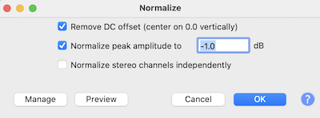

Recently, there has been a lot of talk about so-called [AI music](https://www.npr.org/2023/04/21/1171032649/ai-music-heart-on-my-sleeve-drake-the-weeknd). At the time of writing, this refers to taking a song made by a person and applying a voice conversion model to the vocals to make it sound like Kanye, Drake, or any other artist singing the lyrics.

I won't bother linking to specific examples of AI music, as most of them will likely get taken down over time, as they are legally problematic for two reasons:

* a) they are unauthorised deep fakes that violate a musician's [right to publicity](https://www.tiktok.com/@mordy4prez/video/7223186484151749934). (I'm not a lawyer - this could be incorrect.
* b) are primarily trained on catalogues of music owned by record labels, which violates [copyright law](https://edition.cnn.com/2023/04/18/tech/universal-music-group-artificial-intelligence/index.html)

But still, you can find them all over YouTube and TikTok by searching `ai music` or `ai covers`.

If you're reading this sometime in the future, AI music might be something entirely different, like [Midjourney](https://beatbot.fm) (disclaimer: the link is to a product built by a company called Splash, which I am the CTO) for music.

---

This weekend I wanted to play with this voice conversion technology to make AI covers of my own. But, instead of taking a song and making it sound like someone else was singing it, I want to do the inverse: take some tunes and have my voice cover them.

If you are eager to get straight to the point, here is the finished product.


Note that I have no natural talent for singing and a minimal range, as you will see later in the article.

---

This article aims to give a high-level look at the technology that makes this possible and shows how I trained my voice model. It was straightforward.

Let's start by looking at the ML learning system used for this.

## Singing Voice Conversion (SVC)

[Voice Conversion](https://paperswithcode.com/task/voice-conversion) is a technology that modifies the speech of a target speaker to sound like someone else. It has legitimate use cases in speech therapy, accessibility, entertainment and other fields. It has illegitimate use cases such as identity theft, fraud and starting world wars. I will comment on the ethics of this technology later in the article.

As the name suggests, singing voice conversion or SVC is about taking a source *singing* audio and making it sound like someone else.

The popularity of SVC has taken off in recent months, with Discord channels forming to allow people to share artist models and datasets, as well as tips for training models and inference.

The most popular implementation of SVC is from a repository called [so-vits-svc](https://github.com/svc-develop-team/so-vits-svc), which is a portmanteau of the [SoftVC](https://github.com/bshall/soft-vc) encoder and [VITS](https://github.com/jaywalnut310/vits), though, the authors replaced SoftVC with ContentVec in the latest version, 4. Some alternative implements like [RVC](https://github.com/RVC-Project/Retrieval-based-Voice-Conversion-WebUI/blob/main/docs/README.en.md) exist, which improves training speed and requires less training data. However, it has some disadvantages when dealing with lower-quality source audio: SoVITS is a good starting point.

The core idea of the system is to take a source speech signal, extract source audio speech features, including pitch and intonations and transform it into a target speech signal.

Though the original [so-vits-svc](https://github.com/svc-develop-team/so-vits-svc) project is now archived, many [forks](https://github.com/voicepaw/so-vits-svc-fork) have sprung up that add various functionality and simplify training and inference.

Creating the dataset is the first step to training an SVC model on a new target voice.

## Create a dataset

You can train a new voice with around 100 clips of the target speaker's voice, each between 5-15 seconds (people commonly recommend making them ~10 seconds). You should trim excessive silence and ensure the vocals have minimal audio layers and processing. 

I recorded myself singing six songs across different genres, including rap. I picked songs whose lyrics I know very well, but in future, I would choose additional pieces that capture a range of timbres and pitches to improve the model.

I used an app called [Voloco](https://resonantcavity.com/) to record the vocals on my phone, which provides some tools for pitch correction and vocal cleaning. I recorded the songs in my closest facing towards my close to minimise the echoes and unwanted noise.

*pic*

You can listen to the audio clips [here](https://soundcloud.com/5-footnothing/sets/lex-ai-training-set?si=1ff35fef8db747b4ac5c50113ecbfcb9), though a warning, I am a terrible singer with an annoying voice.

Next, I loaded each wav into Audacity and normalised them via the **Effects** menu > **Normalise**, as the recording was quiet.



Next, to create and extract ~10-second clips around silence. You can highlight a region in Audacity and press Cmd + b (Ctrl + b on PC) to create a label. You don't need to add any text.


Then you can export each label as an audio clip via File > Export Multiple.


I have a folder with about 113 clips and about 14 minutes of clean audio.

```
lex@lex-macbook-m1:~/Dropbox/svc/Datasets/LexRapAndSing> ls -l | tail
-rw-r--r--@ 1 lex  staff  1030346  6 May 15:19 LEX_PASSIONFRUIT-01.wav
-rw-r--r--@ 1 lex  staff  1137050  6 May 15:19 LEX_PASSIONFRUIT-02.wav
-rw-r--r--@ 1 lex  staff  2348418  6 May 15:19 LEX_PASSIONFRUIT-03.wav
-rw-r--r--@ 1 lex  staff  1937766  6 May 15:19 LEX_PASSIONFRUIT-04.wav
-rw-r--r--@ 1 lex  staff  1940414  6 May 15:19 LEX_PASSIONFRUIT-05.wav
-rw-r--r--@ 1 lex  staff   162786  6 May 15:19 LEX_PASSIONFRUIT-06.wav
-rw-r--r--@ 1 lex  staff  2334638  6 May 15:19 LEX_PASSIONFRUIT-07.wav
-rw-r--r--@ 1 lex  staff  2413502  6 May 15:19 LEX_PASSIONFRUIT-08.wav
-rw-r--r--@ 1 lex  staff  1987614  6 May 15:19 LEX_PASSIONFRUIT-09.wav
-rw-r--r--@ 1 lex  staff  1963956  6 May 15:19 LEX_PASSIONFRUIT-10.wav
```

Let's get to training.

## Training the model

The authors of the [so-vits-svc forks](https://github.com/voicepaw/so-vits-svc-fork) have made the training process so easy. In [this Colab notebook](https://colab.research.google.com/github/34j/so-vits-svc-fork/blob/main/notebooks/so-vits-svc-fork-4.0.ipynb), you merely upload your dataset to your Google Drive and run all the cells and end up with a trained model.

Here's a breakdown of what's going on in the notebook.

1. Mount your Google Drive to access your training set.

```bash
from google.colab import drive
drive.mount('/content/drive')
```

2. Unzip the dataset to a folder called `dataset_raw`.

```bash
!mkdir -p "dataset_raw"
!unzip /content/drive/MyDrive/svc/LexDataset.zip -d dataset_raw/lex
```

3. Run the preprocessing scripts, which resample the waves to 44khz, normalise the audio and prepare for training.

```bash
svc pre-resample
svc pre-config
svc pre-hubert -fm dio
```

4. Then train the model as follows, specify a path on Google Drive to dump the checks points for easy resume ability:

```bash
svc train --model-path drive/MyDrive/svc/lex-20230506/logs/44k
```

I trained it for a few hours to about 2k epochs, then downloaded the weights to my local machine to perform inference.

## Transfer vocals to other songs

Some AI covers take an existing song and change the vocals. Thanks to the magical source separator tool by Facebook called [Demucs](https://github.com/facebookresearch/demucs), they can do that. It is unbelievable how well this works.

In this inference example, I took a cover of Fleetwood Mac's Dreams from YouTube by a singer called [Lanie Gardney](https://www.youtube.com/watch?v=V1LhC1zGouc). The reason to use a cover version over the original is that the vocals have less layering and processing, but it still worked okay with the original song.

I split the stems using the `htdemucs_ft` model:

```
> demucs --device cpu --name htdemucs_ft songs/Dreams.wav
```

It is pretty slow on a CPU but much faster on the GPU. The `htdemucs` split stems about 4x faster than `htdemucs_ft`, so that's another option for a slight quality penalty.

And now I have a folder that contains the song stems:

```
> ls separated/htdemucs_ft/Dreams/
bass.wav	drums.wav	other.wav	vocals.wav
```

And can use the `svc infer` command to run inference using my voice model:

```
svc infer \
--transpose 0 \
--model-path models/lex/G_2057.pth \
--config-path models/lex/config.json \

separated/htdemucs_ft/Dreams/vocals.wav
```
The inference script takes in a few parameters that are worth paying attention to:

* `--transpose` allows you to transpose the source voice before inference. Usually you would transpose `-12` for female-to-male, or `+12` for male-to-female. Although, it is pretty incredible to hear my voice in the range of Stevie Nicks (covered by Lanie Gardney, who also has a remarkable voice).
* `--auto-predict-f0` is an alternative to `--transfose`, which automatically adjusts the pitch to match the target speaker. It works amazingly for rap, but for singing, it can alter the pitch and make the vocals out of the key.
* `--f0-method` is the method of performing 
* `--model-path` the path to the `G_*.pth` file
* `--cluster-model-path`

Now I have my converted vocals in the `results` folder.

Here's how they sound side-by-side against the source:

Original:


Transferred vocals with transpose 0 (singing in Larie's/Stevie's pitch)


Transferred vocals with transpose -12 (probably closer to my range, if I could sing)


And just for good measure, here's me trying to sing it without any autotune (warning: it sounds terrible)


Then I added the stems and my new vocals into a Logic Pro project and applied some effects the vocals:

* a noise gate to clean out some artefacts.
* eq to reduce some noisy parts and remove sub rumble.
* compressor to flatten out the peaks
* reverb and delay, which masks imperfections.

And here's the finished song on YouTube.

I tried transferring to rap and it sounds great:

I even tried transferring to my wife's favorite Taiwenese band, Mayday, and as a native Mandarine speaker, she confirms the results are near perfect:

In future, I'm planning to run some additional experiments:

* find the minimal amount of data required to get a good result
* transferring using just speaking data to singing and rapping.
* trying non-human voices. I'm keen to hear how my dog sounds singing the classics.

I want to finish the article by giving my two cents on the implications for the music industry and ethics.

## The implications of this for the music industry

Will this effectively destroy the music industry as we know it? Probably not.

This particular trend of replacing voices will likely have a short shelf life. People will get sick of them, and I imagine that labels will start working with artists to create their authorised voice models, with some artists like [Grimes](https://consequence.net/2023/05/grimes-ai-generated-song-voice/) already producing and selling access to her official voice model.

Making a classifier to detect modified vocals should be pretty easy, and social networks may instead choose to use it to compensation the artist (let's be honest, the labels), or block them entirely.

The next question is: if anyone can sing in perfect pitch, does that invalidate natural talent? Again, probably not. There's more to music than the audio file; people want to connect to the artist and engage with other fans. The artist's story has a role to play.

Also, apparently, there's a bigger demand than [ever for watching humans play chess](https://qz.com/work/1329974/jobs-and-ai-if-you-are-worried-about-human-obsolescence-consider-chess), even though AI mastered it many years ago.

## The ethics of deep fakes

The true implication of this tech, and deep fakes in general, is we can no longer trust voice (and video) recordings without some kind of verification step.

If you have a bank that is using voice recognition technology to authorise you, I would recommend changing banks or turning off this feature immediately.

This isn't a technology of the future, this a technology of the present, and as you can see from the simplicity of training a model, it isn't reserved for software developers or machine laerning engineers, it is technology available to anyone.

Perhaps, we should be weary of how much of our own audio we publically release to the world? We should definitely be wearing of trusting what we hear. 

Now that you are aware of the potential for misuse of this technology, it's up to us to educate our family and friends for the and the potential for fakers to scam us. Verify and check everything you hear.

## Conclusion

With minimal effort, I was able to create a decent model that made it sound like I could sing with perfect pitch. This technology is super easy to use, and will only get easier. The music industry will be fine - they will cash in on this technology and the demand for human-made music will continue to exist, but deep fakes are going to be an increasingly large problem for society and we should be aware of how capable the tools are now.