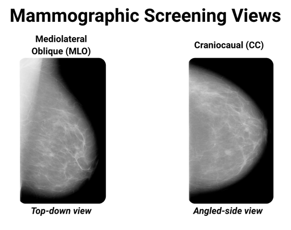
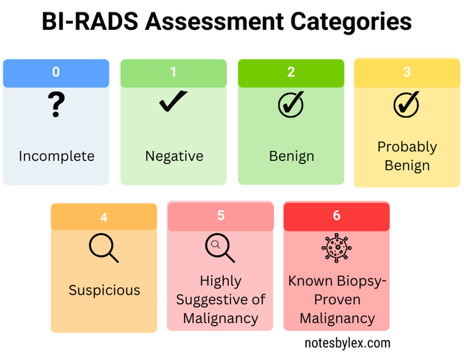
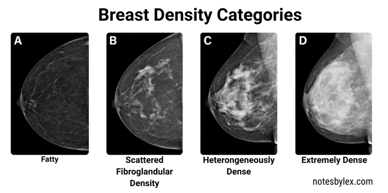

As part of my final project for my BSc, I worked on Breast Cancer Detection. This note was made while doing background research for that topic. See topic #BreastCancerDetection

X-ray **Mammography** is a breast cancer screening method and remains one of the more effective population-wide tools for early detection of Breast Cancer [^1]. The breast is compressed between two plates to spread tissue evenly and reduce motion blur. A typical screening exam records two views of the breast: [Caniocaudal (CC)](../../../permanent/caniocaudal-cc.md), a top-to-bottom view, and [Mediolateral (MLO)](../../../permanent/mediolateral-mlo.md), a side view.

When reading a mammogram, a radiologist looks for specific abnormalities: masses, calcifications, distortion of breast tissue, or asymmetries when comparing the two breasts and two views.

To standardise reporting, radiologists use the [Breast Imaging Reporting and Data System (BI-RADS)](../../../permanent/breast-imaging-reporting-and-data-system.md), which assigns a category from 0 to 6 indicating level of suspicion: 0 (incomplete—additional imaging needed), 1 (negative), 2 (benign), 3 (probably benign—short-interval follow-up suggested), 4 (suspicious—biopsy should be considered), 5 (highly suggestive of malignancy), and 6 (known biopsy-proven malignancy). Categories 4 and 5 typically warrant biopsy to confirm or rule out cancer.

Radiologists also classify breast composition by density using four categories: A (almost entirely fatty), B (scattered fibroglandular densities), C (heterogeneously dense), and D (extremely dense). Higher breast density both increases breast cancer risk and reduces mammographic sensitivity, as dense tissue appears white on mammograms (the same appearance as potential tumours) effectively masking lesions.

## References

[^1] Misra S, Solomon NL, Moffat FL, Koniaris LG. Screening criteria for breast cancer. Adv Surg. 2010;44:87-100. doi: 10.1016/j.yasu.2010.05.008. PMID: 20919516.