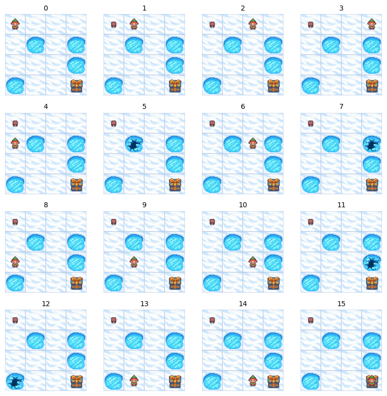

A **Markov Decision Process (MDP)** is a mathematical framework for modelling decision-making problems where outcomes are partly random and partly controlled by a decision-maker. The goal is to find an optimal policy that maximizes cumulative reward over time.

The Frozen Lake environment in the [gymnasium](https://gymnasium.farama.org/) library provides an excellent visualization of an MDP. In this environment, an agent navigates a frozen lake with slippery surfaces, where taking an action (like moving left) doesn't guarantee the intended movement due to environmental uncertainty.

MDPs form the theoretical foundation for many [Reinforcement Learning](reinforcement-learning.md) algorithms, enabling theoretical understanding and practical implementation of RL solutions.

## Core Components

MDPs assume the [Markov Property](markov-property.md), which states that future states depend only on the current state and action, not on the history:

$$
P(s_{t+1} \mid s_t, a_t, s_{t-1}, a_{t-1}, \dots, s_0, a_0) = P(s_{t+1} \mid s_t, a_t)
$$

A Markov Decision Process consists of 4 main components:

### State Space

The **state space** (or **observation space**) encompasses all possible states a system can occupy. The agent observes the current state before deciding on an action.

Frozen Lake has 16 possible states in the standard 4×4 grid. You can access the observation space via `env.observation_space` in the gymnasium.



### Actions

**Actions** represent the set of all possible moves available to the agent. In the Frozen Lake example, each state has four possible actions:

* 0: Move left
* 1: Move down
* 2: Move right
* 3: Move up


You can access the available actions in the gymnasium via `env.action_space`.

### Transition Probabilities

**Transition probabilities** define the likelihood of moving to a new state $s'$ given that the agent takes action $a$ in state $s$. This is denoted as:

$$
P(s' \mid s, a)
$$

In Frozen Lake, transitions can be stochastic (slippery) or deterministic, depending on the environment configuration. In the default slippery version, actions have probabilistic outcomes. For example, choosing to move right may result in:

- 1/3 probability of moving right (intended direction)
- 1/3 probability of moving up
- 1/3 probability of moving down

This stochasticity models the uncertainty of moving on a slippery surface.

### Reward Function

The **reward function** $R(s, a, s')$ provides a numeric reward upon transitioning from state $s$ to state $s'$ after taking action $a$.

In Frozen Lake, the reward structure is:

- Reach goal: +1
- Reach hole: 0
- Reach frozen tile: 0

The rewards are sparse in this environment, with the agent only receiving a positive reward (+1) upon reaching the goal. This sparsity makes learning more challenging and reflects many real-world problems with limited feedback.

## Solving MDPs

To solve an MDP, we need two additional concepts:

### Policy

A **policy** ($\pi$) is the agent's strategy for deciding which action to take in each state. It can be:

- **Deterministic**: $\pi(s) = a$ (maps each state to a specific action)
- **Stochastic**: $\pi(a|s) = P(a|s)$ (maps each state to a probability distribution over actions)

Here's a simple random policy implementation for the Frozen Lake environment:

```python
import gymnasium as gym

env = gym.make('FrozenLake-v1')

def random_policy(state):
    return env.action_space.sample()

state, info = env.reset()
terminated, truncated = False, False

while not (terminated or truncated):
    action = random_policy(state)
    next_state, reward, terminated, truncated, info = env.step(action)
    
    print(f"State: {state}, Action: {action}, Reward: {reward}, Next state: {next_state}")
    
    state = next_state
```

An optimal policy maximizes the expected cumulative reward.

### Discount Factor

The **discount factor** $\gamma$ (gamma) is a parameter between 0 and 1 that determines how much the agent values future rewards relative to immediate ones. It's used in calculating expected returns:

$$
G_t = R_{t+1} + \gamma R_{t+2} + \gamma^2 R_{t+3} + \dots = \sum_{k=0}^{\infty} \gamma^k R_{t+k+1}
$$

Where:

- A $\gamma$ close to 0 makes the agent myopic (short-sighted), primarily valuing immediate rewards.
- A $\gamma$ close to 1 makes the agent far-sighted, strongly valuing future rewards.

For Frozen Lake, a discount factor of around 0.9 to 0.99 is typically chosen, as reaching the goal requires planning several steps ahead.

## Algorithms to Solve MDPs

Various algorithms can solve MDPs by finding the optimal policy or value functions:

### Dynamic Programming Methods

* **[Value Iteration](Value%20Iteration.md)**
    * An iterative algorithm that computes the optimal state-value function by repeatedly applying the Bellman optimality equation.
    * Converges to the optimal value function, from which an optimal policy can be derived.

* **Policy Iteration**
    * Alternates between policy evaluation (computing the value function for the current policy) and policy improvement (making the policy greedy with respect to the current value function).
    * Often more efficient than value iteration for certain problems.

### Model-Free Methods

* **[Q-Learning](../../../permanent/q-learning.md)**
    * A model-free reinforcement learning algorithm that learns the optimal action-value function directly from experience.
    * Does not require knowledge of transition probabilities or rewards.
* **SARSA (State-Action-Reward-State-Action)**
    * An on-policy learning algorithm that updates Q-values based on the action actually taken rather than the greedy action.

Understanding MDPs provides a solid foundation for more advanced reinforcement learning concepts and applications, from game playing to robotics and autonomous systems.