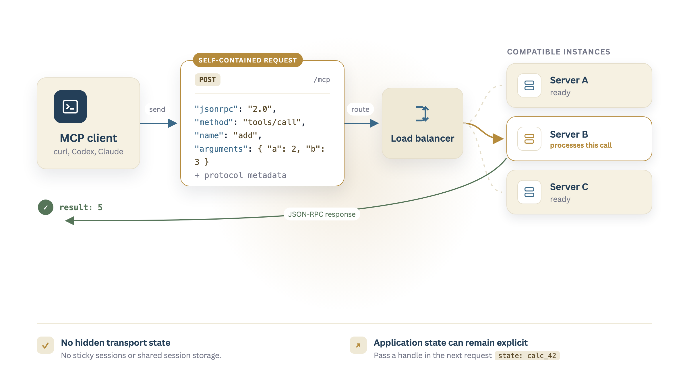

**Stateless MCP** is the new stateless protocol core for [MCP](mcp.md) introduced in the [2026-07-28 Specification](https://blog.modelcontextprotocol.io/posts/2026-07-28/).

The original MCP specification described a handshake protocol that started with an `initialize` request, which the client and the server used to agree on the protocol version and capabilities, and finished with an `initialized` notification.

That's all gone now in the new spec.

Clients can just call the MCP tools they want immediately. If they need to know what capabilities a server has, there's a new optional `server/discover` RPC method.

Basically, stateless MCP looks a lot more like a typical [JSON-RPC](json-rpc.md) API, but with a few helpful standards for server and tool discovery, multi-round-trip requests and optional extensions for long-running tasks. It also supports Streamable HTTP, where the client sends each MCP message as a separate `POST` request.

Stateless servers are a lot easier to host and manage. For one thing, they don't require sticky load balancing or shared session storage.



The protocol is stateless, but the application doesn't have to be. A tool can return an explicit state handle and the model can pass it to later calls.

The Python SDK uses `/mcp` as the default endpoint, and the message body uses JSON-RPC. There are `Mcp-Method` and `Mcp-Name` headers to identify the request and help with routing and authorisation.

## Building a stateless MCP server

I'm going to construct a basic MCP server and client so we can see exactly what it looks like.

### Server

This example uses version 2 of the official MCP [Python SDK](https://github.com/modelcontextprotocol/python-sdk) for the server. It uses `curl` for the client.

Let's start with a trivial example of a calculator that can only add numbers.

I'll create a new instance of an `MCPServer`, add a single tool called `add` and then set a few server options:

- `stateless_http=True` disables transport session tracking.
- `json_response=True` makes the server return a JSON object instead of an SSE stream.

This starts the server in the background:

```bash
uv run --with 'mcp>=2,<3' python - >/tmp/stateless-mcp.log 2>&1 <<'PY' &
from mcp.server import MCPServer

mcp = MCPServer("Calculator")

@mcp.tool()
def add(a: int, b: int) -> int:
    """Add two numbers."""
    return a + b

mcp.run(
    transport="streamable-http",
    port=3001,
    stateless_http=True,
    json_response=True,
)
PY

sleep 2
echo "Server running at http://127.0.0.1:3001/mcp"
```
<!-- nb-output hash="050a09ad2ada1807" format="html" -->
<div class="nb-output">
<pre class="nb-stream-stdout">Server running at http://127.0.0.1:3001/mcp
</pre>
</div>
<!-- /nb-output -->

Note that `uv run` lets us run a simple command without manually creating an environment.

### Client

The `tools/call` method allows us to call a known tool directly.

```bash
curl --silent --show-error http://127.0.0.1:3001/mcp \
  -H 'Content-Type: application/json' \
  -H 'Accept: application/json, text/event-stream' \
  -H 'MCP-Protocol-Version: 2026-07-28' \
  -H 'Mcp-Method: tools/call' \
  -H 'Mcp-Name: add' \
  --data '{
    "jsonrpc": "2.0",
    "id": 1,
    "method": "tools/call",
    "params": {
      "name": "add",
      "arguments": {"a": 2, "b": 3},
      "_meta": {
        "io.modelcontextprotocol/protocolVersion": "2026-07-28",
        "io.modelcontextprotocol/clientInfo": {
          "name": "curl",
          "version": "1.0"
        },
        "io.modelcontextprotocol/clientCapabilities": {}
      }
    }
  }' | python3 -m json.tool
```
<!-- nb-output hash="7df648bca06acadb" format="html" -->
<div class="nb-output">
<pre class="nb-stream-stdout">{
    &quot;jsonrpc&quot;: &quot;2.0&quot;,
    &quot;id&quot;: 1,
    &quot;result&quot;: {
        &quot;content&quot;: [
            {
                &quot;text&quot;: &quot;5&quot;,
                &quot;type&quot;: &quot;text&quot;
            }
        ],
        &quot;isError&quot;: false,
        &quot;resultType&quot;: &quot;complete&quot;,
        &quot;structuredContent&quot;: {
            &quot;result&quot;: 5
        },
        &quot;_meta&quot;: {
            &quot;io.modelcontextprotocol/serverInfo&quot;: {
                &quot;name&quot;: &quot;Calculator&quot;,
                &quot;version&quot;: &quot;&quot;
            }
        }
    }
}
</pre>
</div>
<!-- /nb-output -->

The server returns `5` in an MCP tool result.

We can also use the `server/discover` method to see what the server supports. The request uses the same minimal `_meta` object as the tool call.

```bash
curl --silent --show-error http://127.0.0.1:3001/mcp \
  -H 'Content-Type: application/json' \
  -H 'Accept: application/json, text/event-stream' \
  -H 'MCP-Protocol-Version: 2026-07-28' \
  -H 'Mcp-Method: server/discover' \
  --data '{
    "jsonrpc": "2.0",
    "id": 2,
    "method": "server/discover",
    "params": {
      "_meta": {
        "io.modelcontextprotocol/protocolVersion": "2026-07-28",
        "io.modelcontextprotocol/clientInfo": {
          "name": "curl",
          "version": "1.0"
        },
        "io.modelcontextprotocol/clientCapabilities": {}
      }
    }
  }' | python3 -m json.tool
```
<!-- nb-output hash="08d4041cafb2add0" format="html" -->
<div class="nb-output">
<pre class="nb-stream-stdout">{
    &quot;jsonrpc&quot;: &quot;2.0&quot;,
    &quot;id&quot;: 2,
    &quot;result&quot;: {
        &quot;cacheScope&quot;: &quot;private&quot;,
        &quot;capabilities&quot;: {
            &quot;prompts&quot;: {
                &quot;listChanged&quot;: true
            },
            &quot;resources&quot;: {
                &quot;listChanged&quot;: true,
                &quot;subscribe&quot;: true
            },
            &quot;tools&quot;: {
                &quot;listChanged&quot;: true
            }
        },
        &quot;resultType&quot;: &quot;complete&quot;,
        &quot;supportedVersions&quot;: [
            &quot;2026-07-28&quot;
        ],
        &quot;ttlMs&quot;: 0,
        &quot;_meta&quot;: {
            &quot;io.modelcontextprotocol/serverInfo&quot;: {
                &quot;name&quot;: &quot;Calculator&quot;,
                &quot;version&quot;: &quot;&quot;
            }
        }
    }
}
</pre>
</div>
<!-- /nb-output -->

This tells us that the server supports tools. It does not list the individual `add` tool. A client can call `tools/list` if it needs the tool names and schemas.

```bash
curl --silent --show-error http://127.0.0.1:3001/mcp \
  -H 'Content-Type: application/json' \
  -H 'Accept: application/json, text/event-stream' \
  -H 'MCP-Protocol-Version: 2026-07-28' \
  -H 'Mcp-Method: tools/list' \
  --data '{
    "jsonrpc": "2.0",
    "id": 3,
    "method": "tools/list",
    "params": {
      "_meta": {
        "io.modelcontextprotocol/protocolVersion": "2026-07-28",
        "io.modelcontextprotocol/clientInfo": {
          "name": "curl",
          "version": "1.0"
        },
        "io.modelcontextprotocol/clientCapabilities": {}
      }
    }
  }' | python3 -m json.tool
```
<!-- nb-output hash="dd63c25ac06c3cd5" format="html" -->
<div class="nb-output">
<pre class="nb-stream-stdout">{
    &quot;jsonrpc&quot;: &quot;2.0&quot;,
    &quot;id&quot;: 3,
    &quot;result&quot;: {
        &quot;cacheScope&quot;: &quot;private&quot;,
        &quot;resultType&quot;: &quot;complete&quot;,
        &quot;tools&quot;: [
            {
                &quot;description&quot;: &quot;Add two numbers.&quot;,
                &quot;inputSchema&quot;: {
                    &quot;type&quot;: &quot;object&quot;,
                    &quot;properties&quot;: {
                        &quot;a&quot;: {
                            &quot;title&quot;: &quot;A&quot;,
                            &quot;type&quot;: &quot;integer&quot;
                        },
                        &quot;b&quot;: {
                            &quot;title&quot;: &quot;B&quot;,
                            &quot;type&quot;: &quot;integer&quot;
                        }
                    },
                    &quot;required&quot;: [
                        &quot;a&quot;,
                        &quot;b&quot;
                    ],
                    &quot;title&quot;: &quot;addArguments&quot;
                },
                &quot;name&quot;: &quot;add&quot;,
                &quot;outputSchema&quot;: {
                    &quot;properties&quot;: {
                        &quot;result&quot;: {
                            &quot;title&quot;: &quot;Result&quot;,
                            &quot;type&quot;: &quot;integer&quot;
                        }
                    },
                    &quot;required&quot;: [
                        &quot;result&quot;
                    ],
                    &quot;title&quot;: &quot;addOutput&quot;,
                    &quot;type&quot;: &quot;object&quot;
                }
            }
        ],
        &quot;ttlMs&quot;: 0,
        &quot;_meta&quot;: {
            &quot;io.modelcontextprotocol/serverInfo&quot;: {
                &quot;name&quot;: &quot;Calculator&quot;,
                &quot;version&quot;: &quot;&quot;
            }
        }
    }
}
</pre>
</div>
<!-- /nb-output -->

There is our `add` tool, including the input and output schemas generated from the Python types.

### Stop the server

```bash
kill "$(lsof -tiTCP:3001 -sTCP:LISTEN)"
echo "Server stopped"
```
<!-- nb-output hash="4c9e32219050bfb7" format="html" -->
<div class="nb-output">
<pre class="nb-stream-stdout">Server stopped
</pre>
</div>
<!-- /nb-output -->

An MCP request is now a self-contained unit of work. Any compatible server instance can process the request and the server does not need hidden transport state, so it can be load-balanced easily.

Much better.

## References

- [The 2026-07-28 Specification announcement](https://blog.modelcontextprotocol.io/posts/2026-07-28/)
- [`server/discover` specification](https://modelcontextprotocol.io/specification/2026-07-28/server/discover)
- [MCP tools specification](https://modelcontextprotocol.io/specification/2026-07-28/server/tools)
- [Streamable HTTP specification](https://modelcontextprotocol.io/specification/2026-07-28/basic/transports/streamable-http)
- [MCP Python SDK: Running your server](https://py.sdk.modelcontextprotocol.io/run/)
