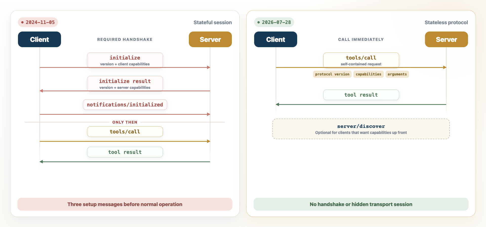

The [latest MCP specification](https://blog.modelcontextprotocol.io/posts/2026-07-28/), released on the 28th of July 2026, makes a major architectural change to the [MCP](mcp.md) protocol: it's now stateless.

Previously, an MCP client and server had to complete a handshake before the client could call a tool. They used it to agree on the protocol version and capabilities, and to share session identifiers.

That's all gone now.



Clients can just call the MCP tools they want immediately. If they need to know what capabilities a server has, there's a new optional (for clients, at least) [`server/discover`](https://modelcontextprotocol.io/specification/2026-07-28/server/discover) RPC method.

Basically, stateless MCP looks a lot more like a typical [JSON-RPC](json-rpc.md) API, but with a few helpful standards for server and tool discovery, multi-round-trip requests and optional extensions for long-running tasks.

## Why does this matter?

Stateless servers are a lot easier to host and manage. For one thing, they don't require sticky load balancing or shared session storage.


However, just because the protocol is stateless doesn't mean the application has to be. If a tool needs to remember something between calls, it can return a state ID, which the client includes in the next request.

## Building a stateless MCP server

I'm going to construct a basic MCP server and client so we can see exactly what it looks like.

This example uses version 2 of the official MCP [Python SDK](https://github.com/modelcontextprotocol/python-sdk) for the server. It uses `curl` for the client.

The Python SDK uses `/mcp` as the default endpoint, and the message body uses JSON-RPC. There are `Mcp-Method` and `Mcp-Name` headers to identify the request and help with routing and authorisation. It also supports Streamable HTTP, where the client sends each MCP message as a separate `POST` request.

### Server

First, install version 2 of the `mcp` package:

```bash
uv add "mcp>=2,<3"
```
<!-- nb-output hash="f7fab58ce3446564" format="html" -->
<div class="nb-output">
<pre class="nb-stream-stderr">Resolved 182 packages in 3ms
</pre>
<pre class="nb-stream-stderr">Audited 178 packages in 5ms
</pre>
</div>
<!-- /nb-output -->

Let's start with a trivial example of a calculator that can only add numbers.

I'll create a new instance of an MCP server using the `MCPServer` base class:

```python
from mcp.server import MCPServer

mcp = MCPServer("Calculator")
```
<!-- nb-output hash="6fdb0c00cfca6c7c" format="html" -->

<!-- /nb-output -->

Then, use the [tool decorator](https://py.sdk.modelcontextprotocol.io/api/mcp/server/?h=tool+dectorator#mcp.server.MCPServer.tool) to add a single tool called `add`

```python
@mcp.tool()
def add(a: int, b: int) -> int:
    """Add two numbers."""
    return a + b
```
<!-- nb-output hash="2d555ae5c76f8579" format="html" -->

<!-- /nb-output -->

Finally we can call the `run` method to start a server and set a few server options:

- `stateless_http` disables transport session tracking.
- `json_response` makes the server return a JSON object instead of an SSE stream.

```python {background=mcp-server}
mcp.run(
    transport="streamable-http",
    port=3001,
    stateless_http=True,
    json_response=True,
)
```
<!-- nb-output hash="8bdffefd1a241872" format="html" -->
<div class="nb-output">
<pre class="nb-stream-stderr">INFO:     Started server process [46781]
</pre>
<pre class="nb-stream-stderr">INFO:     Waiting for application startup.
</pre>
<pre class="nb-stream-stderr">[08/08/26 10:34:09] INFO     StreamableHTTP       streamable_http_manager.py:151
                             session manager                                    
                             started                                            
</pre>
<pre class="nb-stream-stderr">INFO:     Application startup complete.
</pre>
<pre class="nb-stream-stderr">INFO:     Uvicorn running on http://127.0.0.1:3001 (Press CTRL+C to quit)
</pre>
<pre class="nb-stream-stdout">Background process &quot;mcp-server&quot; started with 2 preceding python cells.
</pre>
</div>
<!-- /nb-output -->

The plugin combines these three Python cells into a temporary script and runs it as a background process.

This example is running directly in my Obsidian notebook through my [Obsidian Markdown Notebook](obsidian-markdown-notebook-code-execution-with-outputs-stored-in-the-file.md) plugin. To run it outside Obsidian, save the code as `mcp_server.py`, then run `uv run python mcp_server.py`. Leave that terminal open while you run the client commands below in another terminal.

### Client

The `tools/call` method allows us to call a known tool directly.

```bash {format=json}
curl --silent --show-error http://127.0.0.1:3001/mcp \
  --retry 10 --retry-connrefused --retry-delay 1 \
  -H 'Content-Type: application/json' \
  -H 'Accept: application/json, text/event-stream' \
  -H 'MCP-Protocol-Version: 2026-07-28' \
  -H 'Mcp-Method: tools/call' \
  -H 'Mcp-Name: add' \
  --data '{
    "jsonrpc": "2.0",
    "id": 1,
    "method": "tools/call",
    "params": {
      "name": "add",
      "arguments": {"a": 2, "b": 3},
      "_meta": {
        "io.modelcontextprotocol/protocolVersion": "2026-07-28",
        "io.modelcontextprotocol/clientCapabilities": {}
      }
    }
  }' | python3 -m json.tool
```
<!-- nb-output hash="dc7c682ad70676c2" format="json" -->
```json
{
    "jsonrpc": "2.0",
    "id": 1,
    "result": {
        "content": [
            {
                "text": "5",
                "type": "text"
            }
        ],
        "isError": false,
        "resultType": "complete",
        "structuredContent": {
            "result": 5
        },
        "_meta": {
            "io.modelcontextprotocol/serverInfo": {
                "name": "Calculator",
                "version": ""
            }
        }
    }
}
```
<!-- /nb-output -->

The server returns `5` in an MCP tool result.

As mentioned, we can also use the `server/discover` method to see what the server supports. The request uses the same `_meta` object as the tool call.

```bash {format=json}
curl --silent --show-error http://127.0.0.1:3001/mcp \
  --retry 10 --retry-connrefused --retry-delay 1 \
  -H 'Content-Type: application/json' \
  -H 'Accept: application/json, text/event-stream' \
  -H 'MCP-Protocol-Version: 2026-07-28' \
  -H 'Mcp-Method: server/discover' \
  --data '{
    "jsonrpc": "2.0",
    "id": 2,
    "method": "server/discover",
    "params": {
      "_meta": {
        "io.modelcontextprotocol/protocolVersion": "2026-07-28",
        "io.modelcontextprotocol/clientCapabilities": {}
      }
    }
  }' | python3 -m json.tool
```
<!-- nb-output hash="da456ab7ae27d206" format="json" -->
```json
{
    "jsonrpc": "2.0",
    "id": 2,
    "result": {
        "cacheScope": "private",
        "capabilities": {
            "prompts": {
                "listChanged": true
            },
            "resources": {
                "listChanged": true,
                "subscribe": true
            },
            "tools": {
                "listChanged": true
            }
        },
        "resultType": "complete",
        "supportedVersions": [
            "2026-07-28"
        ],
        "ttlMs": 0,
        "_meta": {
            "io.modelcontextprotocol/serverInfo": {
                "name": "Calculator",
                "version": ""
            }
        }
    }
}
```
<!-- /nb-output -->

This tells us that the server supports tools. A client can call `tools/list` if it needs the tool names and schemas.

```bash {format=json}
curl --silent --show-error http://127.0.0.1:3001/mcp \
  --retry 10 --retry-connrefused --retry-delay 1 \
  -H 'Content-Type: application/json' \
  -H 'Accept: application/json, text/event-stream' \
  -H 'MCP-Protocol-Version: 2026-07-28' \
  -H 'Mcp-Method: tools/list' \
  --data '{
    "jsonrpc": "2.0",
    "id": 3,
    "method": "tools/list",
    "params": {
      "_meta": {
        "io.modelcontextprotocol/protocolVersion": "2026-07-28",
        "io.modelcontextprotocol/clientCapabilities": {}
      }
    }
  }' | python3 -m json.tool
```
<!-- nb-output hash="55763b6055b766af" format="json" -->
```json
{
    "jsonrpc": "2.0",
    "id": 3,
    "result": {
        "cacheScope": "private",
        "resultType": "complete",
        "tools": [
            {
                "description": "Add two numbers.",
                "inputSchema": {
                    "type": "object",
                    "properties": {
                        "a": {
                            "title": "A",
                            "type": "integer"
                        },
                        "b": {
                            "title": "B",
                            "type": "integer"
                        }
                    },
                    "required": [
                        "a",
                        "b"
                    ],
                    "title": "addArguments"
                },
                "name": "add",
                "outputSchema": {
                    "properties": {
                        "result": {
                            "title": "Result",
                            "type": "integer"
                        }
                    },
                    "required": [
                        "result"
                    ],
                    "title": "addOutput",
                    "type": "object"
                }
            }
        ],
        "ttlMs": 0,
        "_meta": {
            "io.modelcontextprotocol/serverInfo": {
                "name": "Calculator",
                "version": ""
            }
        }
    }
}
```
<!-- /nb-output -->

There is our `add` tool, including the input and output schemas generated from the Python types.

An MCP request is now a self-contained unit of work. Any compatible server instance can process the request, and the server does not need hidden transport state, so it can be load-balanced easily.

Much better.

## References

- [The 2026-07-28 Specification announcement](https://blog.modelcontextprotocol.io/posts/2026-07-28/)
- [The 2026-07-28 architecture specification](https://modelcontextprotocol.io/specification/2026-07-28/architecture)
- [The 2024-11-05 lifecycle specification](https://modelcontextprotocol.io/specification/2024-11-05/basic/lifecycle)
- [`server/discover` specification](https://modelcontextprotocol.io/specification/2026-07-28/server/discover)
- [MCP tools specification](https://modelcontextprotocol.io/specification/2026-07-28/server/tools)
- [Streamable HTTP specification](https://modelcontextprotocol.io/specification/2026-07-28/basic/transports/streamable-http)
- [MCP Python SDK: Running your server](https://py.sdk.modelcontextprotocol.io/run/)
