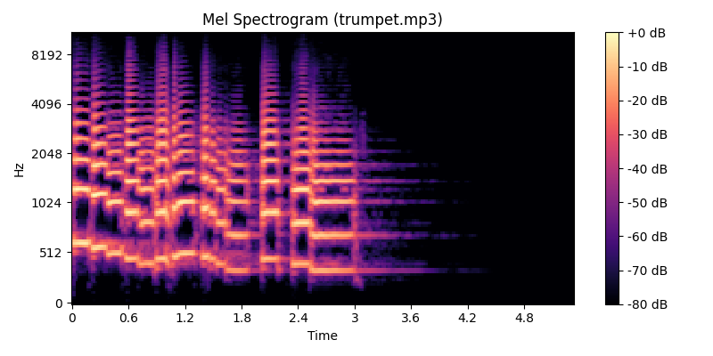
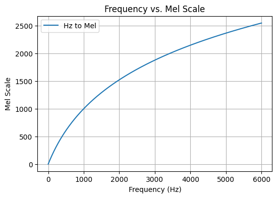

Mel Spectrogram is a graphic representation of a [Sound Wave](sound-wave.md), visualising pitch energy over time.

Here is a Mel Spectrogram of the audio of a Trumpet

<audio controls>
  <source src="/_media/trumpet_example.mp3" type="audio/mpeg">
</audio>

The process of generating a Mel Spectrogram works like this:

1. Break the audio signal down into short frames
2. Use a [Fourier Transform](../../../permanent/Fourier%20Transform.md) to convert the time signal into the frequency domain.
3. Use a [Mel Filter Bank](../../../permanent/mel-filter-bank.md) maps the frequency domain into the Mel Scale.
4. Plot Mel Scale over time.

## Mel Scale

The Mel Scale is a *perceptual scale* of audio frequencies. In other words, it represents our perceived distance of the frequencies from others.

The Mel scale is a logarithmic formula where 1000Mel = 1kHz. You can convert Hz to Mel using this formula:

$Mel(f) = 2595 \log_{10} (1 + \frac{f}{100})$

