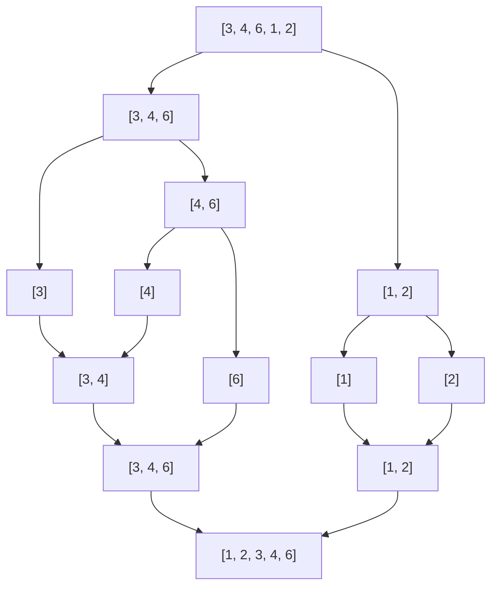

**Merge Sort** is a [Divide-and-Conquer](divide-and-conquer.md) sorting algorithm, which sorts a list recursively by dividing it into halves until a single --element or empty list is created; it then merges these sublists of create a software list.

Merge Sort is one of the faster and most stable sorting algorithms, with an $O(n \log n)$ time complexity in the average and worst case.

## Algorithm

$$
\begin{aligned}
&\textbf{MERGESORT}(A, a, b) \\
&\quad \text{if } a < b \text{ then} \\
&\quad\quad m = \left\lfloor \frac{a + b}{2} \right\rfloor \\
&\quad\quad \textbf{MERGESORT}(A, a, m) \\
&\quad\quad \textbf{MERGESORT}(A, m + 1, b) \\
&\quad\quad \textbf{MERGE}(A, a, m, b)
\end{aligned}
$$

## Simple step-by-step example

Given array: $[3, 4, 6, 1, 2]$, a=1 and b=5 for the initial call.

1.  After the first recursive call, we would have sorted the first half (a=1, m=3), so the array would become $[3, 4, 6, 2, 1]$
2. After the 2nd recursive call, we would have sorted the 2nd half (a=4, b=5), so the array would become $[3, 4, 6, 1, 2]$
3. Then the final merge would merge both sides, resulting in $[1, 2, 3, 4, 6]$

## Visualisation

