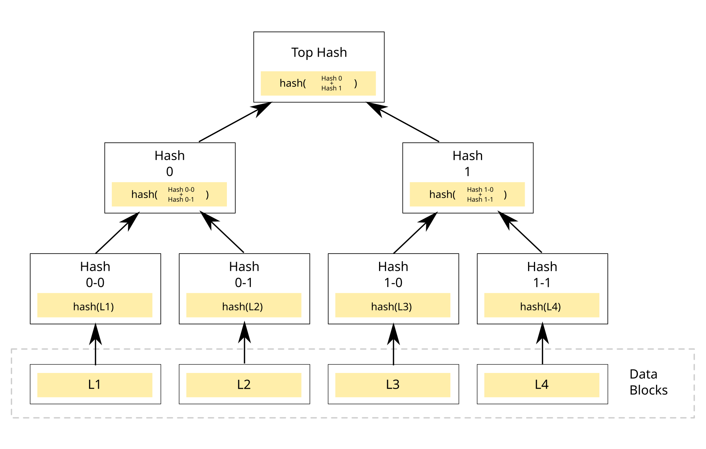
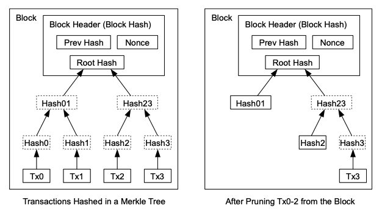

**Merkle Tree** is a data structure where each parent node contains the hash of its child nodes, enabling efficient verification of large datasets, amongst many other useful things.

*Original illustration by David Göthberg. [Source](https://commons.wikimedia.org/wiki/File:Hash_Tree.svg)*

To construct a Merkle Tree, data is first hashed at the leaf nodes. These hashes are then paired and hashed again to form parent nodes, continuing recursively until reaching a single hash at the root called the **Merkle Root**. The leaf nodes contain a hash of the data. This structure makes Merkle Trees "tamper-evident" - any change to data will propagate upward, altering the root hash.

If there's an odd number of nodes at any level, the last node is typically duplicated (paired with itself) to create an even number for the next level.

Merkle Proofs, a capability enabled by Merkle Trees, allows us to verify a specific transaction or piece of data is included in a dataset by only checking a small number of hashes rather than the entire set. You only need to hash values from the leaf to the node to verify that a transaction (for example) exists in the ledger.

In the Bitcoin Paper, Nakamoto described a method to reclaim disk space by hashing transactions into a tree structure with only the Merkle root stored in the block header. The Merkle Root used in Bitcoin also enables "simple payment verification", a feature allowing clients to verify transactions without downloading the entire blockchain.

*Diagram from [Bitcoin: A Peer-to-Peer Electronic Cash System](https://bitcoin.org/bitcoin.pdf)*

Also, [Git](git.md) repositories are a type of Merkle Tree, where each commit is identified by a hash that depends on the entire history of the repository, including the file contents, commit messages, timestamps, and parent commits.

Beyond Bitcoin and Git, Merkle Trees are foundational in distributed file systems like IPFS and Certificate Transparency logs used to verify SSL certificates across the web.