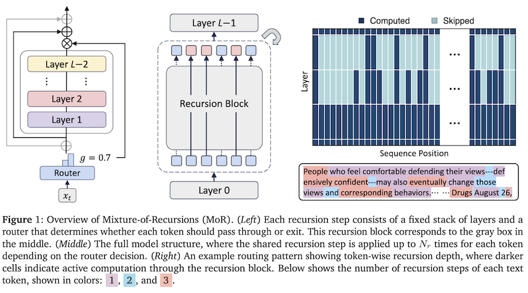
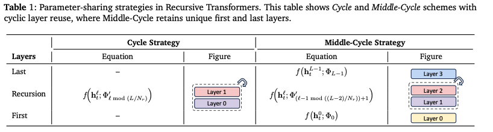
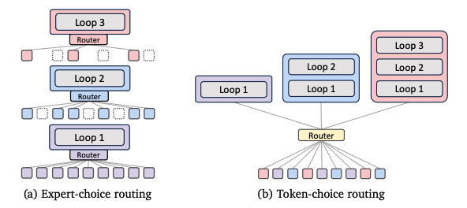

*My notes on paper [Mixture-of-Recursions: Learning Dynamic Recursive Depths for Adaptive Token-Level Computation](https://arxiv.org/pdf/2507.10524) by Sangmin Bae, Yujin Kim, Reza Bayat, Sungnyun Kim, Jiyoun Ha, Tal Schuster, Adam Fisch, Hrayr Harutyunyan, Ziwei Ji, Aaron Courville and Se-Young Yun*

Really interesting paper from researchers at KAIST AI, Mila and Google: "Mixture-of-Recursions: Learning Dynamic Recursive Depths for Adaptive Token-Level Computation"

They build on the [Recursive Transformer](recursive-transformer.md), where layers (or groups of layers) can be applied repeatedly during decoding, allowing us to reduce the overall layer count of a network. They add a router to each stack of layers, which assigns the number of repeats (or recursion depth) per token.

This routing strategy means that simple tokens (think: "and", "the", etc) only need to traverse a small recursive depth, and more content-rich tokens can be assigned larger recursion depths, effectively allowing the model to optimise computation at the token level. The routing is a form of [Latent Reasoning](latent-reasoning.md), where the model can effectively think at each layer group within the network.

They also introduce a "recursion-wise key/value caching" mechanism, where key-value pairs are cached based on corresponding recursion.

Interestingly, although the MoR learns to assign recursive depth to each token during training, at inference time, the depth can be optionally fixed, enabling a form of test-time scaling that trades compute for performance.

I feel that this has the potential to dramatically decrease LLM parameter counts, continuing the tradition of democratising AI.

They experiment with multiple-layer configuration strategies:

- **Cycle**: Layers reused cyclically (e.g., [0,1,2,0,1,2,0,1,2])
- **Sequence**: Same layer repeated before moving to next (e.g., [0,0,0,1,1,1,2,2,2])
- **Middle-Cycle/Middle-Sequence**: Keep unique first and last layers, share only middle layers

Best performance: Middle-Cycle strategy

They also try two different routing strategies:

- **Expert-choice**: Each recursion depth selects its top-k tokens. Guarantees a fixed compute budget but requires auxiliary loss to avoid causality violation
- **Token-choice**: Each token is assigned a fixed recursion depth upfront. No causality issues, but needs load balancing

Best performance: Expert-choice with auxiliary loss and linear router

And two different K/V caching strategies:

- **Recursion-wise caching**: Only cache K/V pairs for tokens active at each recursion depth. Reduces memory by ~50%
- **Recursive sharing**: Reuse K/V pairs from the first recursion for all subsequent steps. Maximum memory savings but slight accuracy drop

Best performance: Recursion-wise caching for expert-choice routing