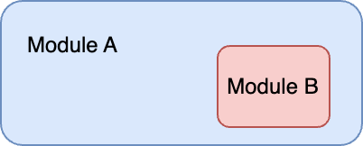
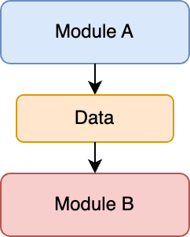
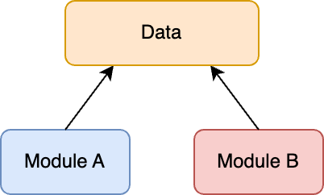
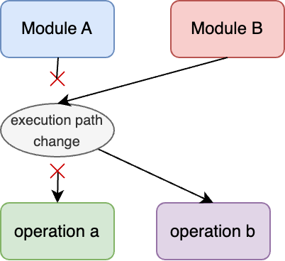

Module coupling concerns the interdependence between software [Modules](module.md): how much do a group of modules rely on each other?

Coupling is certainly not a bad thing on its own; it's necessary to develop a sufficiently complex system. However, some types of coupling are preferred over others.

Similar to [Module Cohesion](module-cohesion.md), the [ISO/IEEE Systems and Software Engineering Vocabulary](https://www.iso.org/obp/ui/#iso:std:iso-iec-ieee:24765:en) recognises six key types of module coupling.

Having names for these different coupling types is quite useful for identifying problem points in a code base and strategies for refactoring.

---

## [Content Coupling](content-coupling.md)

**Content Coupling** is when a module is contained within another module.



Consider an `Image` module that contains various image type loading implementations: `JpegImage`, `PngImage`, `GifImage`, etc.

Given an image, a user doesn't need to know which submodule to call for their specific image type; they request to load an image, and the main module calls the required submodules.

```python
image = Image.load("cat.jpg")
```

Content Coupling is universally considered a good idea and property of Khorikov's [Well-Designed API](well-designed-api.md).

---

## [Data Coupling](data-coupling.md)

**Data Coupling**, also known as *input-output coupling*, is a type of coupling in which output from one software module is input to another.



For example, a data module that prepares data before running a transformation.

```python
import data
import transform

my_data = data.prepare_data()
output = transform.transform_data(my_data)
```

Data coupling is also considered a good thing.

---

## [Common-Environment Coupling](common-environment-coupling.md)

**Common-environment coupling** is when multiple modules share the same global data.



Common environment refers to global variables, singleton state objects, system environment variables, etc.

It is not necessarily a bad thing. However, using a mutable global state can lead to hard-to-find bugs.

Sometimes, a better idea is to use sub-environments: global states within specific classes or modules, name-spaced environment variables, etc.

If you must use a global environment, ideally, it would be immutable.

---

## [Control Coupling](control-coupling.md)

**Control Coupling** is when a module communicates information, perhaps via flags, to another to influence its execution.

.png)

For example, if **Module A** passes flags to **Module B** to change the mathematical operations that **Module B** performs.

Control coupling is mostly considered bad; in the example above, **Module B** is hard to test and verify since it's dependent on control information from **Module A**, which can lead to complex and hard-to-reason designs.

Data coupling is preferred over control coupling.

---

## [Hybrid Coupling](hybrid-coupling.md)

**Hybrid Coupling** occurs when different subsets of the range of values of a data item are used for separate and unrelated purposes.

.png)

It is a rare type of coupling but sometimes the only option, especially in limited memory environments (microcontrollers). You should avoid it unless you know what you're doing.

---

## [Pathological Coupling](pathological-coupling.md)

**Pathological Coupling** occurs when one module is used to change the behaviour of another module.



I'm thinking of ideas like monkey patching or modifying private variables.

It's mostly a bad thing. Usually, it occurs when a module is repurposed to support functionality it wasn't originally intended for, and it often calls for a refactor.
