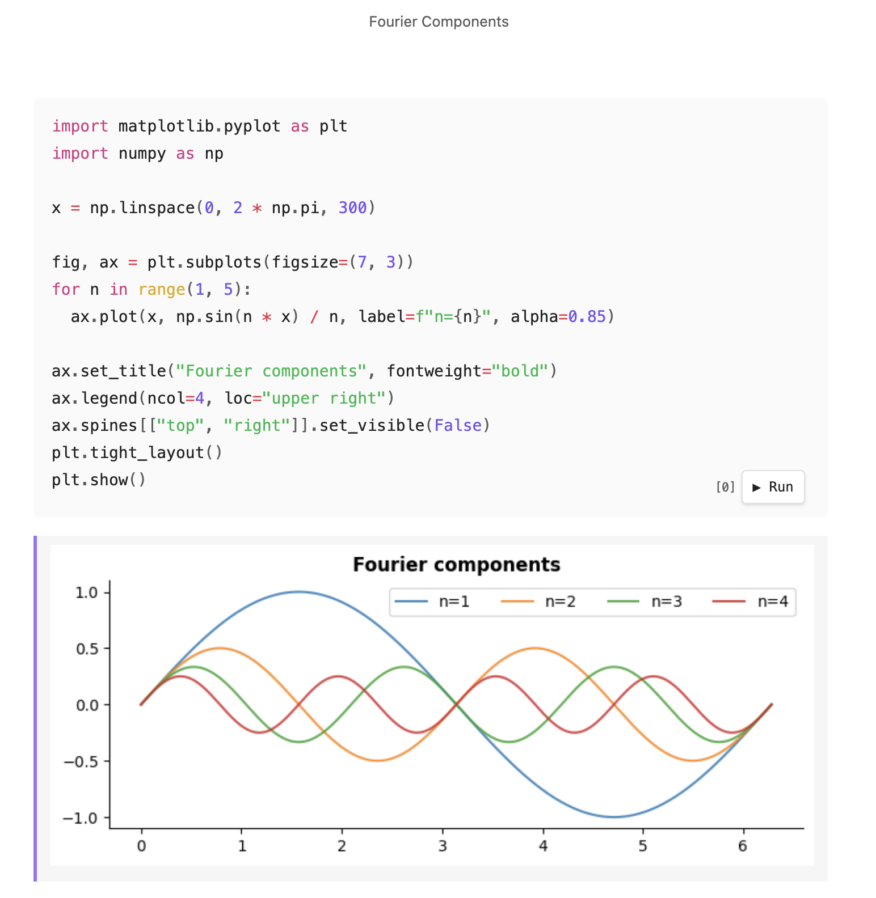
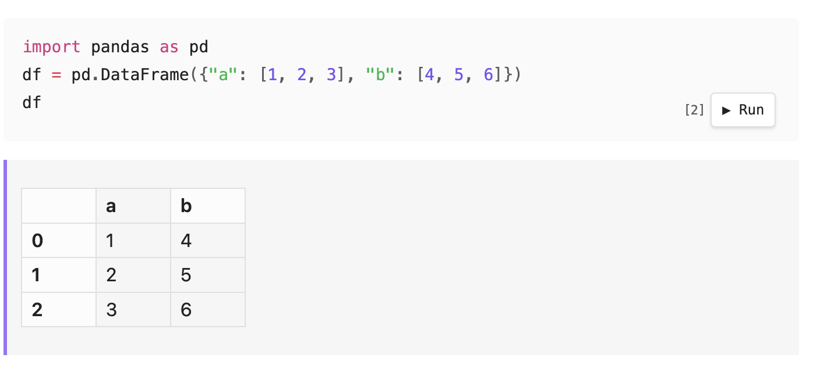
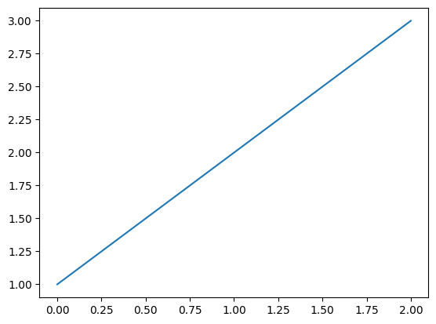

I've built [Obsidian Markdown Notebook](https://github.com/lextoumbourou/obsidian-markdown-notebook), a plugin that lets you execute code in Obsidian with both code and output stored in the same file, kinda like a Markdown [Jupyter Notebook](https://jupyter.org/).

Right now, the supported languages are Python, JavaScript, Bash, and R. If you want support for more, let me know.

Here's an example of plotting Fourier series components:

[](../_media/obsidian-markdown-notebook-cover-2.png)

There are quite a few similar plugins already for executing code in Obsidian. However, none of them are designed from the start to store outputs directly in the Markdown file itself. It scratches an itch I've had for a while.

By default, outputs are rendered as HTML. For example, a pandas DataFrame renders as a table:

````markdown
```python
import pandas as pd
df = pd.DataFrame({"a": [1, 2, 3], "b": [4, 5, 6]})
df
```
<!-- nb-output hash="a1b2c3d4e5f6a7b8" format="html" -->
<div class="nb-output-html">...</div>
<!-- /nb-output -->
````

[](../_media/pandas-dataframe-example.png)

You can also render as an image by adding `format=image` to the code fence:

````markdown
```python {format=image}
import matplotlib.pyplot as plt
plt.plot([1, 2, 3])
plt.show()
```
<!-- nb-output hash="209f46a0d3ce8ca2" format="image" -->

<!-- /nb-output -->
````

The image filename is a hash of the language and source code, so two notes with identical code fences will share the same cached image. You can also assign an `id` to control the filename:

````markdown
```python {format=image id=numberplot}
import matplotlib.pyplot as plt
plt.plot([1, 2, 3])
plt.show()
```
<!-- nb-output id="numberplot" hash="209f46a0d3ce8ca2" format="image" -->

<!-- /nb-output -->
````

Output blocks use HTML comments, so they're invisible in PDF export and any standard Markdown renderer.

Each output block stores a hash of the cell's source code. If the code hasn't changed, the cached output is shown without re-executing. Re-running a cell updates the output in place.

You can also specify document-level defaults in the YAML frontmatter, or set project-level defaults in plugin settings.

```yaml
---
title: My document
notebook:
  format: image
  markdownLinks: true  # There's other settings too - see the GitHub repo for the full list.
---
```

### Similar Plugins

There is a lot of prior art here, but again the major gap is that none of them focuses on storing the output artifact alongside the code.

* [Obsidian Execute Code Plugin](https://github.com/twibiral/obsidian-execute-code) is the closest relative. It does support persistent output since version 2.0.0. However, the output is plain text, and I want rich output (HTML tables, images) to be a first-class citizen from the start.
* [Obsidian Code Emitter](https://github.com/mokeyish/obsidian-code-emitter) is a great plugin that supports 15 different languages without requiring any system dependencies. However, the outputs do not survive vault reload and cannot be rendered to PDF.
* [JupyMD](https://github.com/d-eniz/jupymd) uses [Jupytext](https://github.com/mwouts/jupytext) to pair a Markdown file with a Jupyter notebook, but the outputs are stored in the Jupyter file. I just want something totally native where everything lives in the Markdown file.

And of course, [Jupyter Notebook](https://github.com/jupyter/notebook) was the primary inspiration. There is also a [Markdown-based notebooks proposal](https://github.com/jupyter/enhancement-proposals/pull/103) from 2023 that stalled without a consensus. I want it now, damn it!

---

See the [project Github](https://github.com/lextoumbourou/obsidian-markdown-notebook) for more details.

Also, side note: the project was developed using a [Research, Plan, Implement Workflow](research-plan-implement-workflow.md). You can see the Markdown files for each stage in the [`.claude`](https://github.com/lextoumbourou/obsidian-markdown-notebook/tree/main/.claude) directory.
