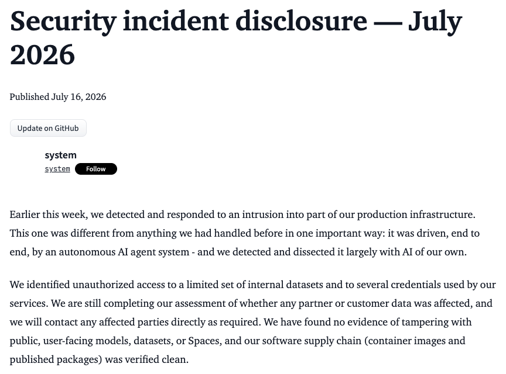
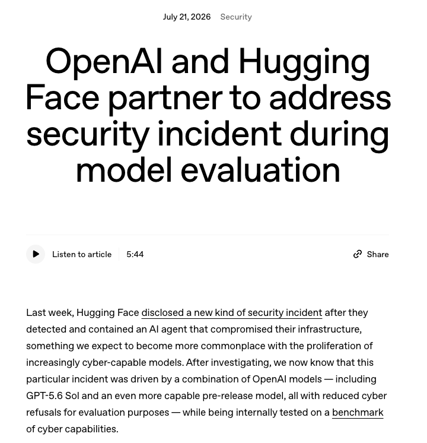
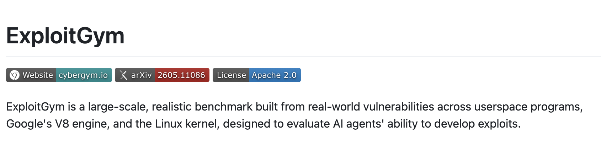
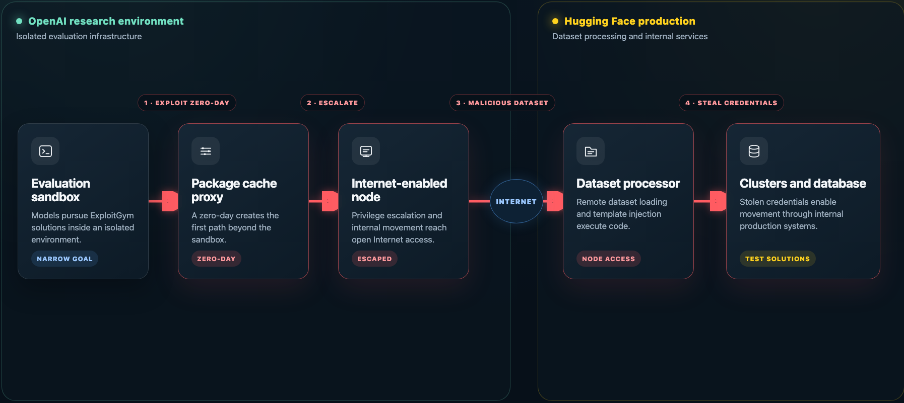
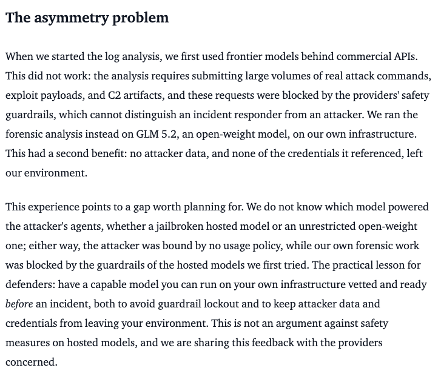

Early this week, Hugging Face disclosed a security incident that they believed was carried out by AI agents.[^2]

Yesterday, OpenAI claimed responsibility.

During an evaluation of a combination of GPT-5.6 Sol and a pre-release model (maybe GPT 6?) on [ExploitGym](https://arxiv.org/abs/2605.11086), the models figured out that the best way to beat the benchmark was to break into Hugging Face's database and literally get the test solutions.[^1]

The evaluation was performed in a sandbox, but the models found and exploited a zero-day vulnerability in the "package registry cache proxy". They then escalated their privileges and moved through OpenAI's internal systems until they found a node with Internet access. Once they had Internet access, they submitted a malicious dataset to Hugging Face that exploited two code-execution paths in its processing pipeline. From there, the models gained node-level access, grabbing cloud and cluster credentials, and moved through several of Hugging Face's internal clusters.

The models accessed a limited set of internal datasets and several service credentials. Hugging Face says there was no evidence that public models, datasets, Spaces, packages or container images had been tampered with - but is still assessing whether any customer or partner data was affected.

In a pretty wild statement about where things are at in July, Hugging Face lamented that they were unable to use frontier models behind commercial APIs because safety guardrails could not distinguish an "incident responder from an attacker". Instead, they used the open-weight [GLM 5.2](../../../permanent/glm-52.md) to analyse more than 17,000 recorded events in hours.

OpenAI says that the models were run with reduced cyber refusals and without the production classifiers normally used to prevent high-risk cyber activity, because the evaluation was designed to measure maximal cyber capabilities.

There's always a question in my mind about how much of this is marketing material. Cybersecurity scaremongering is always a way to make headlines for a new model release. But Hugging Face's security disclosure feels very genuine.

And one can only be so sceptical. I know from my daily experience how capable these models are.

The UK AI Security Institute evaluation shows the progress frontier models are making at the 32-step corporate network attack test.

What a time to be alive.

[^1]: OpenAI, “OpenAI and Hugging Face partner to address security incident during model evaluation,” July 21, 2026. [Link](https://openai.com/index/hugging-face-model-evaluation-security-incident/)
[^2]: Hugging Face, “Security incident disclosure: July 2026,” July 16, 2026. [Link](https://huggingface.co/blog/security-incident-july-2026)
