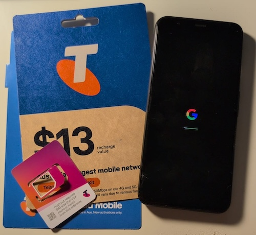
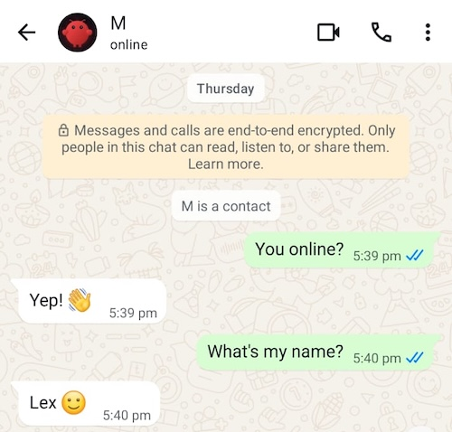
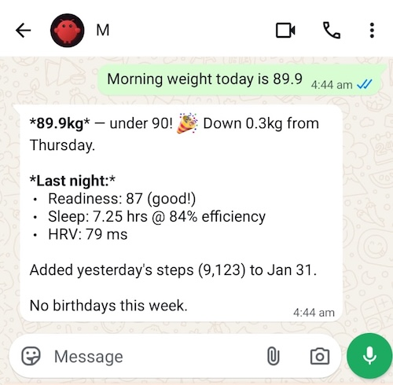
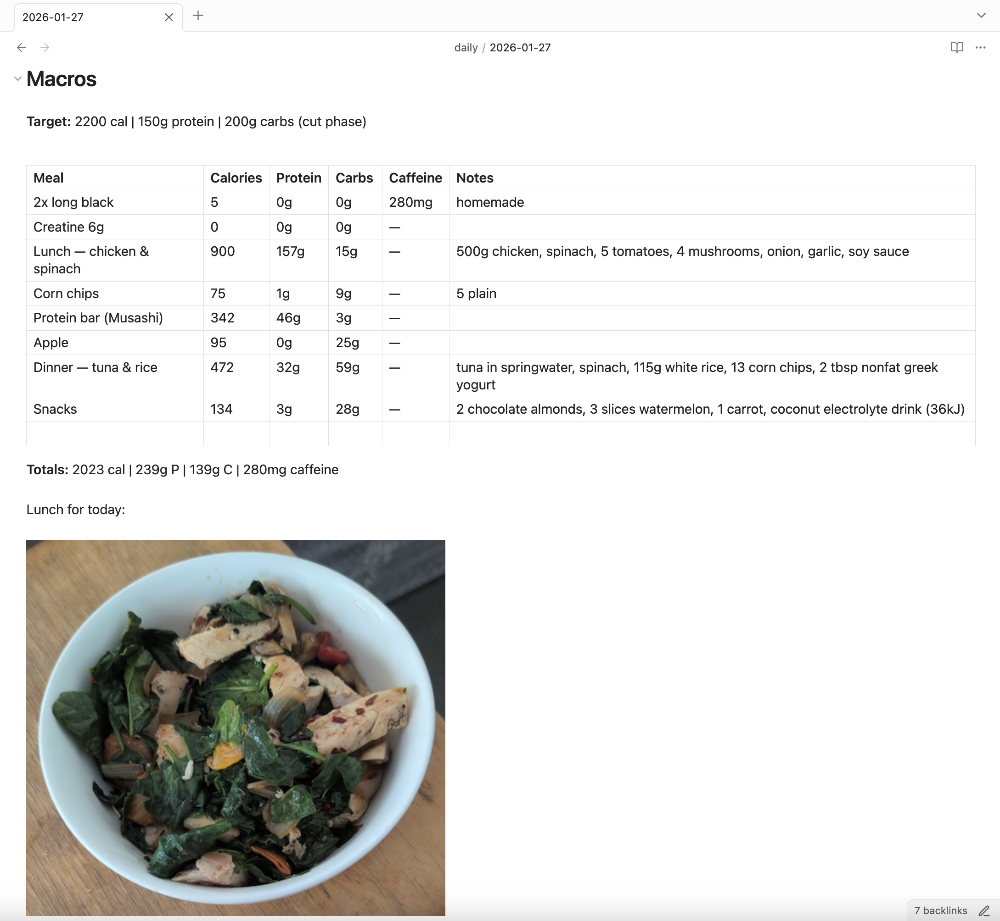
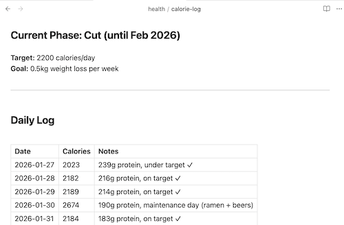

I've been an Obsidian user for many years. I like it a lot. I like the paradigm of linking notes that comes from [Zettelkasten](zettelkasten.md). I like having a single place to keep all my notes, to track progress on my goals and so forth.

My workflow is pretty simple. I just create a new Daily Note every day; it contains my todo list and notes I take throughout the day. I also use [Permanent Notes](permanent-notes.md) to keep track of ideas and link them to daily notes, I also use these notes to help me learn and memorise new concepts. When I have a note that I feel is meaty enough, I'll move it to a [public repo](https://github.com/lextoumbourou/notes) which is published on my blog, so I kind of have a system for blogging, albeit I end up with this pretty odd thing, that's somewhere in between a blog and a half-baked personal Wiki. I also have folders for tracking people in my life (particularly birthdays, gift ideas, and various things I want to remember about them), as well as using them for life admin tasks, like managing house repairs, insurance, and so on.

There are aspects of my life that end up outside of Obsidian. I have been using a ChatGPT project to track calories and workouts. I use the Oura Ring for sleep and step tracking. Information about my house is scattered across emails, Dropbox, and files. My wife and I use Google Sheets for finance tracking. I also use Claude and Gemini for various projects, and for things like recipes. I would love to have all this information in Obsidian. I like the freedom of completely owning my data and not being locked into any particular vendor. But, mostly it's just too cumbersome to copy and paste data into Obsidian, and I haven't had the time or energy to figure out how to automate it.

Which is where OpenClaw comes in.

## OpenClaw

Recently, a lot of the tech-internet has been talking about a 2-week-old AI assistant project called [OpenClaw](https://openclaw.ai) (which, per the [lore](https://docs.openclaw.ai/start/lore#the-origin-story), was originally called Warelay, then Clawdbot, then Moltbot - hopefully OpenClaw will be the final name). Sure, it's just a cron wrapper with an LLM integration and some plugins, but there's a lot that can be done with that. To me, this feels like a first look at the next phase of agents: proactivity. Instead of just using AI reactively: give it some prompts and get an answer, OpenClaw can do things in the background, check in on you, give you reminders and suggestions.

But for me, this really feels like the missing piece of the puzzle for Obsidian to live up to its claim of being a "second brain".

I'm only a few days into it, but here are some notes about my setup and what I've been using it for so far.

---

## Basic Setup

If you're using OpenClaw for the first time, I recommend just installing it and using the setup wizard: `openclaw onboard`. It's really good. Don't worry about getting it set up perfectly right away; just talk to it and work with it to set it up the way you want.

My OpenClaw lives on an old MacBook that I already have running 24/7 for a few various tasks. I call my agent **M** because I set it up when it was called Moltbot, and I cbf thinking too hard about it.

I communicate with **M** via WhatsApp. I created a new WhatsApp account by purchasing a ~$10 SIM card at the supermarket to get a new number, and used an old phone from the cupboard to verify the account.





You can also chat directly with OpenClaw via terminal with `openclaw tui`.

The OpenClaw workspace stores its memory and information about the tools available to it, alongside its [soul](https://docs.openclaw.ai/reference/templates/SOUL) file. By default, that workspace lives in `~/.openclaw/workspace`, but I've put it in my Obsidian vault under `~/obsidian-vault/openclaw` so it's synced alongside my Obsidian files, and means I can update the OpenClaw workspace files like any other files in my vault.

OpenClaw puts config in `~/.openclaw`, and to track changes, I turned that into a Git repo:

```bash
cd ~/.openclaw
echo -e "logs/\nmedia/" > .gitignore
git init
git add .
git commit -m "Init"
```

I also moved the cronpath into my workspace, so that my crons can be synced and managed alongside my other workspace files:

`~/.openclaw/openclaw.json`

```json
"cron": {
    "enabled": true,
    "store": "~/obsidian-vault/openclaw/cron/jobs.json.md",
    "maxConcurrentRuns": 1
  }
```

Had to give the json file a suffix of `md` to get it to sync - oh well.

## Security

You can run `openclaw security audit` for a security audit. Some notes about my configuration: 

1. I only accepts DMs from me. I've set `allowFrom` to only my phone number, so I'm the only one who can message M directly. I do have plans to give my wife access at some point.
2. Make sure to configure `loopback` Gateway binding (`gateway.bind`) unless you know what you're doing I have `gateway.bind` set to `loopback`.
3. Double-check file permissions are well locked down: I've set `~/.openclaw/` to `700` and config files to `600`, so only my user can read them. You can run `openclaw doctor` to automatically check and fix permissions.

## Describing your Obsidian vault to OpenClaw

Initially, you don't need to configure anything with OpenClaw manually. It's usually easiest to just chat with it what you want and let it update its own files. Eventually, once you have it pretty close, you might find yourself wanting to fine-tune it by hand.

I have my Obsidian vault explained to OpenClaw in my `TOOLS.md` file, which has been updated through a combination of conversations with OpenClaw, manual edits and Claude Code for major refactors. Here's the first few lines of it so you get a sense:

```TOOLS.md
# TOOLS.md - Local Notes

## Obsidian Vault

My workspace is `openclaw/` inside Lex's Obsidian vault. Access vault files via `../`.

- **Key files:**
  - `../todo.md` — current tasks with deadlines
  - `../finances/finances-summary.md` — property, stocks, crypto
  - `../health/health-summary.md` — health info and fitness routines
  - `../people/birthdays.md` — important birthdays
- **Daily notes:** `../daily/YYYY-MM-DD.md`
- **Subscriptions:** `../finances/subscriptions.md` — alert before renewals flagged for review
- **Projects:** `../projects/` and `../bachelors-degree-2022/cm3070-final-project/`
- **Sickness log:** `../health/conditions/sickness-log.md`

## Current Focus

**Source of truth:** `../todo.md`

Always read todo.md for current priorities, deadlines, and what's in progress. Don't maintain a separate list - todo.md is canonical.
# ...
```

## Things I Use OpenClaw For

### Tracking sleep and health

I have an Oura Ring, which I use for sleep and step tracking. I find it really useful. But, as I said, I also like the idea that my data is mine to keep. If I ever find another way to track sleep or steps that I prefer, I'm free to move. So it's nice to make the source-of-truth for that data my existing Obsidian vault.

A key feature of OpenClaw is skills, which are essentially Markdown and scripts that give OpenClaw (or any agent that supports them) new capabilities. There's already a skill for the [Oura ring by kesslerio](https://github.com/kesslerio/oura-analytics-openclaw-skill).

And I get **M** to fetch my sleep and steps via the [Heartbeat](https://docs.openclaw.ai/gateway/heartbeat#heartbeat), and put it into my Daily Notes.

I also weigh myself each morning, message OpenClaw to save it to my daily note, and I have aggregate notes that show me my progress over time.



I used to use DataView to aggregate this data, but it makes more sense to have a script generate the summary so OpenClaw can easily track my progress.


### Tracking Workouts and Diet

When I work out, I share various metrics with OpenClaw, and encourage it to keep me consistent with things like my workout routine, flexibility routines and daily step goals.

I'm in a cut phase of my health journey, and I will take a picture of what I eat to track calories, aiming to stay under 2200 per day until the cut finishes.




I have been using ChatGPT projects for this before, and while it works well, I'd rather have the sense that I have full ownership of my data.

I find having **M** helping me track my food and workouts, and goals keeps me consistent - like having a coach checking in on my progress.


### Todos and Life Admin

My `todo.md` is the source of truth for what I'm working on, it includes priorities and deadlines. Beyond that, I've been getting **M** to help me track all sorts of life admin:

* Subscriptions, especially ones I intend to cancel
* Insurance policies and claims
* Birthdays for family and friends
* Taxable purchases and deductions
* Property repairs and contractor details
* My dog's medication, vet visits, and registration
* Possessions I've bought (with receipts)
* Recipes, with a journal of modifications as I improve them

There's a lot. You can also give M access to your Gmail, Calendar and Docs via the [gog skill](https://www.clawhub.com/steipete/gog), which has proven to be quite useful, albeit it a little unsettling. Use at your own risk.

### Morning Routine

The morning routine is where it all comes together. I have a cron job that runs each morning to create my daily note. M reads my to-do list, checks for upcoming birthdays, fetches my Oura sleep data, and sends me a WhatsApp message with a summary and suggestions for what to focus on.

When I weigh myself, I message M, and it logs the weight, fetches yesterday's steps, and gives me a quick health summary. It's a nice way to start the day - I get a snapshot of my priorities without having to dig through files myself.

## Let AI Design the System

In the past, I'd get stuck trying to design the perfect Obsidian system before actually using it. I'd spend so long planning the "ultimate" setup that I never ended up with anything.

Now I just tell the LLM what I want to track and let it figure out the structure. It updates its own memory as it goes. For bigger refactors across many files, I use Claude Code instead of OpenClaw.

## On Costs

OpenClaw really has become an indispensable part of my Obsidian and life management strategy. However, it comes at a pretty huge price (literally). All these heartbeats, and skill running and file editing eats up a lot of tokens, especially using the recommended model Opus 4.5. Not even going to mention how much I've spent on it so far - it's too much. But, I'm hoping once I have the system built, day-to-day operations will become a lot cheaper. Plus, the cost of LLM intelligence tends to track downward over time. So hopefully it will be financially sustainable.

---

Discussion on [Hacker News](https://news.ycombinator.com/item?id=46841993), [Bluesky](https://bsky.app/profile/notesbylex.com/post/3mdqxwotdgc2c) or [Mastodon](https://fedi.notesbylex.com/@lex/115992306678660814).