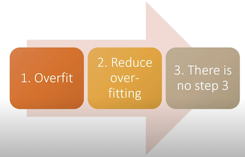

In a [Tweet by Karpathy from 2019](https://twitter.com/karpathy/status/1013244313327681536?lang=en), he describes his #1 neural network training mistake: *"You didn't try to overfit a single batch first"*.

Jeremy Howard shares a similar sentiment in his [Three Steps to Training a Good Model](https://www.youtube.com/watch?v=4u8FxNEDUeg&t=1267s) from the same year, where he lists the *Overfit* as the #1 step:

*A slide from [fastai - Lesson 8 (2019) - Deep Learning from the Foundations](https://www.youtube.com/watch?v=4u8FxNEDUeg&t=1267s0).*

In my experience, failing to check that the model can overfit to a small amount of data is one of the surest ways to waste time in machine learning. If the model cannot learn to perform the task perfectly on a small set of in-domain data, then what hope do you have generalising with a larger dataset?

Also, by starting with the overfitting, you allow the data collection and model construction to happen in parallel, which is much closer to the [Iterative Development](iterative-development.md) goals of the Agile software methodology. Instead of spending time collecting data upfront, it can be done alongside the model development, allowing for parallel progress streams throughout the project. It also means each step can inform each other: model results can be used to assess the data most pertinent for modelling the problem, and available data can tell what model architectures make the most sense for the project.

Always start a neural network training endeavour by overfitting on a small amount of data first.
