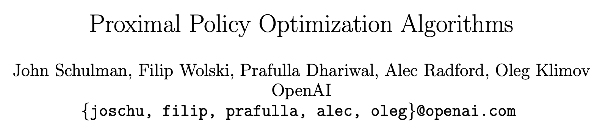
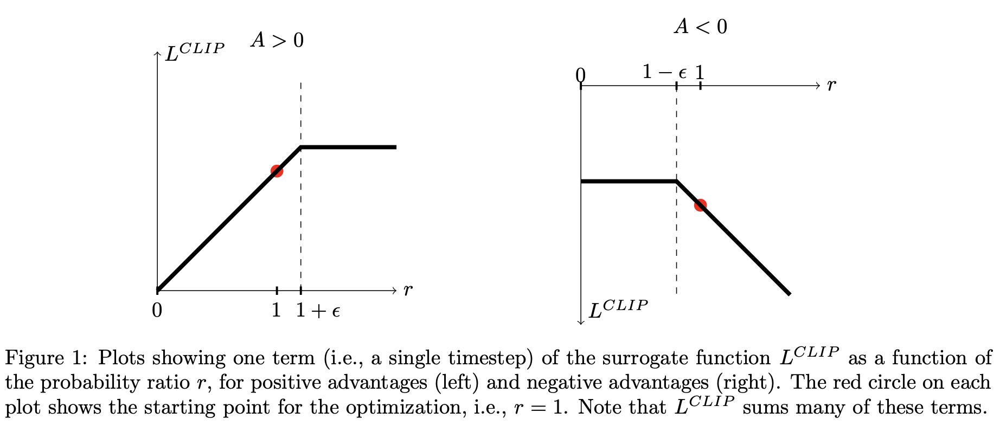
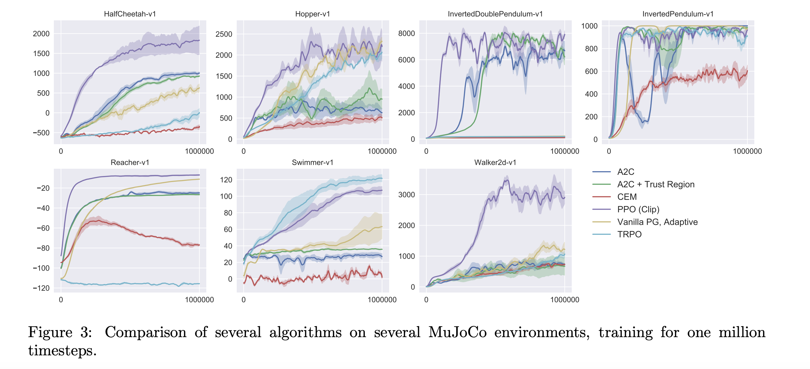
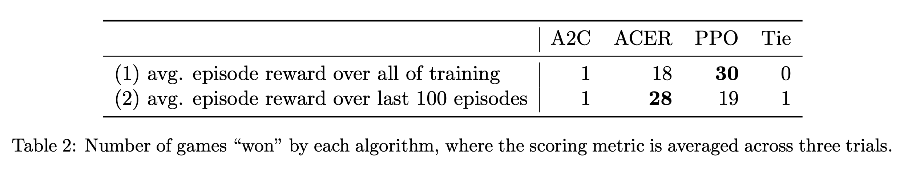

**Proximal Policy Optimization** (PPO) is a policy gradient algorithm for [Reinforcement Learning (RL)](reinforcement-learning.md), introduced by John Schulman and others at OpenAI in the 2017 paper [Proximal Policy Optimization Algorithms](https://arxiv.org/abs/1707.06347).

It improves the policy in small steps. Its clipped objective stops the new policy from moving too far from the old one in a single update:

$L^{CLIP}(\theta) = \hat{\mathbb{E}}_t\left[\min\left(r_t(\theta)\hat{A}_t, \text{clip}(r_t(\theta), 1 - \epsilon, 1 + \epsilon)\hat{A}_t\right)\right]$

where $r_t(\theta)$ is the ratio between the probability of the action under the new and old policies, and $\hat{A}_t$ is the estimated advantage.

This makes training more stable than vanilla policy gradient methods, while being simpler to implement than TRPO. PPO became one of the most widely used RL algorithms, including for [Reinforcement Learning from Human Feedback](reinforcement-learning-from-human-feedback.md) in language models. See also [Group Relative Policy Optimisation](group-relative-policy-optimisation.md).

