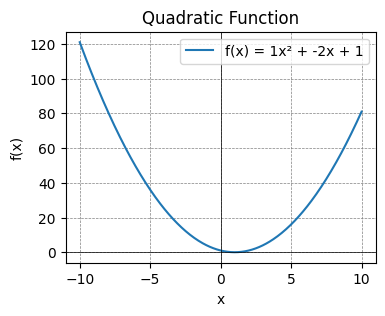

**Quadratic functions** are of the form: $f(x) = ax^2 + bx + c$ where $a$, $b$ and $c$ are constants.

The functions graph as parabolas - a U-shape curve that open upwards or downs depending on the sign of $a$. If $a>0$, the parabola opens upwards, and if $a<0$, it opens downwards.

In this example, I've used $a = 1$, $b = -2$ and $c =1$, giving us the function $f(x) = x^2 - 2x + 1$

