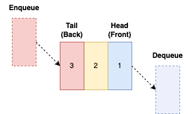

A queue is a simple data structure based on First In, First Out (FIFO) principle, where the longer an item has waited, the sooner it will be available.

It is based around the fundamental queue paradigm that we're familiar with: front of the line goes first.

A queue has a **head** and a **tail**. We **dequeue** by removing an element from the head of the queue and **enqueue** by adding an element to the tail.

A queue supports the following operations in its typical form:

<table class="table-border">
    <tr>
        <th>Operation</th>
        <th>Pseudocode</th>
        <th>Description</th>
    </tr>
    <tr>
        <td>head</td>
        <td><code>HEAD(q)</code></td>
        <td>Return element at the head of queue <code>q</code>.</td>
    </tr>
    <tr>
        <td>dequeue</td>
        <td><code>DEQUEUE(q)</code></td>
        <td>Remove and return element at the <strong>head</strong> of the queue.</td>
    </tr>
    <tr>
        <td>enqueue</td>
        <td><code>ENQUEUE(o, q)</code></td>
        <td>Adds element <code>o</code> to the tail of the queue.</td>
    </tr>
    <tr>
        <td>isEmpty?</td>
        <td><code>EMPTY(s)</code></td>
        <td>Return boolean result of is empty check.</td>
    </tr>
    <tr>
        <td>new empty queue</td>
        <td><code>new QUEUE q</code></td>
        <td>Create a new, empty queue.</td>
    </tr>
</table>

---

## Recommended Reading

[Introduction to Algorithms, Third Edition](https://amzn.to/3HyDauB)

**Chapter 10** covers Elementary Data Structures like a [Stack](stack.md) or [Queue](queue.md).
