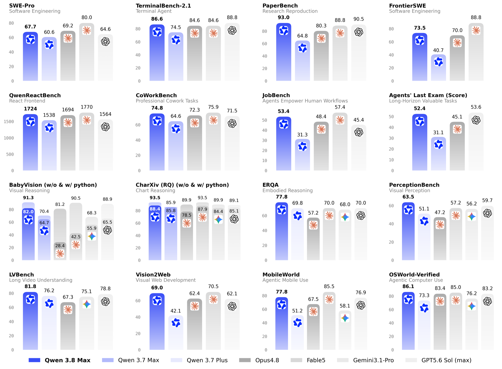
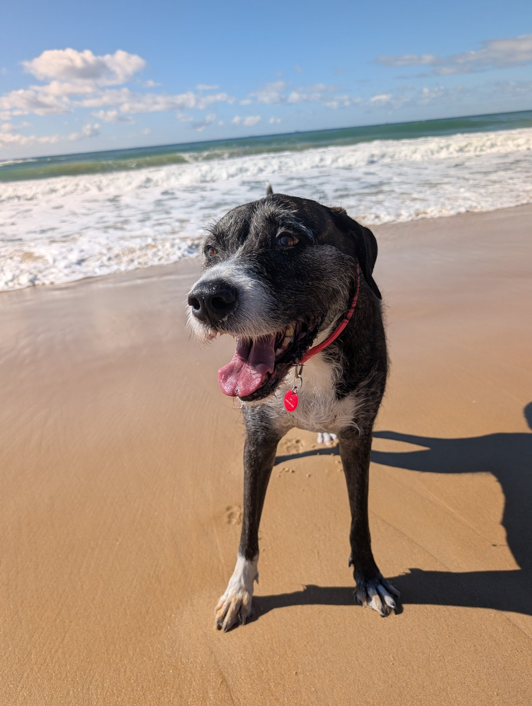

**Qwen3.8-Max** is a new 2.4T-parameter [Mixture of Experts Model](mixture-of-experts-model.md) from the Qwen team at Alibaba Cloud, with 95 billion active parameters.

It accepts text, image and video inputs and has a 1M-token context window, supporting up to 991,800 input tokens and 131,070 output tokens.

It's also another frontier-level open-weight model (well, soon to be: they release the weights next week), like the [Kimi K3](kimi-k3.md) model released last month. Wild times.

## Benchmarks

In Qwen's test results, it is competitive with GPT5.6 Sol (max) and Fable5, even beating them on certain benchmarks.

Among the results reported by the team, it leads PaperBench and several legal, finance, visual-reasoning and computer-use benchmarks. It remains behind Fable5 on many coding and cowork evaluations, and behind GPT5.6 Sol (max) on several general-reasoning tests, but is still an incredibly capable model.



*Selected benchmark results published by Qwen. The full announcement contains the complete tables and evaluation caveats.*

## Pricing and Cache Settings

The input pricing is roughly on par with mid-tier models such as GPT 5.6 Terra and the Claude Sonnet family, while the output pricing is considerably cheaper.

The standard prices compare as follows per million tokens:

| Model | Input | Output |
| --- | ---: | ---: |
| Qwen3.8-Max | $2.00 | $6.00 |
| GPT-5.6 Terra | $2.50 | $15.00 |
| Claude Sonnet 5 (from 1 Sep 2026) | $3.00 | $15.00 |

*GPT-5.6 Terra requests with more than 272K input tokens are charged $5.00 per million input tokens and $22.50 per million output tokens. The Claude Sonnet 5 row uses its standard pricing after the introductory offer ends in August.*

QwenCloud lists the following cache prices:

| Usage                   | Price |
| ----------------------- | ----: |
| Implicitly cached input | $0.25 |
| Explicit cache creation | $2.50 |
| Explicit cache read     | $0.17 |

Implicit caching is always enabled, similar to how other vendors do it. The service attempts to cache common request prefixes, but does not guarantee a hit.

If you want to guarantee a hit, "explicit caching" uses a `cache_control` marker to retain a prefix in cache for five minutes. Reading the cache resets that period for another five minutes.

Claude supports a [similar caching paradigm](https://platform.claude.com/docs/en/build-with-claude/prompt-caching), as does [OpenAI since GPT 5.6](https://developers.openai.com/api/docs/guides/prompt-caching#prompt-cache-breakpoints).

## Multimodal example

Conveniently, Qwen provides OpenAI- and Claude-compatible endpoints.

You can create a new key via [QwenCloud](https://home.qwencloud.com/), under **API Keys** > **Create API key**.

In this example, using the OpenAI-compatible endpoint, I send an image of Doggo on a recent trip to the Sunshine Coast and see if it can figure out her breed.



```python
import base64
from pathlib import Path

from openai import OpenAI

image_path = (
    Path.home() /
    "code/private-notes/public/notes/_media/qwen38-max-doggo.jpg"
)
image = base64.b64encode(image_path.read_bytes()).decode()
api_key = (Path.home() / ".secrets/qwencloud_personal").read_text().strip()

client = OpenAI(
    api_key=api_key,
    base_url="https://dashscope-intl.aliyuncs.com/compatible-mode/v1")

response = client.chat.completions.create(
    model="qwen3.8-max",
    messages=[{"role": "user", "content": [
        {"type": "image_url",
         "image_url": {"url": f"data:image/jpeg;base64,{image}"}},
        {"type": "text", "text": "What breed or mix does this dog most "
         "resemble? Give a cautious one-sentence answer."},
    ]}],
    reasoning_effort="low",
)

usage = response.usage
cost = (usage.prompt_tokens * 2 + usage.completion_tokens * 6) / 1_000_000
print(response.choices[0].message.content)
print()
print(f"{usage.prompt_tokens:,} input + {usage.completion_tokens:,} output tokens = ${cost:.4f}")
```
<!-- nb-output hash="05056f75d7c98b9e" format="html" -->
<div class="nb-output">
<pre class="nb-stream-stdout">This dog most resembles a pit bull–type or Staffordshire terrier mix, likely with some hound or pointer influence given its lean brindle legs and white markings.

</pre>
<pre class="nb-stream-stdout">1,956 input + 159 output tokens = $0.0049
</pre>
</div>
<!-- /nb-output -->

Not bad. The adoption centre had her as a Bull Arab/Stag Hound, although probably a mix of things (perhaps not too far off).

## Sources

- [Qwen3.8-Max announcement](https://qwen.ai/blog?id=qwen3.8)
- [Qwen3.8-Max model capabilities and pricing](https://www.qwencloud.com/models/qwen3.8-max)
- [QwenCloud context-cache documentation](https://docs.qwencloud.com/developer-guides/text-generation/context-cache)
- [QwenCloud multimodal documentation](https://docs.qwencloud.com/developer-guides/multimodal/vision)
- [GPT-5.6 Terra pricing](https://developers.openai.com/api/docs/models/gpt-5.6-terra)
- [Claude API pricing](https://platform.claude.com/docs/en/about-claude/pricing)
