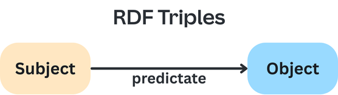

**RDF** (or Resource Description Framework) is a graph-based data model where data is defined as triples: `subject` -> `predicate` -> `object`. It forms the foundation of the [Semantic Web](semantic-web.md), and is a building block of [Linked Data](linked-data.md). It's also a popular form of [Knowledge Representation](knowledge-representation.md), as a form of classical AI.

I've only really learned about it in academic settings, in my career, in which I've faced many different problems of AI and data-engineering, I've never seen a practical application for it.




The key rules are that the **Subject** and **Predicate** must be a [URI](../../../permanent/uri.md), where the object can be a URI, string, number, or date.
        
## RDF Serialisation

There are multiple ways to serialise RDF data, each with different advantages:

### [N-Triples](n-triples.md)

The simplest serialisation format, expressing each triple on a separate line using full URIs. While it is verbose, it's also easy to parse and process programmatically.

Here is an example of how I might express myself using N-Triples format:

```
<https://example.org/person/lex> <https://example.org/hasName> "Lex T"
<https://example.org/person/lex> <https://example.org/hasAge> 38
<https://example.org/person/lex> <https://example.org/worksFor> <https://example.org/company/canva>
<https://example.org/company/canva> <https://example.org/hasName> "Canva"
<https://example.org/company/canva> <https://example.org/locatedIn> "Sydney"
```

### [Turtle (Terse RDF Triple Language)](turtle-terse-rdf-triple-language.md)

**Turtle** (or **Terse RDF Triple Language**) is a human-readable RDF serialisation format. It includes features like:

* Prefixes to reduce URL length and complexity.
* A semicolon (`;`) to keep the same subject, continues with a new predicate
* A comma (`,`) keeps the same subject and predicate, adds a new object.
* `"a"` shortcut - replaces "is of type".
* Language tags to specify labels in different languages.

Example:

```turtle
@prefix foaf: <http://xmlns.com/foaf/0.1/> .
@prefix ex:   <https://example.org/> .

<https://example.org/person/lex>
    a foaf:Person ;
    foaf:name "Lex Toumbourou" ;
    foaf:age 38 ;
    ex:worksFor <https://example.org/company/canva> ;
    foaf:knows <https://example.org/person/john>, <https://example.org/person/kim> .

<https://example.org/company/canva>
    a foaf:Organization ;
    foaf:name "Canva" ;
    ex:locatedIn "Sydney" .
```

### [RDFa](rdfa.md)

RDFa allows RDF data to be embedded directly into HTML markup using special attributes, which enables web pages to contain machine-readable structured data alongside human-readable content. RDFa is useful for search engine optimisation and semantic web apps.

RDFa attributes:

- `about` - specifies the subject of the RDF statements.
- `property` - creates a literal value relationship.
- `rel` - create a resource relationship.
- `resource` - specifies the object resource.
- `typeof` - declares the RDF type of the subject.
- `datatype` - specifies the data type of literal values.

Example:

```html
<!DOCTYPE html>
<html xmlns="http://www.w3.org/1999/xhtml"
      xmlns:foaf="http://xmlns.com/foaf/0.1/"
      xmlns:ex="https://example.org/">
      <head>
          <title>Employee Profile</title>
      </head>
      <body>
          <div about="https://example.org/person/lex" typeof="foaf:Person">
              <h1 property="foaf:name">Lex Toumbourou</h1>
              <p>Age: <span property="foaf:age" datatype="xsd:integer">38</span></p>
              <p>Works for:
                  <span about="https://example.org/company/canva" typeof="foaf:Organisation">
                      <span property="foaf:name">Canva</span>
                  </span>
              </p>
              <p>Location:
                  <span about="https://example.org/company/canva" property="ex:locatedIn">Sydney</span>
              </p>
          </div>
      </body>
</html>
```

### [JSON-LD](json-ld.md)

JSON-LD expresses RDF using familiar JSON syntax while maintaining full RDF compatibility. A good format for working with web applications since it uses common JSON syntax while maintaining full RDF compatibility.

Keywords of JSON-LD:

- `@context` - defines namespace prefixes and mappings.
- `@id` - specifies the subject URI.
- `@type` - declares the RDF type.
- `@value` and `@type` - for typed literal values.
- `@graph` - contains an array of linked data objects.


```json
{
    "@context": {
        "foaf": "https://xmlns.com/foaf/0.1/",
        "ex": "https://example.org",
        "xsd": "https://www.w3.org/2001/XMLSchema#"
    },
    "@graph": [
        {
            "@id": "ex:person/lex",
            "@type": "foaf:Person",
            "foaf:name": "Lex Toumbourou",
            "foaf:age": {
                "@value": 38,
                "@type": "xsd:integer"
            },
            "ex:worksFor": {
                "@id": "ex:company/canva"
            }
        },
        {
            "@id": "ex:company/canva",
            "@type": "foaf:Organisation",
            "foaf:name": "Canva",
            "ex:locatedIn": "Sydney"
        }
    ]
}
```

### [RDF/XML](rdf-xml.md)

One of the first approaches to RDF serialisation, using XML syntax, makes it more verbose but useful for systems already processing XML, but 
mostly considered less readable than Turtle or JSON-LD formats.

- `rdf:about` specifies the subject URI
- `rdf:resource` creates relationships to other resources
- `rdf:datatype` specifies data types for literal values
- Nested elements represent predicates and objects


```xml
<?xml version="1.0" encoding="UTF-8"?>
<rdf:RDF xmlns:rdf="http://www.w3.org/1999/02/22-rdf-syntax-ns#"
         xmlns:foaf="http://xmlns.com/foaf/0.1/"
         xmlns:ex="http://example.org/">
    <foaf:Person rdf:about="https://example.org/person/lex">
        <foaf:name>Lex Toumbourou</foaf:name>
        <foaf:age rdf:datatype="http://www.w3.org/2001/XMLSchema#integer">38</foaf:age>
        <ex:worksFor rdf:resource="https://example.org/company/canva"/>
    </foaf:Person>
    
    <foaf:Organisation rdf:about="https://example.org/company/canva">
        <foaf:name>Canva</foaf:name>
        <ex:locatedIn>Sydney></ex:locatedIn>
    </foaf:Organisation>
</rdf:RDF>
```


## RDF Vocabulary

RDF provides the structural foundation, but vocabularies define the actual meaning of the data. Common vocabularies include:

* **FOAF** (Friend of a Friend) - for describing people and relationships.
* **Dublin Core** - for metadata about resources.
* **Schema.org** - for structured data on web pages.

## RDF Extensions and Ecosystem

While RDF provides the data model, several extensions provide additional capabilities.

* [RDF Schema](rdfs.md) - Provides a basic vocabulary for defining classes, properties and hierarchies in RDF data.
* [Web Ontology Language (OWL)](web-ontology-language-owl.md) - A more expressive language built on RDF for creating complex ontologies and reasoning.
* [Triplestores](triplestores.md) - Specialised databases designed to store and efficiently query RDF triple data.
* [SPARQL](sparql.md) - the standard query language for retrieving and manipulating RDF data, similar to SQL for relational databases.