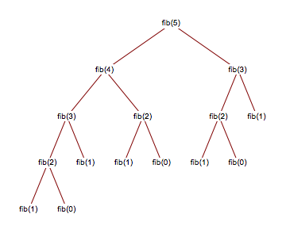

**Recursion** is a problem-solving method where a [Function](function.md) calls itself with a smaller instance of the problem. A [Base Case](../../../permanent/base-case.md) is required to ensure the calls eventually terminate.

All recursive problems can be solved using iteration; however, some algorithms, particularly a [Divide-and-Conquer](divide-and-conquer.md) algorithm, can be solved much more elegantly with recursion.

## Fibonacci numbers example

The canonical example of a recursive solution is the Fibonacci number sequence. The sequence is the sum of the previous two numbers:

$0, 1, 1, 2, 3, 5, 8, 13, ..., n$

It can be expressed recursively as: $F_n = F_{n - 1} + F_{n - 2}$

The base cases are:

* $\text{Fibonacci}(1) = 1$
* $\text{Fibonacci}(0) = 0$

We visualise a call to $\text{Fibonacci}(5)$ by representing the call stack as a tree, like this:



*[Source dhovemey at ycp](http://faculty.ycp.edu/~dhovemey/fall2005/cs102/lecture/fib5.png) (page now unavailable)*

As you can see, each branch opens two new branches until we finally reach the bottom of the tree (the base case) and can finally propagate the answers back to the top.

In pseudocode:

```javascript
function Fibonacci(n)
     assert n >= 0

    if n < 2 then
        return n
    end if

    return Fibonacci(n-1) + Fibonacci(n-2)

end function
```

## Factorial example

The Factorial algorithm is:

$n! = n \times (n - 1) \times (n - 2) \times ... \times 2 \times 1$

Which can be expressed recursively simply as:

$n! = n \times (n - 1)!$

The base case for Factorial comes at $0! = 1$

We can rewrite the function in pseudocode as follows:

```javascript
function Factorial(n)
    if n = 0 then
        return 1
    end if

    return n x Factorial(n - 1)

end function
```
