<!--
DRAFT SCAFFOLD written by Claude from the redesign session on 2026-10-10.
Every fact, number and screenshot is from that session, but the prose is not
Lex's. Rewrite it in your own words before publishing (PRODUCT.md: the words
on this site are Lex's own). Suggested places to add your own take are marked
"Lex:" in comments below.
-->

I redesigned this blog in one afternoon with Claude Code and a design skill called Impeccable [@bakausImpeccable2025]. This post walks through how it went, with screenshots from each step.

<!-- Lex: why now? what bugged you about the old design? -->

## The old theme

The old theme was a three-column layout: a navigation column on the left, the note in the middle and a panel of cards on the right. It looked like a documentation app rather than somewhere to read.

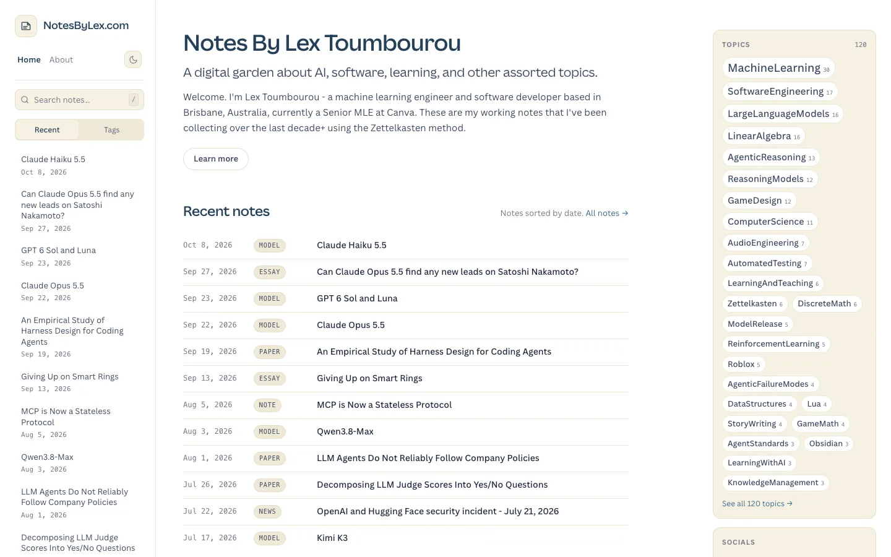

A few things were wrong with it:

- **It read like an app.** The left column repeated the home page's recent notes on every page.
- **Mobile was worse.** The whole navigation stacked above the article, so a note's title started about 500px down the screen.
- **The palette was a default.** Cream cards, navy text and a gold accent, which happens to be one of the looks AI-generated sites cluster around.
- **The font was my employer's.** The site was set in Canva Sans, Canva's brand typeface.

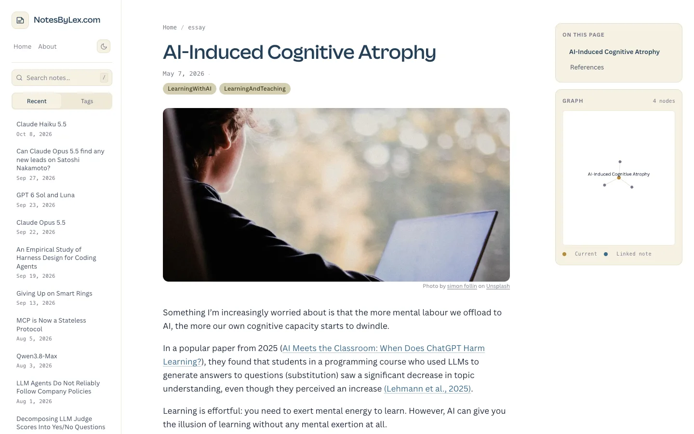

## What Impeccable is

Impeccable is a skill for coding agents, written by Paul Bakaus [@bakausImpeccable2025]. It does two things.

First, it writes the brand down as two files that every later design session reads first. `PRODUCT.md` holds who the site is for, what it's for and the voice. `DESIGN.md` holds the visual system: colours, type, components and rules.

Second, it stops the agent from shipping its default look. Instead of designing straight away, it runs a fixed process: an interview, a roll of the dice that deals competing visual directions, a decision page in the browser, mockup images before any code, the build, an independent review and finally a documenter that writes `DESIGN.md` from what actually shipped.

## The interview

The interview asked about the product, not about taste. My answers:

- The main reader is me. The site is my public second brain.
- NotesByLex is the house brand, with me as the author behind it.
- The knowledge graph, backlinks and dark mode had to survive.
- Mockups first, then code.

## The roll

Claude listed seven visual worlds from my readers' culture: Pelican Books, transit maps, Cornell notes, engineering pads, Luhmann's slip box, arXiv preprints and Tufte's books. Impeccable's dice then picked one of the seven to build, so the agent's favourite doesn't always win. It also dealt challengers from its own catalogue of worlds.

All of it landed on one decision page, with a generated mockup for each direction set with a real note from this site.

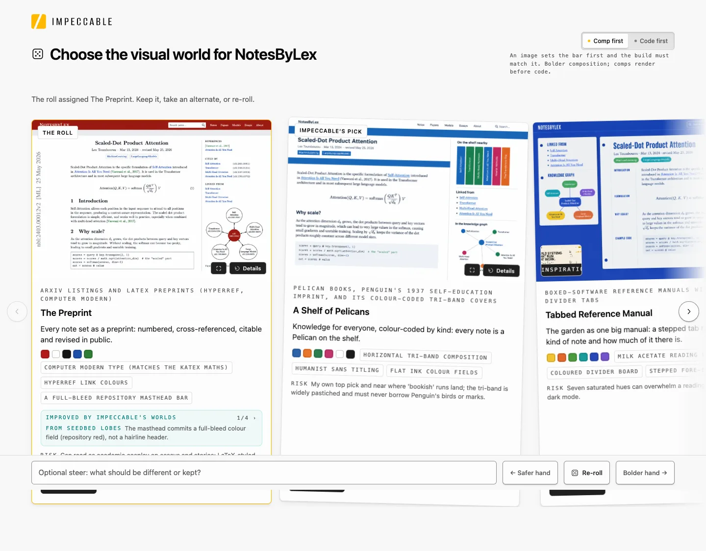

The roll assigned an arXiv-style preprint. Claude's own pick was Pelican Books. I chose one of the challengers, a hand-drawn technical zine, because I write a lot by hand and it felt like my style.

<!-- Lex: say this in your words; you said "writing stuff by hand like that is a good fit for my style". -->

## Picking a layout

With the world chosen, Impeccable generated three layouts in it: a top bar with a right sidebar, notebook tabs with notes in the margin, and an index card pinned to the left.

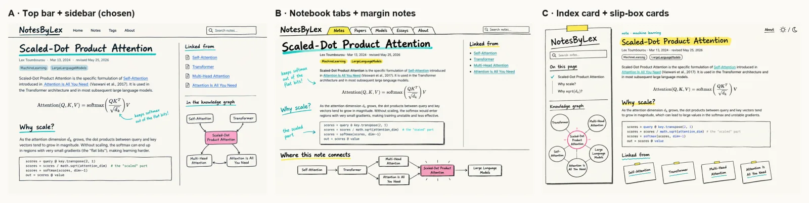

I went with A, the most familiar of the three. The zine lives in the frame (the lettering, the sketched lines, the highlighter), while the reading column stays calm.

## Choosing the lettering

Impeccable measured the mockup's lettering and ranked real fonts against it. The first pick was Edu QLD Beginner, a font based on the handwriting Queensland kids learn at school. The independent reviewer pointed out that it was a slanted school print, while the mockup showed an upright felt-tip marker. Seeing them side by side made the choice easy: Shantell Sans.

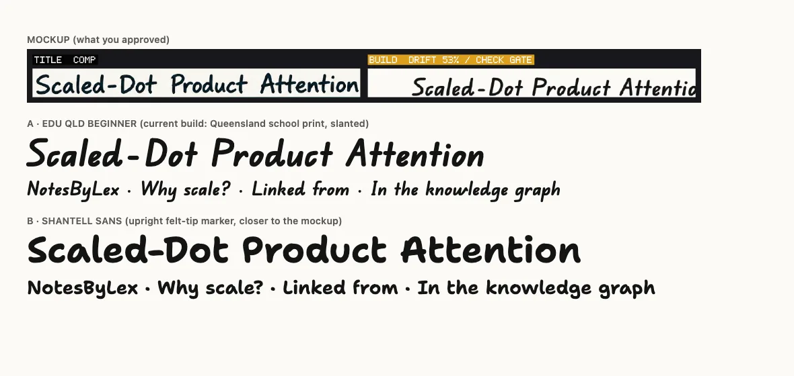

Body text is Atkinson Hyperlegible Next, a typeface designed by the Braille Institute for legibility, and code uses its mono sibling. All three are self-hosted and open source, which also meant Canva Sans could go.

## Building it

Claude built it as a real Pelican theme rather than a one-off page. The hand-drawn outlines, rules and highlighter swipes are drawn live with Rough.js [@shihnRoughjs2016], so they work on every page, and each has a plain CSS border underneath so the page still reads with JavaScript off.

The sidebar graph is drawn the same way from the site's real link data. Notes that link to the current note sit above it and notes it links to sit below, with doodled arrows between them. Dense notes switch to a trunk-and-branch tree so lines never cross. It also meant the old graph's WebGL libraries no longer load on article pages.

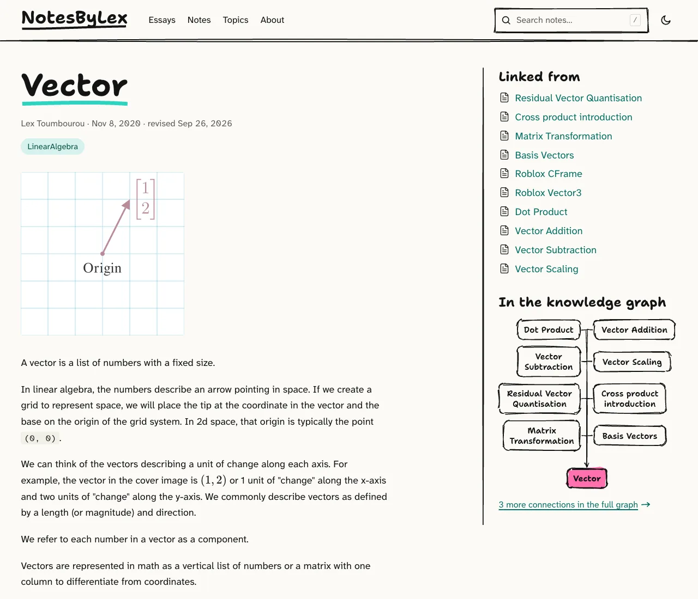

## The pixel gate

Impeccable's strictest step compares the build to the approved mockup pixel by pixel and refuses to continue below 72%. Our first build scored 60%. The gap was mostly not the build's fault: the mockup was drawn at about 1.4 times the scale, with invented text and no cover image. Matching it would have meant 26px body text and deleting a real diagram, so I downgraded the mockup to a reference.

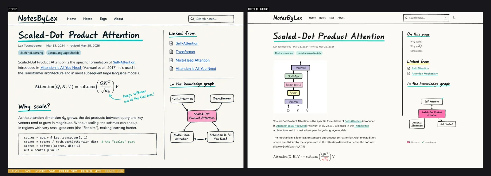

One thing I liked: the mockup had a handwritten margin note in my voice ("keeps softmax out of the flat bits!"). Claude didn't ship it, because the words on this site are mine. Instead there's a `> [!scribble]` callout I can write myself.

## The independent review

When the build was done, Impeccable handed it to a separate reviewer agent with fresh context. It came back with eight material fixes, including the lettering, a sidebar rule that stopped short, the graph's dead space and mobile maths that cut off without a scroll cue. After one round of fixes, its second pass scored six of the eight resolved and caught two small regressions the fixes had introduced.

## Iterating

Then came a run of my own calls:

- **One highlighter swipe per page.** The first build put a swipe under every heading, which was busy. Now only the page title gets one, drawn on once as the page loads.
- **No read tracking.** The graph ticked notes you'd already read. My readers don't need that.
- **Essays and notes.** The home page now leads with essays (the pieces I'd be happy to post on Hacker News), then a compact list of working notes.
- **A colour per kind.** Every note kind (note, paper, model, course, book, talk, news) gets its own highlighter, and list pages show a key.
- **The home page starts with my name**, using the same opening as the About page.

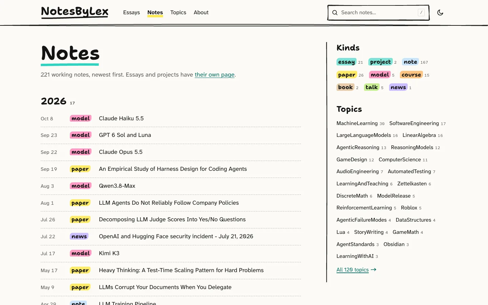

## The result

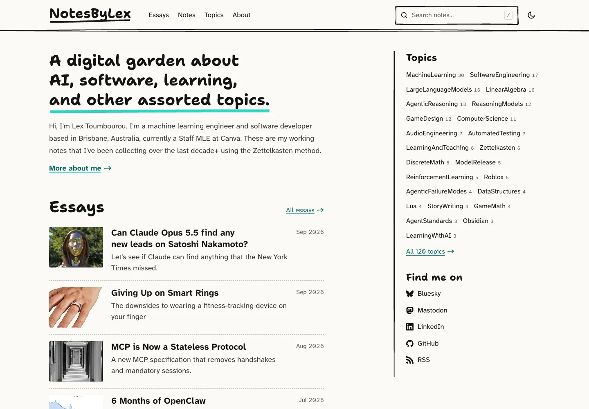

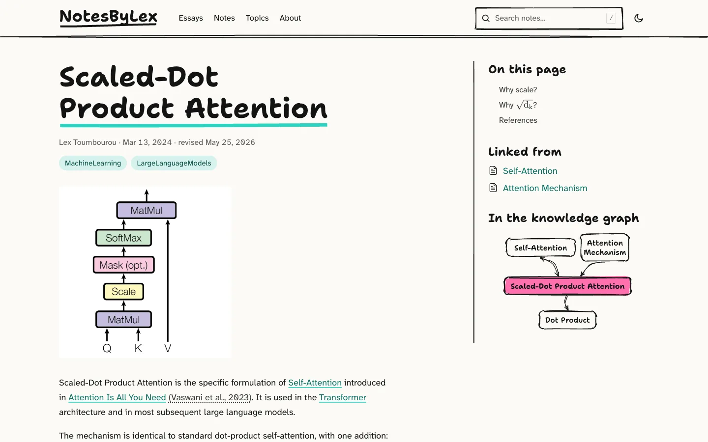

Dark mode is chalk on slate:

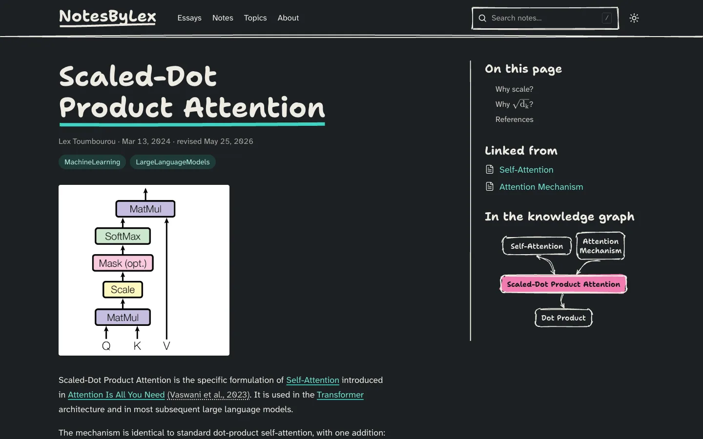

And on a phone the note starts at the top of the screen instead of below the navigation:

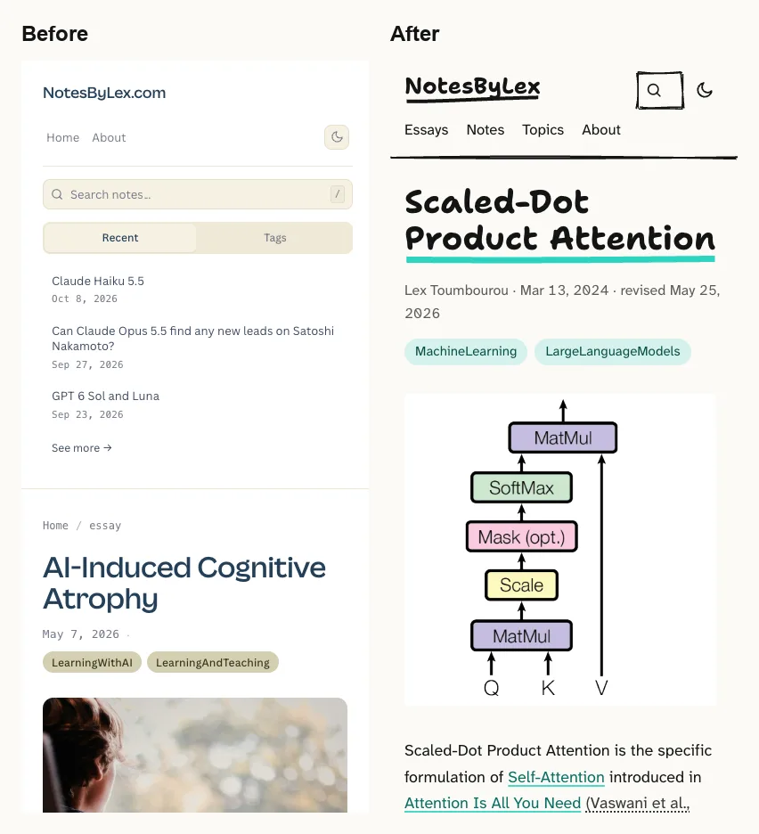

## The brand guide

The whole system is written down in the site's repository as `BRAND.md`, `PRODUCT.md` and `DESIGN.md`. My NotesByLex videos will use the same styles next.

<!-- Lex: what you'd take away from the process; what surprised you; would you use Impeccable again. -->
