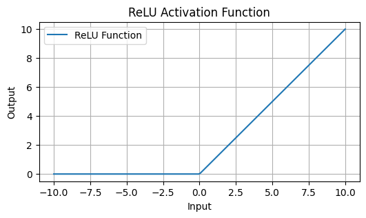

**Rectified Linear Unit (ReLU)** is the most common activation function in deep learning: it converts negative values to 0. ReLU is one of the simplest conceivable ways to add non-linearity to a neural network. And it works!

$f(x)= \max(0,x)$

Code:

```python
import numpy as np

def relu(x):
    return np.maximum(0, x)
```

The paper [Rectified Linear Units Improve Restricted Boltzmann Machines](https://www.cs.toronto.edu/~fritz/absps/reluICML.pdf) is commonly cited as the first usage of the ReLU activation function, though the first usage of the function dates back to the 1975 paper [Cognitron: A self-organizing multilayered neural network](https://link.springer.com/article/10.1007/BF00342633)

ReLU helped to overcome the vanishing gradient problem prevalent in traditional activation functions like [Sigmoid Function](sigmoid-function.md) or tanh. In these functions, gradients can become extremely small, stopping the network from learning further.

However, since the function outputs zero for any negative input, neurons can sometimes become inactive and stop contributing to the learning process, referred to as *"dying ReLU"*, especially if the network is not properly initialized or the learning rate is too high.

Variations like [Leaky ReLU](leaky-relu.md) and Parametric ReLU mitigate this by replacing 0 with a small value when the unit is inactive, providing a way to keep the neurons alive during the training process.



## Recommended Reading

[Deep Learning for Coders with Fastai and PyTorch: AI Applications Without a PhD](https://amzn.to/3Svowuu)


To learn more about loss functions and the fundamentals of neural networks in general, I recommend [Deep Learning for Coders with Fastai and PyTorch: AI Applications Without a PhD](https://amzn.to/3Svowuu)—an approachable yet complete top-down guide to Deep Learning.
