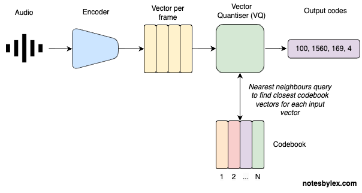
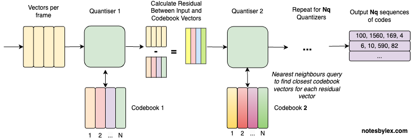

**Residual Vector Quantization (RVQ)** is a technique for encoding audio into discrete tokens called *codes*. It's like a tokeniser for audio. Not only does that allow us to compress audio into absurdly small sizes - up to a 90x compression rate, but we can also use the tokens to model audio using the same architectures that work so well for text, like Transformers. Effectively, we can build large language models for audio, speech or music, and that's precisely what recent models like Google's [AudioLM](https://google-research.github.io/seanet/audiolm/examples/), Microsoft's [VALL-E (X)](https://www.microsoft.com/en-us/research/project/vall-e-x/) and Meta's [MusicGen](https://audiocraft.metademolab.com/musicgen.html) are.

RVQ applied to audio in the [Soundstream](https://blog.research.google/2021/08/soundstream-end-to-end-neural-audio.html) paper by Google Researchers and has since been used in popular neural audio compression architectures like [Encodec](https://github.com/facebookresearch/encodec) and [DAC](https://github.com/descriptinc/descript-audio-codec).

To understand, RVQ. First, let's ignore the R part of RVQ, leaving **Vector Quantization (VQ)**.

Quantisation refers to converting infinite values into discrete finite values, and vector quantisation applies it to [Vectors](vector.md). Vector quantisation comes originally from [signal processing](https://en.wikipedia.org/wiki/Vector_quantization) and has been exploited through image modelling architectures like [VQ-VAE](https://arxiv.org/abs/1711.00937) and [VQGAN](https://compvis.github.io/taming-transformers/).

## Vector Quantisation for Audio

The direct VQ approach to encoding audio would look like this:

1. **Audio Input**: an audio signal is represented as a multidimensional array of numbers with a known [Sample Rate](sample-rate.md) (usually 44100). A mono signal has one channel; stereo and others can have more.
2. **Encoder**: An encoder converts the signal into a sequence of vectors, one per "frame". The frame rate will be dependent on the model architecture and sample rate.
3. **Quantise**: Find the nearest neighbour in a lookup table called the codebook for each vector. The codebook table is learned alongside the encoder and decoder during training.
4. **Output**: The position of the lookup vector in the matrix is the "code" and is all we need to reconstruct the audio, given the RVQ model. However, we want to use the vector representation of codes for any upstream modelling.

However, representing audio with a single code per frame will never allow us to accurately reconstruct audio from these codes unless we have an infinitely large codebook matrix.

One clever technique is to take the difference between the encoded vector and the codebook vector, which we call the **Residual** vector. We can look that vector up in an additional codebook table. And we can repeat this process, each time adding a high capability for accurate reconstruction at the cost of compression size.

## Residual VQ

For Residual Vector Quantisation, we add these steps to the VQ operation:

* **Residual** - calculate a difference vector called the Residual for each codebook and input vector. Use that to look at a subsequent codebook.
* **Repeat** - repeat this for $Nq$ codebook tables.
* **Output** - at the end, we will have $Nq$ sequences of codes for modelling.

So now we have: **Residual** **Vector Quantization**</a>.

## Training

We can train a model like this by performing the encode and decode audio during training and calculating various forms of reconstruction loss, including a GAN-style discriminator. This example is the architecture described in the [SoundStream](../../../permanent/soundstream.md) paper:

---

This article was heavily inspired by [What is Residual Vector Quanitzation](https://www.assemblyai.com/blog/what-is-residual-vector-quantization) by AssemblyAI.
