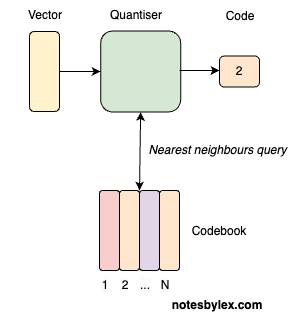
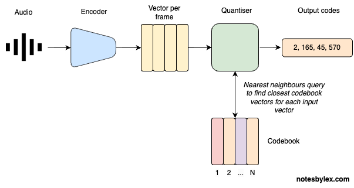

**Residual Vector Quantisation (RVQ)** is a technique for encoding audio into discrete tokens called *codes*. It's like a tokeniser for audio. Not only does that allow us to compress audio into absurdly small sizes - up to a 90x compression rate, but we can also use the tokens to model audio using the same architectures that work so well for text, like Transformers. Now we can build language models for audio, speech or music, and that's precisely what recent models like Google's [AudioLM](https://google-research.github.io/seanet/audiolm/examples/), Microsoft's [VALL-E](vall-e.md) and Meta's [MusicGen](https://audiocraft.metademolab.com/musicgen.html) are.

RVQ was first applied to audio in the [Soundstream](https://blog.research.google/2021/08/soundstream-end-to-end-neural-audio.html) paper by Google Researchers and has since been used in popular neural audio compression architectures like [Encodec](https://github.com/facebookresearch/encodec) and [DAC](https://github.com/descriptinc/descript-audio-codec).

To understand RVQ, let's start by ignoring the R part of RVQ to focus on [Vector Quantisation](vector-quantisation.md) (VQ).

## Vector Quantisation

Quantisation is the process of converting continuous infinite values into discrete finite values.

In VQ, we encode a signal into a series of [Vector](vector.md), then query each vector to find the closest neighbour in a lookup table called a **codebook**. Now, we can represent an entire chunk or *"frame"* of a signal with a single **code**.

The codebook table is nothing more than an embedding table, where the table size is the codebook size, and the vector size is the codebook dimensions: `codebook = nn.Embedding(codebook_size, codebook_dim)`. Like an embedding table, the weights are learned alongside the rest of the network during training.

Vector quantisation comes originally from [signal processing](https://en.wikipedia.org/wiki/Vector_quantization) and has been exploited throughout image modelling architectures like [VQ-VAE](https://arxiv.org/abs/1711.00937) and [VQGAN](https://compvis.github.io/taming-transformers/).

## Vector Quantisation for Audio

The direct VQ approach to encoding audio might look like this:

1. **Audio Input**: an audio signal is represented as a multidimensional array of numbers with a known [Sample Rate](sample-rate.md) (usually 44.1kHz). A mono signal has one channel; stereo and others can have more.
2. **Encoder**: An encoder converts the signal into a sequence of vectors, one per "frame". The frame rate will be dependent on the model architecture and sample rate.
3. **Quantise**: Find each vector's nearest neighbour in the codebook table. Again, the codebook table is learned alongside the encoder and decoder during training.
4. **Output**: The index of the lookup vector in the matrix is the "code" and is all we need to reconstruct the audio, given a Decoder. Though not pictured in the diagram, the decoder is learned alongside the encoder and codebook table.

Note that for upstream modelling tasks, we will want to use the vector representation of each code.

One clear limitation of this approach is that representing audio with a single code per frame will never allow us to accurately reconstruct audio from these codes unless we have an infinitely large codebook.

A clever technique to mitigate this is to take the difference between the encoded vector and the codebook vector for each encoded vector, which we call the **Residual** vector. We can look up the residual vector in a subsequent codebook table. And we can repeat this process, each time adding a high capability for accurate reconstruction at the cost of compression size.

## Residual VQ

For Residual Vector Quantisation, we add these steps to the VQ operation:

* **Residual** - calculate a difference vector called the Residual for each codebook and input vector. Use that to look at a subsequent codebook.
* **Repeat** - repeat this for $Nq$ codebook tables.
* **Output** - at the end, we will have $Nq$ sequences of codes for modelling.

So now we have: **Residual** **Vector Quantization**</a>.

## Training

We can train a model like this by performing the encode and decode audio during training and calculating various forms of reconstruction loss, including a GAN-style discriminator. This example is the architecture described in the [SoundStream](../../../permanent/soundstream.md) paper:

---

This note was heavily inspired by [What is Residual Vector Quanitzation](https://www.assemblyai.com/blog/what-is-residual-vector-quantization) by AssemblyAI.
