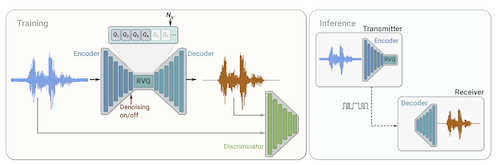

Residual Vector Quantization converts audio into discrete tokens called *codes*.

That allows us to compress audio into small sizes - for example, DAC achieves a 90x compression rate. But even more usefully, the discrete representation will enable us to model audio using architectures that work on discrete representations, like Transformers.

Now, we can make large language models for audio, speech or music. And that's exactly what AudioLM, MusicLM and MusicGen are.

RVQ was first described in the [Soundstream: An End-to-End Neural Audio Codec](../../../permanent/soundstream-an-end-to-end-neural-audio-codec.md) paper and has since been used in popular neural audio compression architectures like [SoundStream](../../../permanent/soundstream.md), [Encodec](../../../permanent/encodec.md) and [dac](../../../permanent/dac.md).

RVQ is an extension to **Vector Quantization (VQ)**, which originally came from image modelling ([VQ-VAE](../../../permanent/vq-vae.md))

The VQ approach to encoding audio would look like this.

At inference time, an encoder chunks an audio file into a list of vectors. The number of samples in a chunk is model-dependent. Then, the RVQ module takes each vector and finds the closest neighbour in a codebook matrix. We can now represent the audio as a set of codes, which is a very minimal representation.

At training time, we can encode, RVQ and decode a bunch of audio and take various forms of reconstruction loss to train a model to get good at it.

This diagram illustrates the training and inference architecture that uses RVQ, which is from the SoundStream paper (fig. 2):

If we only have a single fixed codebook lookup table, it will need to be big to represent all audio effectively, and this is where the **Residual** part comes in.

We can take the difference between the encoded vector and the closest vector, called the "residual error" or "residual", and use that to look up a 2nd codebook table. We can repeat that number of times, adding an extra stream of bits each time. We can do that at times. Now, we should have a reasonable representation of the audio in our codebooks of length N.

[This article by AssemblyAI](---
title: Residual Vector Quantization
date: 2024-01-10 00:00
modified: 2024-01-10 00:00
status: draft
aliases:
- Codebook
cover: /_media/rvq-cover.png
---

Residual Vector Quantization converts audio into discrete tokens called *codes*.

That allows us to compress audio into small sizes - for example, DAC achieves a 90x compression rate. But even more usefully, the discrete representation will enable us to model audio using architectures that work on discrete representations, like Transformers.

Now, we can make large language models for audio, speech or music. And that's exactly what AudioLM, MusicLM and MusicGen are.

RVQ was first described in the [Soundstream: An End-to-End Neural Audio Codec](../../../permanent/soundstream-an-end-to-end-neural-audio-codec.md) paper and has since been used in popular neural audio compression architectures like [SoundStream](../../../permanent/soundstream.md), [Encodec](../../../permanent/encodec.md) and [dac](../../../permanent/dac.md).

RVQ is an extension to **Vector Quantization (VQ)**, which originally came from image modelling ([VQ-VAE](../../../permanent/vq-vae.md))

The VQ approach to encoding audio would look like this.

At inference time, an encoder chunks an audio file into a list of vectors. The number of samples in a chunk is model-dependent. Then, the RVQ module takes each vector and finds the closest neighbour in a codebook matrix. We can now represent the audio as a set of codes, which is a very minimal representation.

At training time, we can encode, RVQ and decode a bunch of audio and take various forms of reconstruction loss to train a model to get good at it.

This diagram illustrates the training and inference architecture that uses RVQ, which is from the SoundStream paper (fig. 2):

If we only have a single fixed codebook lookup table, it will need to be big to represent all audio effectively, and this is where the **Residual** part comes in.

We can take the difference between the encoded vector and the closest vector, called the "residual error" or **Residual**, and use that to look up a 2nd codebook table. We can repeat that number of times, adding an extra stream of bits each time. We can do that at times. Now, we should have a reasonable representation of the audio in our codebooks of length N.

References:
[This article](https://www.assemblyai.com/blog/what-is-residual-vector-quantization) by AssemblyAI is my favourite on this topic.