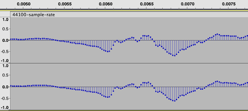
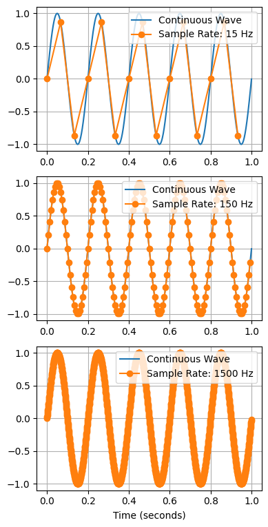

Sample rate measures how accurately a sound wave is digitally represented.

To create a digital audio recording of a [Sound Wave](sound-wave.md), we capture the signal's amplitude many times a second and store it as an array of numbers. Each of these numbers is called a sample. We measure audio quality by number of samples per second or [hertz](https://en.wikipedia.org/wiki/Hertz).

The number is generally stored as an int or float, whose range or precision is defined by the [Bit Depth](bit-depth.md)

Together, they are the two critical details that define the quality of a digital audio recording.

If we zoom into an audio file in Audacity to the higher resolutions, we can visualise our waveform at the sample level:



The number of elements in the array is $\text{ audio time (secs) } \times \text{ sample rate }$. Therefore, higher sample rates will require more storage space. We will have an array per channel for stereo and other multichannel audio.

In Python, the sound is typically represented using a Numpy multidimensional array. Here we can see an example of loading an audio file using the [scipy](https://scipy.org/) library:

```python
>>> from scipy.io import wavfile
>>> sample_rate, audio_array = wavfile.read("../../_media/4s-silence.wav")
>>> audio_array.shape
(176400,)
>>> audio_length = len(audio_array) / sample_rate
>>> audio_length
4.0
```

As you can see, we can find the length of audio represented as a Numpy array by dividing the number of samples by the sample rate.

How do we determine the optimal sample rate?

## Nyquist-Shannon sampling theorem

According to the [Nyquist-Shannon Sampling Theorem](nyquist-shannon-sampling-theorem.md) the frequency of sampling of a wave must be greater than twice the highest frequency in a wave. Since the highest frequency the human ear can hear is around 20 kHz, anything about 40 kHz should perfectly reproduce what the human ear can perceive.

The sample rate for CD audio is 44.1kHz, which is two times 22.05 kHz - that gives a bit of extra buffer for very high frequencies.

44.1kHz continues to be a standard sample rate for high-quality audio, although 48kHz is also a common choice.

However, there are other standard sample rates for different types of audio.

## Common Sample Rates

### 44.1 kHz

The most commonly found sample rate, as it has been the standard for CD quality since inception.

### 48 kHz

For audio and some film and video

### 88.2 kHz and 96 kHz

For higher-resolution audio formats

### 192 kHz

For some ultra-high-definition recordings.

## Aliasing

Since the true sound wave has to be inferred from digital samples, the sound will only be accurately captured if the rate is higher. In particular, the higher frequencies will be folded into lower frequencies, causing distortion - this issue of under-sampling is referred to as aliasing.

The figure below shows an example of a 15Hz sine wave over a minute. As you can see, we can only accurately reconstruct the original sine wave if we sample enough points. However, after a certain number of samples, we can rebuild the sound wave perfectly; more samples do not help.



Real sound waves are more complex than simple sine waves, so more samples are needed to capture that complexity. However, the important detail is that more samples are not necessarily better. We can accurately represent all audio we perceive at any sample rate above 40kHz.
