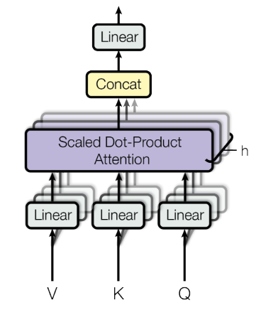

Scaled-Dot Product Attention is a method of computing a token representation to include the context of surrounding tokens. It was described in the paper [Attention Is All You Need](attention-is-all-you-need.md) and is used in the [Transformer](../public/notes/permanent/transformer.md) architecture.

In a seq-to-seq architecture, we typically convert tokens (words) into a sequence of embeddings. However, some token embeddings will be ambiguous without the surrounding context.

Consider the word "minute" in these two sentences:

> "It took one **minute**."

and

>  "The size was **minute**."

The token representing **minute** will mean very different things in each sentence, even though they will use the same embedding representation. The words "took" and "size" indicate whether the word relates to time or size, respectively. We want a way to represent each token with information about important surrounding tokens.

We could use a simple average to achieve this. However, in the **minute** cases, some words are more important to defining the context than others. Could we also use a neural network to compute the weights for each other tokens in sequence to have the most useful average representation? That's exactly what Scaled-Dot Product Attention is.

Scaled-Dot Product Attention uses two matrix projections to compute the scores of other tokens in the sequence, then a softmax to convert to weights. Then, a final projection is to create the final weighted representation. All the weights in the attention module are learned alongside the rest of the network.

Let's see how to compute it step-by-step.

## Scaled-Dot Product Attention Step-by-step

### 0. Prepare Input

Though this step is technically not part of Scaled-Dot Product Attention, we represent input tokens in the Transformer architecture using a standard token embedding: `nn.Embedding` and a [Positional Encoding](positional-encoding.md), which we combine to create a final representation.

The positional embedding represents each token's position in the sequence, as this information would otherwise be lost.

The dimensions of this input are batch, time, and embedding size. For example, with a batch size of 8, four input words (assuming word-level tokenisation) and an embedding dimension of 1024, the embeddings would have a shape of: `(8, 4, 1024)`

### 1. Create projections used for computing scores

Transform input embeddings into three matrices called *query*, *key*, and *values*. However, those names aren't particularly useful; they could also be called *proj1*, *proj2*, and *proj_final*. Many other articles on the web relate these values to the retrieval system, although I think it's unnecessary confusion.

All you need to know is that our goal is to compute a table of scores with a row per token. This paper chooses this particular method of accomplishing it, but there are alternatives.

We can do this in 6 lines of code:

```python
# __init__
query_proj = nn.Linear(embedding_dim, attention_dim, bias=False)
key_proj = nn.Linear(embedding_dim, attention_dim, bias=False)
value_proj = nn.Linear(embedding_dim, attention_dim, bias=False)

# forward
query = query_proj(X)
key = key_proj(X)
value = value_proj(X)
```

Like any typically linear layer, the projection weights are learned throughout training.

### 2. Compute scores as the dot product of query and key

Compute the scores as the dot product of each query and key. However, for efficiency, we compute the dot products for the entire sequence by performing a matrix product of query and the transposed key matrix: $\text{scores} = Q @ K^{T}$

```python
scores = query @ key.transpose(2, 1)
```

### 3. Scale the score values using the square root of the attention dimension

As the size of the attention dimensions increases, the dot products computed to get the attention scores generally grow larger in magnitude as more terms are summed in the dot product calculation. Larger values passed into the Softmax function can lead to small gradients, making learning slow and ineffective. So, they scale the scores by dividing the square root of the attention dimension, which doesn't change their relative scores since the same factor scales all scores but keeps their absolute magnitude in a stable range.

```python
scores = scores / sqrt(attention_dim)
```

Scaled-Dot Product Attention is simply Dot-Product attention with this additional step.

### 4. (Decoder only) Mask out any future tokens

In the Decoder part of the Transformer, we need to ensure that the model cannot "see" future tokens when making predictions, as the decoder should only rely on previously generated tokens to predict the next token in the sequence. To achieve this, we apply a mask to the attention scores before applying the softmax function. The mask sets the scores for future tokens to negative infinity (-inf), which results in zeros applying the softmax function, effectively blocking any information flow from future tokens.

We can use the [tril](https://pytorch.org/docs/stable/generated/torch.tril.html) function to create a diagonal mask where the value `True` represents positions to be masked, then [masked_fill](https://pytorch.org/docs/stable/generated/torch.Tensor.masked_fill_.html#torch.Tensor.masked_fill_) will replace any masked positions with `float("-inf")`. After performing the Softmax operation, any -inf values will be converted into a weight of 0.

```python
# Compute a mask and set all future values to -inf, which ensures a score of 0 after softmax.
attn_mask = torch.tril(torch.ones(*scores.shape)) == 0
scores = torch.masked_fill(scores, attn_mask, float("-inf"))
```

### 5. Compute Softmax to convert scores into probability distributions

Next, we ensure the scores are between 0 and 1 and all the scores equal 1.

```python
scores = softmax(scores, dim=-1)
```

### 6. Calculate the final representations as the dot product of scores and values

Finally, we use the value matrix to create a final output using the calculated weights.

```python
out = scores @ value
```

Here's the full PyTorch module:

```python
import math

import torch
from torch import nn
from torch.nn.functional import softmax


class SingleHeadAttention(nn.Module):
    def __init__(self, embedding_dim, attention_dim):
        super().__init__()
        torch.manual_seed(0)
        self.attention_dim = attention_dim
    
        self.key_proj = nn.Linear(embedding_dim, attention_dim, bias=False)
        self.query_proj = nn.Linear(embedding_dim, attention_dim, bias=False)
        self.value_proj = nn.Linear(embedding_dim, attention_dim, bias=False)

    def forward(self, X):
        key = self.key_proj(X)
        query = self.query_proj(X)
        value = self.value_proj(X)

        scores = query @ key.transpose(2, 1)
        # Scale scores by sqrt of attention dim
        scores = scores / math.sqrt(self.attention_dim)

        # Compute a mask and set all future values to -inf, which ensures a score of 0 after softmax.
        attn_mask = torch.tril(torch.ones(*scores.shape)) == 0
        scores = torch.masked_fill(scores, attn_mask, float("-inf"))

        # Compute softmax of scores.
        scores = softmax(scores, dim=-1)

        # Now, do the final projection with values.
        out = scores @ value

        return out
```

In the Transformer architecture, we combine multiple Self-Attention modules by concatenating their outputs into one final representation, passed through a final feed-forward layer. These multiple Self-Attention layers together are called [Multi-head Attention](multi-head-attention.md).



*Multi-Head Attention diagram from paper Attention Is All Your Need*
