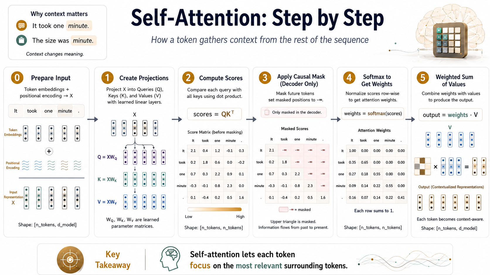
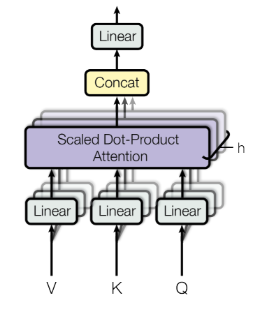

Self-Attention, sometimes called intra-attention or **vanilla attention**, is an [Attention Mechanism](attention-mechanism.md) technique that represents each token in a sequence as a weighted average of all other tokens, where the weights reflect how relevant each token is to the others [@vaswaniAttentionAllYou2017].

It was introduced as the core building block of the [Transformer](transformer.md) architecture in the paper [Attention Is All You Need](attention-is-all-you-need.md).

In a seq-to-seq architecture, we typically convert tokens (words) into a sequence of embeddings. However, some token embeddings will be ambiguous without the surrounding context.

Consider the word "minute" in these two sentences:

> "It took one **minute**."

and

> "The size was **minute**."

The token representing **minute** will mean very different things in each sentence, even though they will use the same embedding representation. The words "took" and "size" indicate whether the word relates to time or size, respectively. We want a way to represent each token with information about important surrounding tokens.

We could use a simple average to achieve this. However, in the **minute** cases, some words are more important to defining the context than others. Could we also use a neural network to compute the weights for each other token in the sequence to get the most useful average representation? That's exactly what self-attention does.

Self-attention uses two matrix projections to compute the scores of other tokens in the sequence, then a softmax to convert to weights, then a final projection to create the final weighted representation. All the weights in the attention module are learned alongside the rest of the network.

The specific formulation from the Transformer paper is [Scaled-Dot Product Attention](scaled-dot-product-attention.md), which adds a scaling step to keep scores numerically stable.

Let's see how to compute it step-by-step.



## Self-Attention Step-by-step

### 0. Prepare Input

Though this step is technically not part of self-attention itself, we represent input tokens in the Transformer architecture using a standard token embedding (`nn.Embedding`) and a [Positional Encoding](positional-encoding.md), which we combine to create a final representation.

The positional embedding represents each token's position in the sequence, as this information would otherwise be lost.

The dimensions of this input are batch, time, and embedding size. For example, with a batch size of 8, four input words (assuming word-level tokenisation) and an embedding dimension of 1024, the embeddings would have a shape of: `(8, 4, 1024)`

### 1. Create projections used for computing scores

Transform input embeddings into three matrices called *query*, *key*, and *values*. However, those names aren't particularly useful; they could also be called *proj1*, *proj2*, and *proj_final*. Many other articles on the web relate these values to the retrieval system, although I think it's unnecessary confusion.

All you need to know is that our goal is to compute a table of scores with a row per token. This paper chooses this particular method of accomplishing it, but there are alternatives.

We can do this in 6 lines of code:

```python
# __init__
query_proj = nn.Linear(embedding_dim, attention_dim, bias=False)
key_proj = nn.Linear(embedding_dim, attention_dim, bias=False)
value_proj = nn.Linear(embedding_dim, attention_dim, bias=False)

# forward
query = query_proj(X)
key = key_proj(X)
value = value_proj(X)
```

Like any typical linear layer, the projection weights are learned throughout training.

### 2. Compute scores as the dot product of query and key

Compute the scores as the dot product of each query and key. However, for efficiency, we compute the dot products for the entire sequence by performing a matrix product of query and the transposed key matrix: $\text{scores} = Q @ K^{T}$

```python
scores = query @ key.transpose(2, 1)
```

### 3. (Decoder only) Mask out any future tokens

In the Decoder part of the Transformer, we need to ensure that the model cannot "see" future tokens when making predictions, as the decoder should only rely on previously generated tokens to predict the next token in the sequence. To achieve this, we apply a mask to the attention scores before applying the softmax function. The mask sets the scores for future tokens to negative infinity (-inf), which results in zeros after applying the softmax function, effectively blocking any information flow from future tokens.

We can use the [tril](https://pytorch.org/docs/stable/generated/torch.tril.html) function to create a diagonal mask where the value `True` represents positions to be masked, then [masked_fill](https://pytorch.org/docs/stable/generated/torch.Tensor.masked_fill_.html#torch.Tensor.masked_fill_) will replace any masked positions with `float("-inf")`. After performing the Softmax operation, any -inf values will be converted into a weight of 0.

```python
attn_mask = torch.tril(torch.ones(*scores.shape)) == 0
scores = torch.masked_fill(scores, attn_mask, float("-inf"))
```

### 4. Compute Softmax to convert scores into weights

Next, we ensure the scores are between 0 and 1 and sum to 1.

```python
scores = softmax(scores, dim=-1)
```

### 5. Calculate the final representations as the dot product of scores and values

Finally, we use the value matrix to create a final output using the calculated weights.

```python
out = scores @ value
```

Here's the full PyTorch module:

```python
import math

import torch
from torch import nn
from torch.nn.functional import softmax


class SingleHeadAttention(nn.Module):
    def __init__(self, embedding_dim, attention_dim):
        super().__init__()
        torch.manual_seed(0)
        self.attention_dim = attention_dim

        self.key_proj = nn.Linear(embedding_dim, attention_dim, bias=False)
        self.query_proj = nn.Linear(embedding_dim, attention_dim, bias=False)
        self.value_proj = nn.Linear(embedding_dim, attention_dim, bias=False)

    def forward(self, X):
        key = self.key_proj(X)
        query = self.query_proj(X)
        value = self.value_proj(X)

        scores = query @ key.transpose(2, 1)

        attn_mask = torch.tril(torch.ones(*scores.shape)) == 0
        scores = torch.masked_fill(scores, attn_mask, float("-inf"))

        scores = softmax(scores, dim=-1)

        out = scores @ value

        return out
```

In the Transformer architecture, we combine multiple self-attention modules by concatenating their outputs into one final representation, passed through a final feed-forward layer. These multiple self-attention layers together are called [Multi-head Attention](multi-head-attention.md).



*Multi-Head Attention diagram from [@vaswaniAttentionAllYou2017].*
