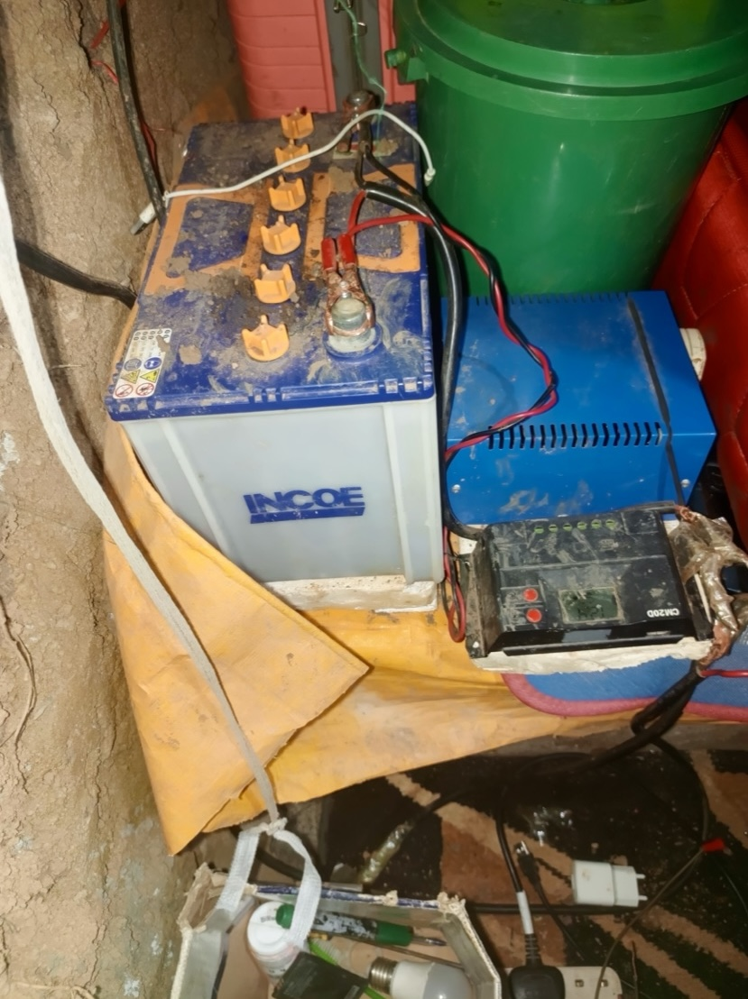
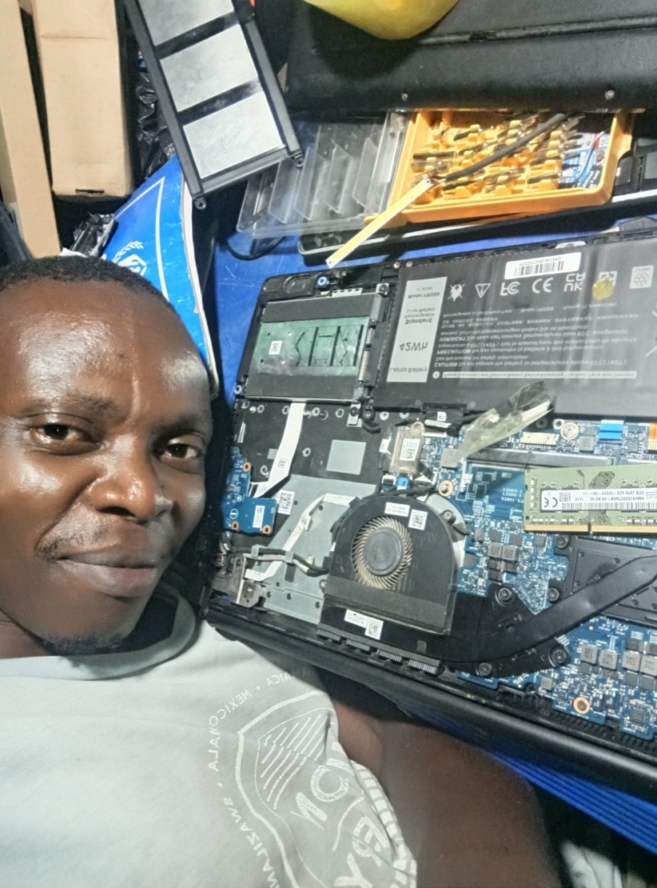
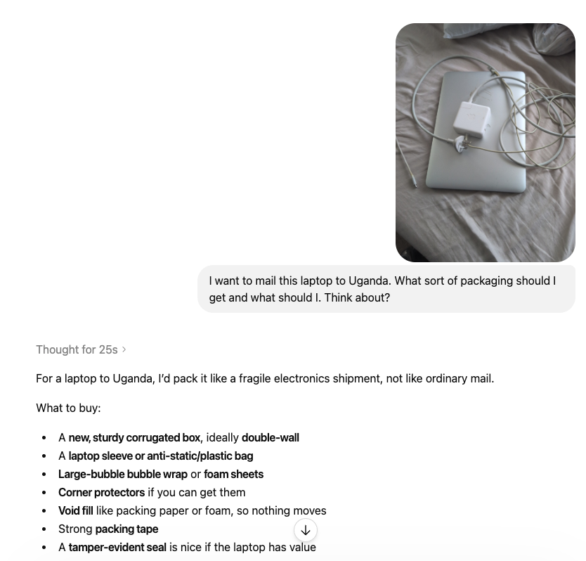
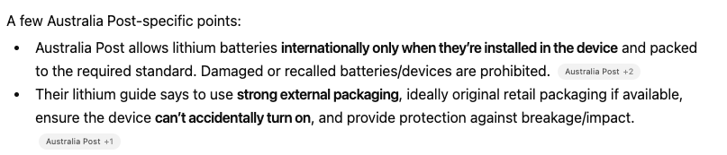
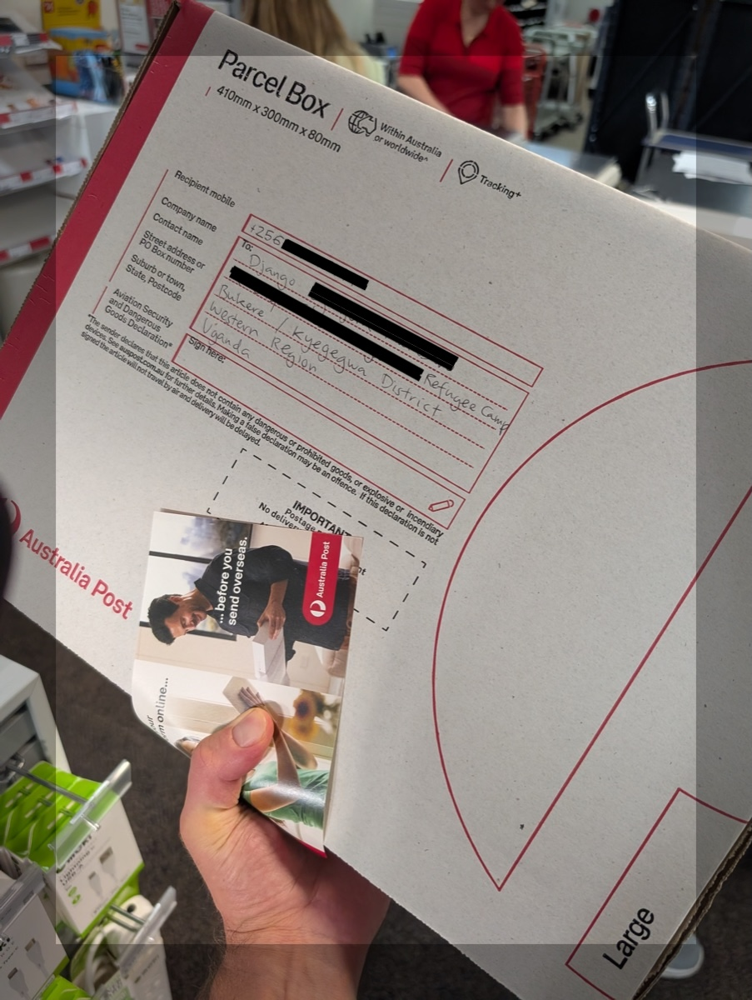
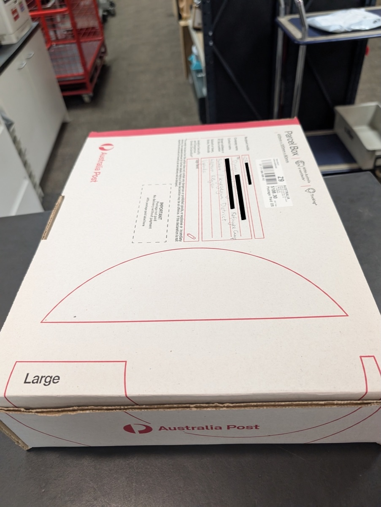
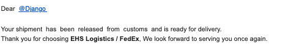
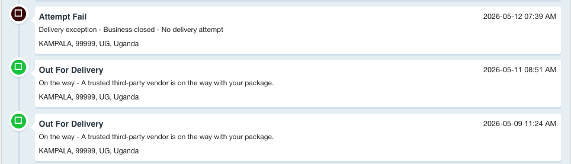
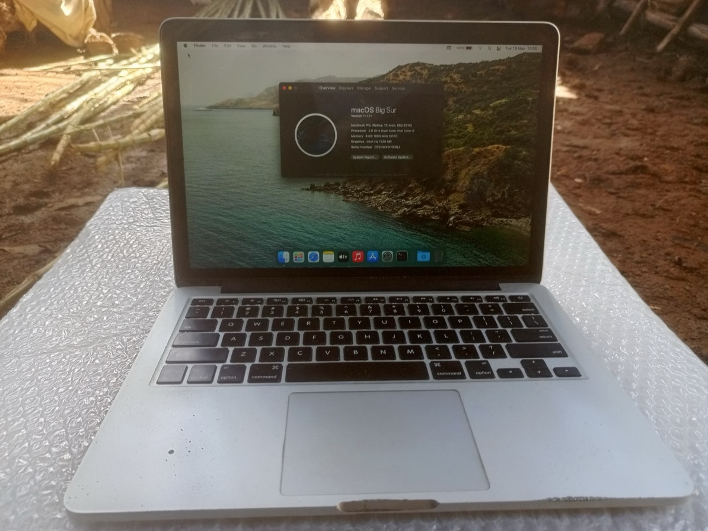

## Intro

For the last few years, while finally earning my belated Bachelor's Degree in the [University of London's World-Class program](university-of-londons-world-class-program.md). I've met some amazing people from all across the world, resiliently completing their degrees after hours while balancing work, families, and other extremely challenging circumstances.

However, there are a few with circumstances quite as challenging as Django's.

Django is a Congolese refugee living in a refugee camp in Western Uganda. He has no reliable electricity in the camp and runs his laptop on solar power; his internet access comes from Airtel minutes, which he needs to ration on a very limited income. This makes completing a Computer Science degree - with assignments that need to be uploaded on time and remotely proctored exams - at times seem nearly impossible. In the last few years, thanks to various world events and a general sentiment away from compassion and charity, it has only gotten harder.

Recently, Django found himself in a new predicament.

His laptop's motherboard burned out after accidentally connecting a USB cable to a 12V battery output, and the next semester was set to start in a few weeks. He had tried to repair it to no avail - the laptop continued to overheat and would not turn on.

<table style="width:100%; border-collapse:collapse;">
  <tr>
    <td style="padding:4px; width:33%;"></td>
    <td style="padding:4px; width:33%;"></td>
  </tr>
</table>

I have a few old MacBooks that are in working order, just sitting around the house. So I offered to send one to him.

Naively, I figured that I'd just go to my local post office, put it in a box with some bubble wrap, and he'd have it in a few days/weeks. However, the process proved a surprisingly difficult ordeal.

I thought it might be interesting to document the process from both our perspectives. It may serve as a practical guide for anyone in a similar circumstance, and also as a window into the day-to-day difficulties my friend faces.

## Sending the laptop

I dusted off the laptop, wiped the hard drive and reinstalled macOS using [Apple's instructions](https://support.apple.com/en-au/guide/mac-help/mh27903/mac). I wiped the screen with a lint-free cloth wetted with only water, avoiding alcohol-based cleaning products. For the keyboard, I used standard alcohol-based multipurpose wipes to remove my ancient finger grime.

I asked ChatGPT how to send the laptop, and it gave me a spiel about finding a reliable freight service or courier.

Despite this, I asked whether it would be possible to send via Australia Post (our national mail service) anyway, since it was down the road from my house. Apparently, I could, as long as the lithium battery was installed in the device.

At the post office, a friendly staff member confirmed it could be sent, helped me package it up securely, and it cost me **$111.60 AUD**.

<table style="width:100%; border-collapse:collapse;">
  <tr>
    <td style="padding:4px; width:50%;"></td>
    <td style="padding:4px; width:50%;"></td>
  </tr>
</table>

I shared the tracking number with Django on April 1st and left it at that. Six days later, he messaged to say it looked like the package was arriving soon. Too easy.

However, a few hours later, I got a knock at my door. The package had been returned to my house after failing to be processed at the distribution centre.

Turns out Australia Post won't ship devices containing lithium batteries internationally by air, after all. I probably [should have checked that on their website](https://auspost.com.au/sending/guidelines/dangerous-prohibited-items). I guess the staff apparently weren't aware of this policy either.

I searched for how to actually send a laptop overseas, and a few freight services with well-tuned SEO popped up. I found a vendor called Pack & Send with an office a few kms from my house.

I submitted a quote request on their website, and they called me back with a price of $213 AUD.

I walked about 45 minutes to the office, in a neighbouring industrial suburb.

The woman at the front desk laughed at the packaging job I had done at the Post Office and said she'd repackage it properly.

This was April 9th, which was about 11 days into the [Strait of Hormuz crisis](https://en.wikipedia.org/wiki/2026_Strait_of_Hormuz_crisis), so she told me to expect delays. She also mentioned there would be additional costs for Django in Uganda: customs fees, taxes, and government charges she couldn't estimate, and that he would need a buffer of at least $50–100 on his end.

## Sending money

Since money was extremely tight on Django's end, I offered to send some for the buffer. Most Ugandan services accept Airtel Money, which I knew could be transferred easily via the [WorldRemit app](https://www.worldremit.com/en). He received the money in about 5 minutes.

Great job, WorldRemit team.

## Clearing Ugandan Customs

We tracked the package from **Brisbane** → **Sydney** → **Guangzhou** → **Korea** → **Japan** → **Hong Kong** → **Turkey** → **France** → **The Netherlands**.

Then, on April 15th, Django received an email outlining the 5-step customs process from an EHS Africa Logistics Agent:

1. Agency Fee Payment of **UGX 95,000 (~$35 AUD)** for administrative fees
2. Appoint EHS Logistics Uganda via the Uganda Revenue Authority (URA) Portal
3. Complete a Tax Assessment
4. Pay any taxes
5. Complete URA Verification

All of this had to be cleared within 5 working days, or we would be paying storage fees, the agent warned.

However, Step 2 required a Tax Identification Number, which Django - a refugee - does not have. And, getting one requires physically presenting at a URA office, and there was none nearby in his district.

## Getting a TIN Number as a Refugee

Django sent an email to the EHS rep asking if it could be completed without a TIN, but received no reply. So he took matters into his own hands.

In his words:

---

Regarding the TIN number, I first tried to do it online because the URA website suggested that the process could be started electronically. However, I discovered that for refugees and non-citizens, it was not truly an online process. Ugandan citizens could complete everything online, but refugees could only begin the application online and then had to physically appear at a URA office with documents for verification before approval.

Even starting the online part was difficult. The application form was an old Excel macro form that could not properly work on my phone. At that time, I did not yet have a computer, so there was practically no way for me to complete or upload the form myself.

I then went to a nearby organization that says it assists refugee youth. They told me they could help fill and submit the form, but they asked me for the equivalent of about 20 USD just to complete the submission process, and they also told me the process could take around two weeks. At another point, I was even told an amount closer to 40 USD. The difficult part was that this was not even the full service - after paying, I would still have to personally travel to a URA office for physical verification.

Since I urgently needed the TIN number for customs clearance, I decided to do the rest myself instead of waiting.

From my area in the refugee settlement, I first walked for about two hours to reach a trading center "Bukere" where I could get a boda-boda motorcycle. From there, I travelled to the main road in "Kyegegwa" and boarded a public taxi/bus to another town, "Mubende", where there was a URA office. The taxi constantly stopped along the road picking up passengers, so the trip took around three hours.

When I reached the town, I first went to a police station to ask for directions because I did not know where the URA office was located. A boda-boda rider was then called to take me there.

At the URA office, I was told that I needed to return all the way back to the refugee settlement and obtain a local authorization letter from the camp leadership - Local Council "LC1", "RWA C1" - before they could process my request. That day was a Friday. I explained repeatedly that I had travelled from very far away, using money that had originally been sent for the laptop clearance process itself, and that returning on Monday would be extremely difficult for me. But they continued insisting.

At some point, one man quietly pulled me aside and suggested that if I "gave something," they could help solve the problem more easily. I refused because I did not want to participate in corruption. After some time, another officer finally agreed to look at my documents. However, after opening the file, he told me that "the network was down" and that I should come back on Monday.

He then told me to walk around town for one or two hours and come back later to check whether the network had returned. I did exactly that. When I returned, he again told me the network was still unavailable. So I remained sitting there in the office area for hours.

What made the situation painful was that while I was being told the network was not working, I could clearly see other people arriving, being served normally, and leaving. Many were speaking local languages, while I was struggling to explain myself in English and repeatedly trying to convince them that I had nowhere else to go and no money for repeated journeys.

After waiting several more hours, I approached again and asked whether they could please try once more. At that point, the same officer suddenly reopened the file and completed the entire process in only a few minutes. The actual generation and printing of the TIN certificate took less than ten minutes.

What had taken nearly two full days of travelling, waiting, stress, negotiation, and indirect requests for unofficial payments was finally completed in a matter of minutes.

When I finally received the printed TIN certificate, I was honestly overwhelmed with relief and gratitude. Before leaving, I found myself individually thanking almost everyone in the office - including some of the people who had initially refused to help me - simply because after everything, I was deeply relieved that the process was finally over.

---

With the TIN in hand, Django could finally complete the Agent Appointment in the URA Portal and the tax worksheet. Taxes totalled **UGX 127,657.76 (~$47 AUD)**. Running total so far: **~$359 AUD** - unfortunately getting close to the laptop's value.

That was April 17th. We were informed the laptop was in the Netherlands, and still unsure of when it would arrive in Uganda - particularly concerning because the new semester was due to start on April 20th.

## Delivery Restrictions and Laptop Seizure

The package next travelled to **France** → **UK** → **Uganda**. However, we received a notice that there were "delivery restrictions".

This caused the package to re-route: **UK** → **UAE** → **Kenya** → back to **Uganda** on May 5th.

Finally, on May 6th, it was back in Uganda - but there was a new problem.

According to Ugandan regulations, used laptops cannot be imported unless accompanied by an original purchase receipt showing the exact purchase price. A customs invoice indicating an estimated value and noting that the laptop is used was not sufficient. Customs temporarily seized it.

FedEx was in contact with the authorities to resolve the situation and was awaiting official communication from customs specifying the additional payment required. However, they told us their system was down, causing further delays.

Meanwhile, Django luckily managed to arrange to borrow a laptop temporarily for a small daily fee, so he could start the semester while waiting.

## Final top-up payment

After some convincing, the authorities accepted a confirmation that the laptop was a used gift, not intended for sale or purchase. The EHS representative requested a top-up payment of **UGX 50,000** for the submission of the amendment.

<table style="width:100%; border-collapse:collapse;">
  <tr>
    <td style="padding:4px; width:50%;"></td>
    <td style="padding:4px; width:50%;"></td>
  </tr>
</table>

Django paid on May 8th. A day later, the shipment was released from customs and marked ready for delivery. Running total: **~$426 AUD**.

## The last leg - getting the laptop

We received a notification that the laptop was out for delivery in Kampala, a 4-hour drive from Django's home. He followed up and was told it was now in Mbale, which is a 4-hour drive in the opposite direction. Then he was told to wait until Thursday, the 14th, another 4 days away.

Meanwhile, the tracking showed an Attempt Failure.

Django took matters into his own hands and followed up physically to get the package. He had picked it up from Bukere, Uganda - about 4 hours from the refugee settlement.

On May 13th, I received this email:

---

Dear Lex,

I hope you are doing well.

I am very happy to let you know that I have finally received the shipment safely. I turned it on, and everything appears to be working properly.

The process of finding and receiving it turned out to be quite an experience. Instead of only waiting for the electronic tracking updates, I decided to personally follow up physically until I finally located it myself. It was not easy, and it involved much more movement and effort than expected, but in the end, I successfully got it.

I checked everything carefully after opening it. Although the package had already been unsealed, everything seems fine and in good condition.

At the moment, I am still on my way back home and not yet fully settled, but I wanted to send this message immediately to let you know that it has safely reached me.

Honestly, after finally receiving it, I felt that all the trouble and effort were worth it. Earlier, we had talked about how expensive the whole process seemed and how it might have been easier to buy something locally instead. But once I held it in my hands, even the person helping me and I both reached the same conclusion: an Apple is still an Apple.

This is my first Apple device in my life, and now I truly understand why people speak so highly about it. A MacBook is a MacBook.

Thank you very much again, Lex. I truly appreciate your kindness, patience, and support throughout this journey.

Kind regards,

Django

---

It is now May 13th, nearly 6 weeks after the first attempt. After **~$426**, and ~36,000 km travelled across 12 countries over 42 days, he had the laptop.

Mission accomplished.