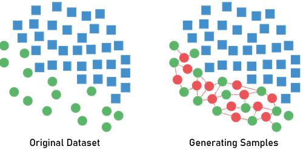

SMOTE, or Synthetic Minority Oversampling Technique, is a technique for addressing class imbalance in datasets by creating synthetic examples for a minority class.

The steps involved in SMOTE are:

1. Randomly pick a point from the minority class.
2. Find its [K-Nearest Neighbours](k-nearest-neighbours.md) in the minority class.
3. Randomly select one of these neighbours and use it to create a synthetic example.

*Image by Emilia Orellana*

A synthetic sample is created by taking the vector difference between the feature vector of the randomly selected neighbour and the original instance, multiplying this difference by a random number between 0 and 1, and then adding it to the feature vector of the original instance.

Here is a mathematical representation:

Let $a$ be a randomly chosen minority class sample and $b$ be a randomly chosen neighbour of $a$.

The synthetic instance $s$ is created as follows: $s = a + \lambda \times (b - a)$

Where $\lambda$ is a random number between 0 and 1.

This interpolation method allows the synthetic samples to be as realistic and representative as possible, lying directly along the line segment between two existing minority class samples in the feature space.
