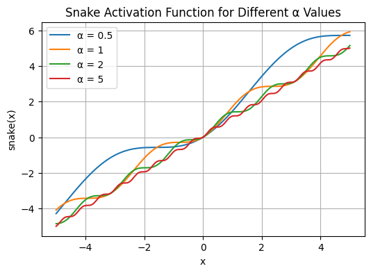

Snake is a neural network activation function useful for modelling problems with a "periodic induction bias" - in other words, problems with regular, repeating patterns - for example, time-series data, audio signals and so on. It was described in the paper [Neural networks fail to learn periodic functions and how to fix it](https://arxiv.org/abs/2006.08195).

In the DAC paper, [High-Fidelity Audio Compression with Improved RVQGAN](../reference/papers/high-fidelity-audio-compression-with-improved-rvqgan.md), they replace [Leaky ReLU](leaky-relu.md) with Snake and significantly improve the reconstructed audio quality.

$\text{snake}(x) = x + \frac{1}{\alpha} \sin^2(\alpha x)$

The $\alpha$ is a parameter that controls the frequency of the periodic component of the signal.

In code:

```python
import numpy as np

def snake_activation(x, alpha):
    return x + (1 / alpha) * np.sin(alpha * x) ** 2
```

Plot:


