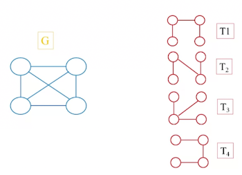

The **Spanning Tree** of a connected graph $G$ is a connected sub graph which contains all vertices of $G$, but with no cycles.

## Example

$G$ is a connected graph, $T_1$, $T_2$, $T_3$ and $T_4$ are spanning trees.

## Minimum Spanning Tree (MST)

The Minimum Spanning Tree (MST) is the lowest cost spanning tree within the graph, where vertices have associated costs.

Two algorithms for computing the MST:

* [Prim's Algorithm](prims-algorithm.md)
* [Kruskal's Algorithm](kruskals-algorithm.md).
