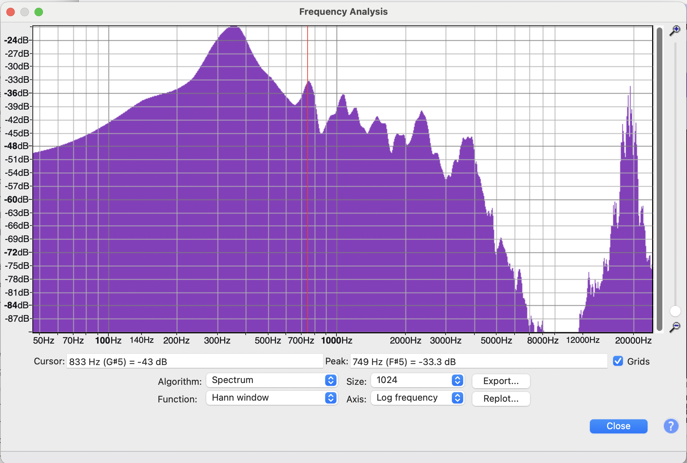

A spectrum shows the frequency content for an audio signal. A **frequency-domain** visualisation.

A spectrum can be for a point in time in an audio signal, or for the entire audio sequence.

In Audacity, you can generate a Spectrum via **Analyze** > **Plot Spectrum**.

*Screenshot of the Plot Spectrum window in [Audacity](https://www.audacityteam.org/).*

