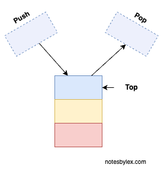
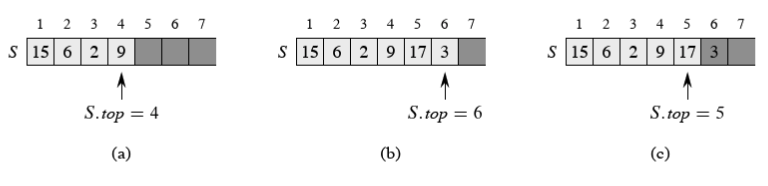

A **stack** is a simple data structure based on the Last In, First Out (LIFO) principle, where only the **Top** element is accessible.

Think of a stack of plates - you can only add or retrieve from the top.

When we add an item to a stack, we call that operation **push**. When you take an item off the stack, we call it **pop**.

A stack `S` can be implemented easily with a fixed-length array. We can track which element is at the top with `S.top`. The size of the array is the maximum size of the stack.

*Example of array-based stack implementation - From Introduction to Algorithms, Third Edition*

 If we attempt to add to a stack beyond its max size, [Stack Overflow](stack-overflow.md) error. If we try to pop from an empty stack, we get the **Stack Underflow** error.

Programming languages use a stack called a [Call Stack](call-stack.md) to keep track of functions running.

A stack supports the following operations in its typical form:

<table class="table-border">
    <tr>
        <th>Operation</th>
        <th>Pseudocode</th>
        <th>Description</th>
    </tr>
    <tr>
        <td>push</td>
        <td><code>PUSH(o, s)</code></td>
        <td>Place <code>o</code> on top of stack.</td>
    </tr>
    <tr>
        <td>top</td>
        <td><code>TOP(s)</code></td>
        <td>Show the element at the top of the stack.</td>
    </tr>
    <tr>
        <td>pop</td>
        <td><code>POP(s)</code></td>
        <td>Remove and return the element at the top of the stack.</td>
    </tr>
    <tr>
        <td>isEmpty?</td>
        <td><code>EMPTY(s)</code></td>
        <td>Return True or False if empty.</td>
    </tr>
    <tr>
        <td>new empty stack</td>
        <td><code>new STACK s</code></td>
        <td>Create a new, empty stack.</td>
    </tr>
</table>

---

## Recommended Reading

[Introduction to Algorithms, Third Edition](https://amzn.to/3HyDauB)

**Chapter 10** covers Elementary Data Structures like a [Stack](stack.md) or [Queue](queue.md).
