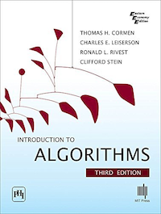

A **stack** is a variable length data structure that supports last in, first out access, and only the **top** element is accessible.

Think of a stack of plates - you can only add and retrieve from the top.

When we add an item to a stack, we typically call that operation **push**, and taking an item off the stack is usually called **pop**. 

A stack can be implemented with an [Array](array.md). The size of the array is the maximum size of the stack. We can track which element of the array is the `top`.

*Example of array-based stack implementation - From Introduction to Algorithms, Third Edition*

Programming languages typically use a stack to keep track of functions running in a program called a [Call Stack](call-stack.md).

 If we try to pop from an empty stack, we get the **Stack Underflow** error. If we attempt to add to a stack beyond its max size, [Stack Overflow](stack-overflow.md) error.

A stack supports the following operations in its typical form:

<table class="table-border">
    <tr>
        <th>Operation</th>
        <th>Pseudocode</th>
        <th>Description</th>
    </tr>
    <tr>
        <td><code>push(o)</code></td>
        <td><code>PUSH(o, s)</code></td>
        <td>Place <code>o</code> on top of stack.</td>
    </tr>
    <tr>
        <td><code>top</code></td>
        <td><code>TOP(s)</code></td>
        <td>Return the element at the top of the stack.</td>
    </tr>
    <tr>
        <td><code>pop!(o)</code></td>
        <td><code>POP(s)</code></td>
        <td>Removes and returns the element at the top of the stack.</td>
    </tr>
    <tr>
        <td><code>empty?</code></td>
        <td><code>EMPTY(s)</code></td>
        <td>Return True or False if empty.</td>
    </tr>
    <tr>
        <td><code>Construct new(empty) stack</code></td>
        <td><code>new STACK s</code></td>
        <td>Create a new stack.</td>
    </tr>
</table>

---

## Recommended Reading

[Introduction to Algorithms, Third Edition](https://amzn.to/3HyDauB)

**Chapter 10** covers Elementary Data Structures like a [Stack](stack.md) or [Queue](queue.md).