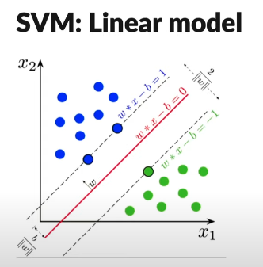

**Support Vector Machine** (SVM) is a [Supervised Learning](supervised-learning.md) algorithm where the objective is to find the [Hyperplane](hyperplane.md) that maximally separates the margin between classes.

*Example comes from AssemblyAI*