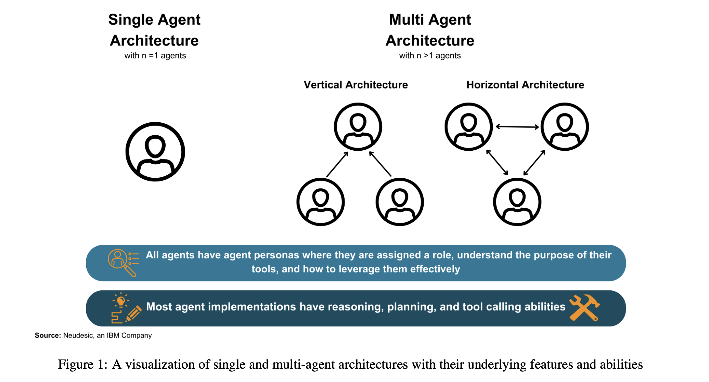

Notes from [The Landscape of Emerging AI Agent Architectures for Reasoning, Planning, and Tool Calling: A Survey](https://arxiv.org/pdf/2404.11584) by Tula Masterman, Sandi Besen, Mason Sawtell, Alex Chao (17 Apr 2024)

This paper surveys the landscape of [Agentic Reasoning](agentic-reasoning.md) including [Reflection](reflection.md), [Planning](planning.md), [Tool Use](tool-use.md) and [Multi-Agent Workflows](multi-agent-workflows.md).

The paper describes the following goals:

a) communicate the current capabilities and limitations of existing AI agent implementations
b) share insights gained from our observations of these systems in action
c) suggest important considerations for future developments in AI agent design

They provide overviews of single-agent and multi-agent architectures, identifying key patterns and divergences in design choices, and evaluating their overall impact on accomplishing a provided goal

Our contribution outlines key themes when selecting an agentic architecture, the impact of leadership on agent systems, agent communication styles, and key phases for planning, execution, and reflection that enable robust AI agent system.

## Introduction

After ChatGPT, first wave of AI applications utilised the [Retrieval Augmented Generation](retrieval-augmented-generation.md) pattern. While that research continues, next generation uses [Agentic Reasoning](agentic-reasoning.md) to allow for more complex interactions than [Zero-Shot Prompting](zero-shot-prompting.md) allows.

Agentic Systems have notions of [Planning](planning.md), loops, [Reflection](reflection.md) and other control structures that can use the model's reasoning capabilities to accomplish tasks.

Among the community, there is a current debate on whether [Single-Agent Systems](single-agent-systems.md) or [Multi-Agent Systems](multi-agent-systems.md) are best suited for solving complex tasks.

* [Single-Agent Systems](single-agent-systems.md)
    * Excel when there's a well defined problem.
    * When feedback from other agent-personas or the user is not needed.

* [Multi-Agent Systems](multi-agent-systems.md)
    * Thrive more when collaboration and multiple distinct execution paths are required.

### 1.1 Taxonomy

* [AI Agents](ai-agents.md)
    * Powered by [Language Model](language-model.md)s.
    * Can plan and take actions to execute goals over multiple iterations.
    * Can be part of [Single-Agent Systems](single-agent-systems.md) or [Multi-Agent Systems](multi-agent-systems.md).
    *  Typically given a [Persona](persona-prompt-engineering.md) and [Tool Use](tool-use.md) to help them achieve goals.
    * Can contain [Memory](memory.md) to save and load info outside of current request.
    * Agent must consist of "brain, perception, and action" as per [The Rise and Potential of Large Language Model Based Agents: A Survey](the-rise-and-potential-of-large-language-model-based-agents-a-survey.md).
* [Persona](persona-prompt-engineering.md)
    * Describes the role or personality of agent, which includes specific-instruction.
    * Contains descriptions of tools it can use.
    * Make agent aware of role, and purpose of their tools and how to leverage effectively.
        * Personality Traits in Large Language Models found that some downstream tasks, like writing social media posts, are affected by persona.
        * Using multi-agent personas has shown improvements compared to [Chain-of-Thought Prompting](chain-of-thought-prompting.md), where the model breaks down plans step-by-step.
* [Tool Use](tool-use.md)
    * In the context of AI agents, **tools** represent any functions that the model can call.
    * Allows an agent to talk to external data sources, and pull and push information to that source.
    * Often associated with persona:
        * For example, a professional contract writer persona may have a suite of suitable tools:
            * adding notes to docs
            * reading docs
            * sending email
            * etc.
* [Single-Agent Architectures](single-agent-architectures.md)
    * Means the agent is powered by one language model, which does all reasoning, planning, and tool execution on their own.
    * The agent is given a system prompt and any tools required to complete their task.
    * No feedback mechanism from other AI agents
        * however, there may be options for humans to provide feedback that guides the agent.
* [Multi-Agent Architectures](multi-agent-architectures.md)
    * These architectures involve two or more agents
    * Each agent can utilise the same language model or a set of different language models.
    * The agents may have access to the same tools or different tools.
    * Each agent typically has their own persona.
    * Wide variety of organizations at any level of complexity.
    * Two primary categories
        * vertical and horizontal
    * These categories represent two ends of a spectrum, where most existing architectures fall somewhere between these two extremes.
* [Vertical Architectures](vertical-architectures.md)
    * One agent is leader. Other agents report to them.
    * In some configurations, reporting agents may communicate exclusively with the lead agent.
    * Leader can be defined with a shared conversation between all agents.
    * The defining features of vertical architectures include having a lead agent and a clear division of labor between the collaborating agents.
* [Horizontal Architectures](horizontal-architectures.md)
    * In this structure, all the agents are treated as equals and are part of one group discussion about the task.
    * Communication between agents occurs in a shared thread where each agent can see all messages from the others.
    * Agents also can volunteer to complete certain tasks or call tools, meaning they do not need to be assigned by a leading agent.
    * Horizontal architectures are generally used for tasks where collaboration, feedback and group discussion are key to the overall success of the task.

## Key Considerations for Effective Agents

Agents extend LMs to solve real problems. They need good problem-solving capabilities to do well on novel tasks. They need to be able to reason and plan and call tools that interact with an external environment.

### The Importance of Reasoning and Planning

[Reasoning](reasoning.md)
* A fundamental building block of human cognition. It lets us make decisions, solve problems and make sense of the world.
* [AI Agents](ai-agents.md) must have strong ability to reason to handle complex environments and make decisions.

Need a tight synergy between "acting" and "reasoning" to allow new tasks to be learned quickly and enable robust decision making, even under previously unseen circumstances, or information uncertainties. See [ReAct: Synergizing Reasoning and Acting in Language Models](react-synergizing-reasoning-and-acting-in-language-models.md).

Agents need reasoning to adjust their plans based on new feedback or info. Without reasoning skills, they can misunderstand the user's request, or generate a response based on a literal understanding, or fail to consider multi-step implications.

[Planning](planning.md), which requires strong reasoning abilities, falls into five major approaches, according to [Understanding the planning of LLM agents: A survey](understanding-the-planning-of-llms-agents-a-survey.md):
* task decomposition
* multi-plan selection
* external module-aided planning
* reflection and refinement
* memory-augmented planning

These methods let the model break a task down into sub tasks, select one plan from many generated options, leverage a pre-existing external plan, revise previous plans based on new information, or leverage external info to improve the plan.

Most agent patterns have a dedicated planning step, which uses one or more of the techniques to create a plan before executing actions.

For example, [Plan Like a Graph](plan-like-a-graph.md) is an approach that represents plans as directed graphs, with multiple steps being executed in parallel. Can achieve a big performance increase on tasks with many independent subtasks that may benefit from async execution.

### The Importance of Effective Tool Calling

A key benefit of agent abstraction over prompting is agents' ability to solve complex problems by calling multiple tools. Problems that need extensive tool calling often also need complex reasoning. Can use [Single-Agent Architectures](single-agent-architectures.md) or [Multi-Agent Architectures](multi-agent-architectures.md) to solve challenging tasks with reasoning and tool calling steps.

Many methods use multiple iterations of reasoning, memory, and reflection to effectively and accurately complete problems. See:
* [RAISE](raise.md)
* [Reflexion](reflexion.md)
* [ReAct](react-agent.md)

They often do this by breaking a larger problem into smaller subproblems, and then solving each one with the appropriate tools in sequence.

Other works focused on advancing agent patterns highlight that while breaking a larger problem into smaller subproblems can be effective at solving complex tasks, single agent patterns often struggle to complete the long sequence required. See:
* Learning to Use Tools via Cooperative and Interactive Agents
* Efficient Tool Use with Chain-of-Abstraction Reasoning

Multi-agent patterns can address the issues of parallel tasks and robustness since individual agents can work on individual subproblems.

Many multi-agent patterns start by taking a complex problem and breaking it down into several smaller tasks.

Then, each agent works independently on solving each task using their own independent set of tools.

## [Single-Agent Architectures](single-agent-architectures.md)

In this section, we highlight some notable single agent methods such as [ReAct](react-agent.md), [RAISE](raise.md), [Reflexion](reflexion.md), [AutoGPT + P](autogpt-plus-p.md), and [Language Agent Tree Search](language-agent-tree-search.md).

Each of these methods contain a dedicated stage for reasoning about the problem before any action is taken to advance the goal.

We selected these methods based on their contributions to the reasoning and tool calling capabilities of agents.

### Key Themes

We find that successful goal execution by agents is contingent upon proper planning and self-correction.

Without the ability to self-evaluate and create effective plans, single agents may get stuck in an endless execution loop and never accomplish a given task or return a result that does not meet user expectations.

We find that single agent architectures are especially useful when the task requires straightforward function calling and does not need feedback from another agent.

#### Examples

* [ReAct](react-agent.md)
    * agent first writes a thought about the given task.
    *  then performs an action based on that thought, and the output is observed.
    * This cycle can repeat until the task is complete.
    * When applied to a diverse set of language and decision-making tasks, the ReAct method demonstrates improved effectiveness compared to zero-shot prompting on the same tasks
    * It also provides improved human interoperability and trustworthiness because the entire thought process of the model is recorded.
    * When evaluated on the [HotpotQA](hotpotqa.md) dataset, the ReAct method only hallucinated 6% of the time, compared to 14% using the chain of thought (CoT) method.
    * ReAct method is not without limitations.
    * While intertwining reasoning, observation and action improves trustworthiness, the model can repetitively generate the same thoughts and actions and fail to create new thoughts to provoke finishing the task and exiting ReAct loop.
    * Incorporating human feedback during the execution of task which increases effectiveness and applicability to real-world scenarios.
* [RAISE](raise.md)
    * The RAISE method is built upon the ReAct method, with the addition of a memory mechanism that mirrors human short-term and long-term memory [16].
    * It does this by using a scratchpad for short-term storage and a dataset of similar previous examples for long-term storage. By adding these components, RAISE improves upon the agent’s ability to retain context in longer conversations. The paper also highlights how fine-tuning the model results in the best performance for their task, even when using a smaller model.
    * They also showed that RAISE outperforms ReAct in both efficiency and output quality. While RAISE significantly improves upon existing methods in some respects, the researchers also highlighted several issues. First, RAISE struggles to understand complex logic, limiting its usefulness in many scenarios. Additionally, RAISE agents often hallucinated with respect to their roles or knowledge. For example, a sales agent without a clearly defined role might retain the ability to code in Python, which may enable them to start writing Python code instead of focusing on their sales tasks. These agents might also give the user misleading or incorrect information. This problem was addressed by fine-tuning the model, but the researchers still highlighted hallucination as a limitation in the RAISE implementation.
* [Reflexion](reflexion.md)
    * Reflexion is a single-agent pattern that uses self-reflection through linguistic feedback [23]. By utilizing metrics such as success state, current trajectory, and persistent memory, this method uses an LLM evaluator to provide specific and relevant feedback to the agent.
    * This results in an improved success rate as well as reduced hallucination compared to Chain-of-Thought and ReAct. Despite these advancements, the Reflexion authors identify various limitations of the pattern. Primarily, Reflexion is susceptible to “non-optimal local minima solutions”. It also uses a sliding window for long-term memory, rather than a database. This means that the volume of long-term memory is limited by the token limit of the language model. Finally, the researchers identify that while Reflexion surpasses other single-agent patterns, there are still opportunities to improve performance on tasks that require a significant amount of diversity, exploration, and reasoning.
* [AutoGPT + P](autogpt-plus-p.md)
    * AutoGPT + P (Planning) is a method that addresses reasoning limitations for agents that command robots in natural language. 
    * AutoGPT+P combines object detection and Object Affordance Mapping (OAM) with a planning system driven by a LLM. This allows the agent to explore the environment for missing objects, propose alternatives, or ask the user for assistance with reaching its goal.
    * AutoGPT+P starts by using an image of a scene to detect the objects present. A language model then uses those objects to select which tool to use, from four options: Plan Tool, Partial Plan Tool, Suggest Alternative Tool, and Explore Tool. These tools allow the robot to not only generate a full plan to complete the goal, but also to explore the environment, make assumptions, and create partial plans.
    * However, the language model does not generate the plan entirely on its own. Instead, it generates goals and steps to work aside a classical planner which executes the plan using Planning Domain Definition Language (PDDL). The paper found that “LLMs currently lack the ability to directly translate a natural language instruction into a plan for executing robotic tasks, primarily due to their constrained reasoning capabilities” [1]. By combining the LLM planning capabilities with a classical planner, their approach significantly improves upon other purely language model-based approaches to robotic planning.
    * As with most first of their kind approaches, AutoGPT+P is not without its drawbacks. Accuracy of tool selection varies, with certain tools being called inappropriately or getting stuck in loops. In scenarios where exploration is required, the tool selection sometimes leads to illogical exploration decisions like looking for objects in the wrong place. The framework also is limited in terms of human interaction, with the agent being unable to seek clarification and the user being unable to modify or terminate the plan during execution.
* [Language Agent Tree Search](language-agent-tree-search.md)
    * [Language Agent Tree Search](language-agent-tree-search.md) (LATS) is a single-agent method that synergizes planning, acting, and reasoning by using trees.
    * This technique, inspired by Monte Carlo Tree Search, represents a state as a node and taking an action as traversing between nodes.
    * It uses LM-based heuristics to search for possible options, then selects an action using a state evaluator.
    * When compared to other tree-based methods, LATS implements a self-reflection reasoning step that dramatically improves performance.
    * When an action is taken, both environmental feedback as well as feedback from a language model is used to determine if there are any errors in reasoning and propose alternatives. This ability to self-reflect combined with a powerful search algorithm makes LATS perform extremely well on various tasks.
    * However, due to the complexity of the algorithm and the reflection steps involved, LATS often uses more computational resources and takes more time to complete than other single-agent methods. The paper also uses relatively simple question answering benchmarks and has not been tested on more robust scenarios that involve tool calling or complex reasoning.

## [Multi-Agent Architectures](multi-agent-architectures.md)

In this section, they look at key studies and sample frameworks with multi-agent architectures:
* [Embodied LLM Agents Learn to Cooperate in Organized Teams](embodied-llm-agents-learn-to-cooperate-in-organized-teams.md)
* [Dynamic LLM-Agent Network: An LLM-agent Collaboration Framework with Agent Team Optimization](../reference/dynamic-llm-agent-network-an-llm-agent-collaboration-framework-with-agent-team-optimization.md)
* [AgentVerse Facilitating Multi-Agent Collaboration and Exploring Emergent Behaviors](agentverse-facilitating-multi-agent-collaboration-and-exploring-emergent-behaviors.md)
* [MetaGPT: Meta Programming for A Multi-Agent Collaborative Framework](metagpt-meta-programming-for-a-multi-agent-collaborative-framework.md)

They highlight how these implementations facilitate goal execution through inter-agent communication and collaborative plan execution.

This is not intended to be an exhaustive list of all agent frameworks, our goal is to provide broad coverage of key themes and examples related to multi-agent patterns

#### Key Themes

Multi-agent architectures create an opportunity for both the intelligent division of labor based on skill and helpful feedback from a variety of agent personas.

Many multi-agent architectures work in stages where teams of agents are created and reorganized dynamically for each planning, execution, and evaluation phase.

This reorganization provides superior results because specialized agents are employed for certain tasks, and removed when they are no longer needed.

 By matching agents roles and skills to the task at hand, agent teams can achieve greater accuracy and decrease time to meet the goal.

Key features of effective multi-agent architectures include clear leadership in agent teams, dynamic team construction, and effective information sharing between team members so that important information does not get lost in superfluous chatter.

##### Examples

* [Embodied LLM Agents Learn to Cooperate in Organized Teams](embodied-llm-agents-learn-to-cooperate-in-organized-teams.md)
    * Research by Guo et al. demonstrates the impact of a lead agent on the overall effectiveness of the agent team [9]
    * This architecture contains a vertical component through the leader agent, as well as a horizontal component from the ability for agents to converse with other agents besides the leader.
    * The results of their study demonstrate that agent teams with an organized leader complete their tasks nearly 10% faster than teams without a leader.
    * Furthermore, they discovered that in teams without a designated leader, agents spent most of their time giving orders to one another (~50% of communication), splitting their remaining time between sharing information, or requesting guidance.
    * Conversely, in teams with a designated leader, 60% of the leader’s communication involved giving directions, prompting other members to focus more on exchanging and requesting information. Their results demonstrate that agent teams are most effective when the leader is a human.
    * Beyond team structure, the paper emphasizes the importance of employing a “criticize-reflect” step for generating plans, evaluating performance, providing feedback, and re-organizing the team [9].
    * Their results indicate that agents with a dynamic team structure with rotating leadership provide the best results, with both the lowest time to task completion and the lowest communication cost on average.
    * Ultimately, leadership and dynamic team structures improve the overall team’s ability to reason, plan, and perform tasks effectively
* [Dynamic LLM-Agent Network: An LLM-agent Collaboration Framework with Agent Team Optimization](../reference/dynamic-llm-agent-network-an-llm-agent-collaboration-framework-with-agent-team-optimization.md)
    * The Dynamic LLM-Agent Network (DyLAN) framework creates a dynamic agent structure that focuses on complex tasks like reasoning and code generation [18]
    * DyLAN has a specific step for determining how much each agent has contributed in the last round of work and only moves top contributors the next round of execution. This method is horizontal in nature since agents can share information with each other and there is no defined leader. DyLAN shows improved performance on a variety of benchmarks which measure arithmetic and general reasoning capabilities.
    * This highlights the impact of dynamic teams and demonstrates that by consistently re-evaluating and ranking agent contributions, we can create agent teams that are better suited to complete a given task.
* [AgentVerse Facilitating Multi-Agent Collaboration and Exploring Emergent Behaviors](agentverse-facilitating-multi-agent-collaboration-and-exploring-emergent-behaviors.md).
    * Multi-agent architectures like AgentVerse demonstrate how distinct phases for group planning can improve an AI agent’s reasoning and problem-solving capabilities [2].
    * AgentVerse contains four primary stages for task execution:
        * recruitment
        * collaborative decision making
        * independent action execution
        * evaluation
    * This can be repeated until the overall goal is achieved.
    * By strictly defining each phase, AgentVerse helps guide the set of agents to reason, discuss, and execute more effectively.
    * As an example, the recruitment step allows agents to be removed or added based on the progress towards the goal.
    * This helps ensure that the right agents are participating at any given stage of problem solving.
    * The researchers found that horizontal teams are generally best suited for collaborative tasks like consulting, while vertical teams are better suited for tasks that require clearer isolation of responsibilities for tool calling.
* [MetaGPT: Meta Programming for A Multi-Agent Collaborative Framework](metagpt-meta-programming-for-a-multi-agent-collaborative-framework.md)
    * Many multi-agent architectures allow agents to converse with one another while collaborating on a common problem.
    * This conversational capability can lead to chatter between the agents that is superfluous and does not further the team goal. MetaGPT addresses the issue of unproductive chatter amongst agents by requiring agents to generate structured outputs like documents and diagrams instead of sharing unstructured chat messages [11].
    * Additionally, MetaGPT implements a ”publish-subscribe” mechanism for information sharing. This allows all the agents to share information in one place, but only read information relevant to their individual goals and tasks.
    * This streamlines the overall goal execution and reduces conversational noise between agents.
    * When compared to single-agent architectures on the HumanEval and MBPP benchmarks, MetaGPT’s multi-agent architecture demonstrates significantly better results.

## Discussion and Observations

### Overview

In this section we discuss the key themes and impacts of the design choices exhibited in the previously outlined agent
patterns.

These patterns serve as key examples of the growing body of research and implementation of AI agent architectures.

Both single and multi-agent architectures seek to enhance the capabilities of language models by giving them the ability to execute goals on behalf of or alongside a human user.

Most observed agent implementations broadly follow the plan, act, and evaluate process to iteratively solve problems.

We find that both single and multi-agent architectures demonstrate compelling performance on complex goal execution. We also find that across architectures clear feedback, task decomposition, iterative refinement, and role definition yield improved agent performance.

### Key Findings

#### Typical Conditions for Selecting a Single vs Multi-Agent Architecture.

Based on the aforementioned agent patterns, they find:
- single-agent patterns are generally best suited for tasks with a narrowly defined list of tools and where processes are well-defined.
- Single agents are also typically easier to implement since only one agent and set of tools needs to be defined.
- Additionally, single agent architectures do not face limitations like poor feedback from other agents or distracting and unrelated chatter from other team members.
- However, they may get stuck in an execution loop and fail to make progress towards their goal if their reasoning and refinement capabilities are not robust.
- Multi-agent architectures are generally well-suited for tasks where feedback from multiple personas is beneficial in accomplishing the task.
- For example, document generation may benefit from a multi-agent architecture where one agent provides clear feedback to another on a written section of the document.
- Multi-agent systems are also useful when parallelization across distinct tasks or workflows is required. 
- Crucially, Wang et. al finds that multi-agent patterns perform better than single agents in scenarios when no examples are provided.
- By nature, multi-agent systems are more complex and often benefit from robust conversation management and clear leadership

While single and multi-agent patterns have diverging capabilities in terms of scope, research finds that “multi-agent discussion does not necessarily enhance reasoning when the prompt provided to an agent is sufficiently robust”.

This suggests that those implementing agent architectures should decide between single or multiple agents based on the broader context of their use case, and not based on the reasoning capabilities required.

#### Agents and Asynchronous Task Execution

While a single agent can initiate multiple asynchronous calls simultaneously, its operational model does not inherently support the division of responsibilities across different execution threads. 

This means that, although tasks are handled asynchronously, they are not truly parallel in the sense of being autonomously managed by separate decision-making entities.

Instead, the single agent must sequentially plan and execute tasks, waiting for one batch of asynchronous operations to complete before it can evaluate and move on to the next step.

Conversely, in multi-agent architectures, each agent can operate independently, allowing for a more dynamic division of labor.

This structure not only facilitates simultaneous task execution across different domains or objectives but also allows individual agents to proceed with their next steps without being hindered by the state of tasks handled by others, embodying a more flexible and parallel approach to task management.

#### Impact of Feedback and Human Oversight on Agent Systems.

When solving a complex problem, it is extremely unlikely that one provides a correct, robust solution on their first try

Instead, one might pose a potential solution before criticizing it and refining it. 

One could also consult with someone else and receive feedback from another perspective. The same idea of iterative feedback and refinement is essential for helping agents solve complex problems.

This is partially because language models tend to commit to an answer earlier in their response, which can cause a ‘snowball effect’ of increasing diversion from their goal state [34] . By implementing feedback, agents are much more likely to correct their course and reach their goal.

Additionally, the inclusion of human oversight improves the immediate outcome by aligning the agent’s responses more closely with human expectations, mitigating the potential for agents to delve down an inefficient or invalid approach to solving a task. As of today, including human validation and feedback in the agent architecture yields more reliable and trustworthy results [4, 9].

Language models also exhibit sycophantic behavior, where they “tend to mirror the user’s stance, even if it means forgoing the presentation of an impartial or balanced viewpoint” [20]. Specifically, the AgentVerse paper describes how agents are susceptible to feedback from other agents, even if the feedback is not sound. This can lead the agent team to generate a faulty plan which diverts them from their objective [2]. Robust prompting can help mitigate this, but those developing agent applications should be aware of the risks when implementing user or agent feedback systems

**Challenges with Group Conversations and Information Sharing**

One challenge with multi-agent architectures lies in their ability to intelligently share messages between agents.

Multi-agent patterns have a greater tendency to get caught up in niceties and ask one another things like “how are you”, while single agent patterns tend to stay focused on the task at hand since there is no team dynamic to manage. The extraneous dialogue in multi-agent systems can impair
both the agent’s ability to reason effectively and execute the right tools, ultimately distracting the agents from the task
and decreasing team efficiency. This is especially true in a horizontal architecture, where agents typically share a group
chat and are privy to every agent’s message in a conversation. Message subscribing or filtering improves multi-agent
performance by ensuring agents only receive information relevant to their tasks.
