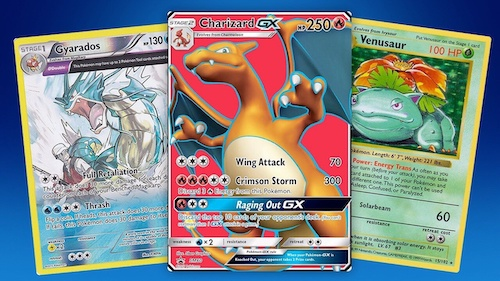

Discussed by Schell and coined by Henry Jenkins, refers to a world that can be "entered" through many different types of media [@schellArtGameDesign2015a] (pg. 336-337).

Pokemon and Star Wars are examples of this.

Schell describes 6 traits that make for a successful transmedia world:

* has a strong original media (ie Pokemon started out as a Gameboy game)
* is intuitive
* has a single creator or small team at its core
* can tell many stories
* makes sense through any gateway (Pokemon works as PC game, card game etc).
