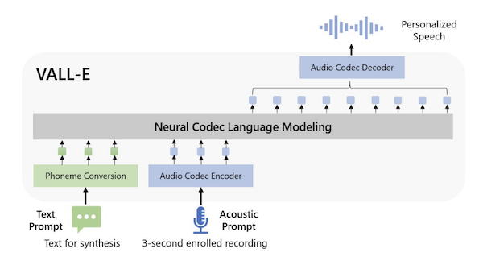

VALL-E is a zero-shot TTS language model based on RVQ. See [Neural Codec Language Models are Zero-Shot Text-to-Speech Synthesizers](../reference/papers/neural-codec-language-models-are-zero-shot-text-to-speech-synthesizers.md)

