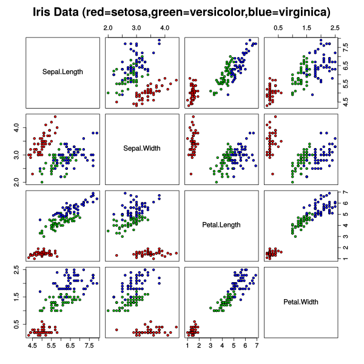

A vector is a list of numbers with a fixed size.

In linear algebra, the numbers describe an arrow pointing in space. If we create a grid to represent space, we will place the tip at the coordinate in the vector and the base on the origin of the grid system. In 2d space, that origin is typically the point `(0, 0)`.

We can think of the vectors describing a unit of change along each axis. For example, the vector in the cover image is $(1, 2)$ or 1 unit of "change" along the x-axis and two units of "change" along the y-axis. We commonly describe vectors as defined by a length (or magnitude) and direction.

We refer to each number in a vector as a component.

Vectors are represented in math as a vertical list of numbers or a matrix with one column to differentiate from coordinates.

$$\vec{A} = \begin{bmatrix}1\\2\end{bmatrix}$$

We can use Pythagoras' Theorem to calculate the length of a vector by squaring each vector component and then taking the square root of their sum:

$$\| \vec{A} \| = \sqrt{1^2 + 2^2}$$

A computer scientist may think of vectors simply as an array. We can use vectors to represent a model of something. For example, the [Iris Flower Dataset](https://archive.ics.uci.edu/ml/datasets/iris) represents flowers as a vector of 4 attributes:

$$
\begin{bmatrix}
\text{sepal length}\\
\text{sepal width}\\
\text{petal length in cm}\\
\text{petal width in cm}
\end{bmatrix}
$$

We can plot these numbers in a coordinate system to see how the flowers relate to each other. This example from [Wikipedia](https://commons.wikimedia.org/wiki/File:Iris_dataset_scatterplot.svg) generates a 2d scatterplot for each pair of values.

* The length of a vector is called its magnitude. See [Vector Magnitude](vector-magnitude.md).
* We can add a vector. See [Vector Addition](vector-addition.md).
* We can subtract vectors. See [Vector Subtraction](vector-subtraction.md).
* We can multiply vectors by a value. See [Vector Scaling](vector-scaling.md).
* We can combine vectors in various ways. See [Dot Product](dot-product.md) or [Element-wise product](Element-wise product).

We describe a [Ray](ray.md) with a similar notation to vectors. However, a Ray doesn't have a length—only a direction to continue infinitely.

[@3blue1brownVectorsChapterEssence2016]
