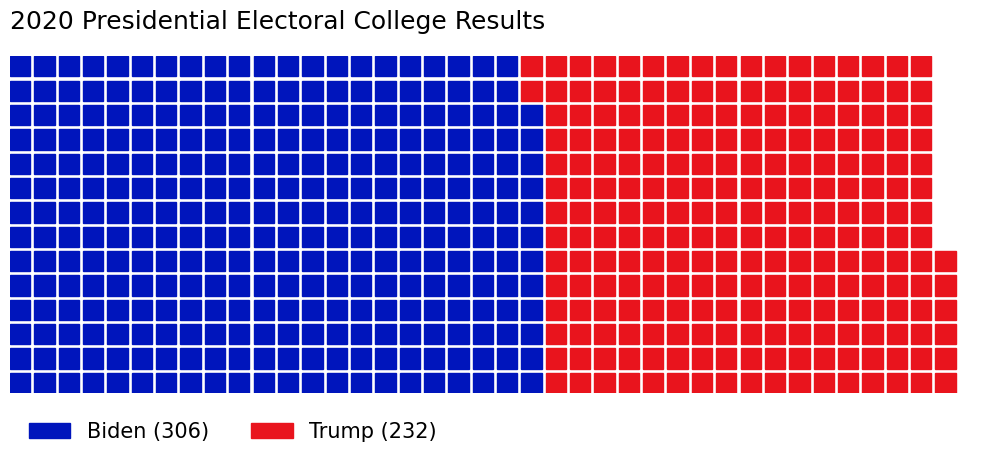

A **Waffle Chart** is a [Data Visualisation](../../../permanent/data-visualisation.md) where data points are represented as squares on a 2D grid. It's used for displaying the proportion or count of each category, for example, showing voting results across a population.

For example, this Waffle Chart shows the 2020 Presidential Election Electoral College Results, highlighting the closeness of the contest and giving a sense of proportion.

Waffle Charts are particularly effective when you need to show parts of a whole, and can often be more visually engaging than a [Pie Chart](pie-chart.md).
