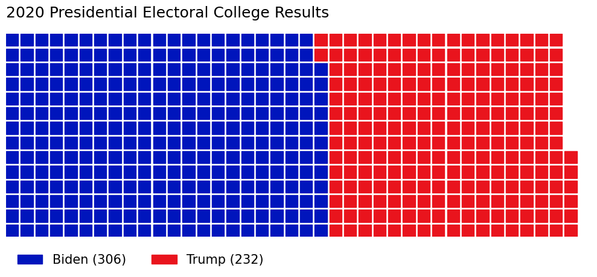

A **Waffle Chart** is a [Data Visualisation](../../../permanent/data-visualisation.md) where data points are represented as squares on a 2d grid. It's used to displaying proportion or count of each category, for example, showing voting results across a population.

s
*Figure 1. Example Waffle Chart showing the 2020 Presidential Election Electoral College Results*